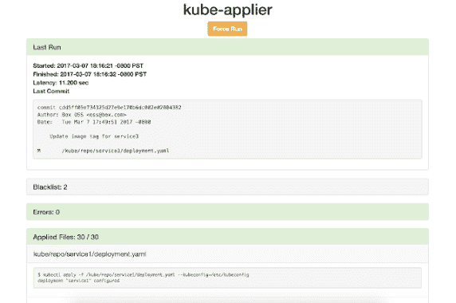
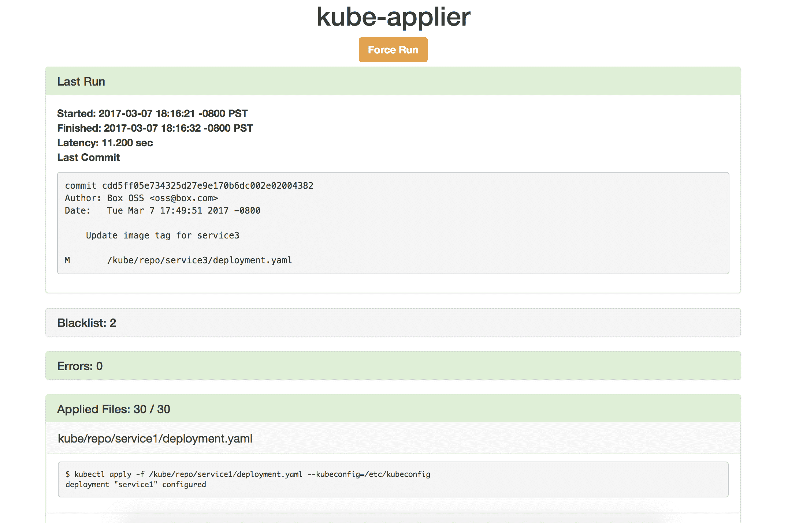

# Kube-Applier:为您的 Kubernetes 集群启用自动化部署和声明性配置

> 原文：<https://kalilinuxtutorials.com/kube-applier/>

Kube-Applier 是一项服务，它通过将声明性配置文件从 Git 存储库应用到 Kubernetes 集群来实现 Kubernetes 对象的持续部署。

kube-applier 在集群中作为一个 Pod 运行，并监视 Git repo，以确保集群对象在 repo 中与它们相关的规范文件(JSON 或 YAML)保持一致。

在指定的时间间隔，kube-applier 执行一次“全面运行”,为 repo 中的所有 JSON 和 YAML 文件发出 kubectl apply 命令。

当对存储库进行新的提交时，kube-applier 会执行一次“快速运行”,仅对自上次运行以来发生更改的文件发出应用命令。

快速运行和完全运行是分开并同时处理的。

kube-applier 提供了一个状态页面，并提供了监控指标。

**要求**

*   Go (1.7+)
*   码头工人(17.05+)
*   不可思议的群集
    *   kube-applier 通常支持任何 Kubernetes 服务器版本，假设您在 docker 文件中安装了兼容的 kubectl 客户机。
    *   docker 文件中指定的 kubectl 版本必须是与集群 API 服务器相同的次要版本，或者是服务器之后的一个版本(例如，客户端 1.3 和服务器 1.4 可以，但客户端 1.4 和服务器 1.3 就不行)。
    *   `**kubectl apply**`有几个已知问题可能会影响您使用 kube-applier。一些例子:
        *   1.6.0 之前的版本存在许多使用`**kubectl apply**`应用第三方资源对象的已知问题。
        *   由于名称空间问题，1.5.8 和 1.6.3 之前的 1.5 和 1.6 版本不受支持，此处已修复。

**设置**

下载源代码并构建容器映像。

**$ go get github.com/box/kube-applier
$ CD $ GOPATH/src/git hub . com/box/kube-applier
$ make container**

为了在 Kubernetes 容器规范中引用它，您需要将图像推送到注册表中。

**用法**

**集装箱规格**

我们建议将 kube-applier 作为一个部署来运行(参见演示 [/](https://github.com/box/kube-applier/tree/master/demo) 中的 YAML 文件示例)。此时，我们仅支持一次运行一个副本，因此，如果为副本提供服务的节点出现故障，直到它被重新安排到另一个节点上，应用程序中可能会出现间隙。

***重要:*** 包含 kube-applier 容器的 Pod 必须在对 API 服务器中的所有名称空间具有写权限的名称空间中生成(例如 kube-system)。

**环境变量**

**必需的**

*   `**REPO_PATH**`–(字符串)包含要应用的配置文件的目录的绝对路径。它必须是 Git 存储库或其中的路径。全部。json 和。将应用此目录(及其子目录)中的 yaml 文件，除非列在黑名单中或从白名单中排除。
*   `**LISTEN_PORT**`–(int)集装箱的港口。这应该与容器规范中指定的端口相同。

**Optional**

*   `**SERVER**`–(字符串)Kubernetes API 服务器的地址。默认情况下，API 服务器的发现由 kube-proxy 处理。如果没有设置 kube-proxy，那么必须用这个环境变量指定 API 服务器地址(然后将其写入后端的 kubeconfig 文件中)。对 API 服务器的身份验证由服务帐户令牌处理。有关更多信息，请参见访问集群。
*   `**BLACKLIST_PATH**`–(字符串)指向“黑名单”文件的路径，该文件指定不应应用的文件。这个路径应该是绝对的(比如`**/k8s/conf/kube_applier_blacklist**`)，而不是相对的`**REPO_PATH**`(虽然你可能想把黑名单文件签入回购)。黑名单文件本身应该是一个明文文件，每行都有一个文件路径。这些路径中的每一个都应该是相对于`R**EPO_PATH**`的(比如`**REPO_PATH**`设置为`**/git/repo**`，要加入黑名单的文件是 **`/git/repo/apps/app1.json`，**黑名单文件中的行应该是`**apps/app1.json**`)。
*   `**WHITELIST_PATH**`–(字符串)指向“白名单”文件的路径，该文件用于使申请人考虑来自 repo 的特定文件子集。只有白名单文件中列出的文件才会被考虑应用。空白名单(或未设置环境变量)意味着 repo 中的所有文件都有资格应用。如果文件同时列在白名单和黑名单中，则不应用该文件。环境变量和文件本身的格式应该与上面的黑名单相同。

* * *

**注意**黑名单和白名单文件支持行注释。如果一行中的第一个非空白字符是#，则该行将被忽略。

* * *

*   `**POLL_INTERVAL_SECONDS**`–(int)每次检查对 repo 的新提交之间等待的秒数(默认值为 5)。置 0 禁用等待时间。
*   `**FULL_RUN_INTERVAL_SECONDS**`–(int)自动完整运行之间的秒数(默认值为 300，即 5 分钟)。置 0 禁用等待时间。
*   `**DIFF_URL_FORMAT**`–(字符串)如果指定，允许状态页显示指向引用特定提交的比较的源代码的链接。 **`DIFF_URL_FORMAT`** 应该是支持链接到提交哈希的托管远程回购的 URL。用“%s”替换提交哈希部分，这样它就可以由 kube-applier 填充(例如`**https://github.com/kubernetes/kubernetes/commit/%s**`)。
*   `**LOG_LEVEL**`–(int)在所有`**kubectl**`命令运行时设置 **`-v`** 标志。使用此选项可以配置更详细的日志记录。如果未指定，默认为标准日志详细度的`**kubectl**`命令上不会设置`**-v**`标志。

**挂载 Git 库**

有两种方法可以将 Git 存储库挂载到 kube-applier 容器中。

*   **Git-sync 边车集装箱**

Git-sync 通过远程 repo 来更新本地目录。本地目录位于一个共享的 emptyDir 卷中，该卷安装在 git-sync 和 kube-applier 容器中。

关于设置和使用，请参考 git-sync repo。

*   **主机装载卷**

从主机目录挂载 Git 存储库。当您希望 kube-applier 将更改应用到某个对象，而不将修改后的规范文件签入远程存储库时，这将非常有用。

**" volumes ":[
{
" host path ":{
" path ":
}，
" name ":" repo-volume "
}
…** 

如果在 kube-applier 运行过程中本地 Git repo 的内容发生变化，会发生什么？

如果在 kube-applier 运行期间对`**$REPO_PATH**`目录中的文件进行了更改，这些更改可能会也可能不会反映在该运行中，这取决于更改的时间。

假设`**$REPO_PATH**`目录是一个 Git repo 或者位于其中，很可能大部分更改都与 Git 提交相关联。因此，运行中间的改变将可能更新头提交散列，这将在当前运行完成时立即触发另一次运行(不管任何改变在当前运行中是否有效)。但是，与新 Git 提交无关的更改不会触发运行。

如果我删除一个配置文件，kube-applier 会删除相关的 Kubernetes 对象吗？

不会。如果从`**$REPO_PATH**`目录中删除一个文件，kube-applier 将不再应用该文件，但是 kube-applier **不会**删除该文件描述的集群对象。这些物体必须使用`**kubectl delete**`手动清理。

**【强制运行】功能**

在极少数情况下，您可能希望在不签入提交或等待下一次计划运行的情况下触发 kube-applier 运行(例如，由于集群中的某些后台条件，您的一些文件未能应用，并且您在上次运行后已经修复了它)。这可以通过状态页上的“强制运行”按钮来实现，如果当前没有运行，该按钮会立即开始运行，或者在当前运行完成时将运行排队以开始运行。在任何给定时间，队列中只能有一次运行。

**监控**

**状态界面**

kube-applier 在 web 服务器上托管一个状态页面，由服务端点 URL 提供服务。“状态”页显示最近一次应用运行的信息，包括:

*   运行类型
*   开始和结束时间
*   潜伏
*   最近提交
*   白名单文件
*   黑名单文件
*   错误
*   文件应用成功

状态页面的 HTML 模板保存在`**templates/status.html**`中，而`**static/**`保存额外的资产。

**指标**

kube-applier 使用普罗米修斯进行度量。指标托管在 web 服务器的/metrics 上(状态 UI 是索引页面)。除 Prometheus 默认指标外，还包括以下自定义指标:

*   **run _ latency _ seconds**–跟踪每个应用运行持续时间的摘要，标记有运行类型和运行是否成功的布尔值(即没有失败的应用尝试)。
*   **file _ apply _ count**–在容器的生命周期内尝试应用的每个文件的计数器，随着每次应用尝试而递增，并由文件路径和尝试结果标记。

Prometheus HTTP API(也可参见 Go 库)可用于查询 metrics 服务器。

[**Download**](https://github.com/box/kube-applier)