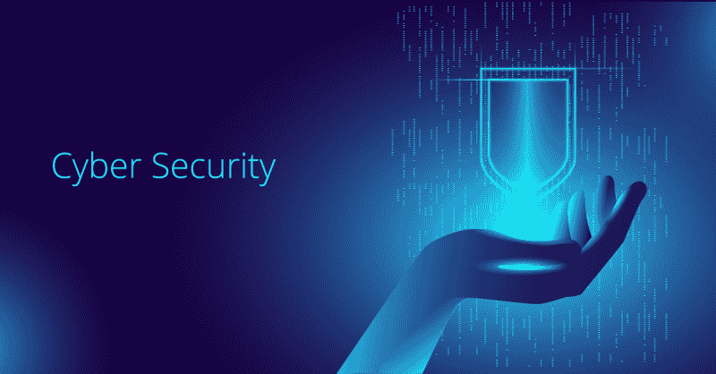

# 创业公司的网络安全提示

> 原文：<https://kalilinuxtutorials.com/cybersecurity-tips-for-startups/>

大公司、成熟的政府机构和非政府机构已经投资于网络安全，以建立更具威胁抵御能力的网络和系统。

创业公司的情况不同。大多数初创公司缺乏投资适当安全措施的资源。因此，黑客入侵初创公司总是一件困难的事情。

这就是为什么你必须格外警惕，以确保你的创业。在本文中，您将了解一些最安全的措施，可以用来保护您的初创企业免受网络安全威胁。

## **1。密码安全**

大多数人在创建密码时倾向于使用最简单的字符。同样，大多数人在多个帐户上重复使用他们的密码。

Harris Poll 在线安全调查显示，65%的人在多个平台上重复使用密码。因此，密码是大多数业务数据泄露的主要原因。仅在 2019 年，42%的企业数据泄露是由弱密码造成的。

你应该为你的创业公司准备的第一道防线是一个独特的、可靠的密码。这些类型的密码将挫败蛮力的努力，并防止未经授权的访问您的系统。

然而，让你的密码容易记住也很好。一些用户最终创建了非常长且复杂的密码，并最终忘记了它们。以下是您应该遵循的一些最佳密码理念:

*   长度胜过复杂性。密码越长，越安全
*   复杂性仍然重要。始终组合小写字母、大写字母、数字和特殊字符。
*   密码管理器是你的秘密武器。他们是伟大的工具，可以用来组织您的密码，并确保安全的密码存储。一些最好的密码管理工具包括:拉斯特帕斯基普萨斯和达什莱恩。
*   请务必为您的每个帐户使用不同的密码。

这些实践适用于你和创业公司的所有利益相关者。因此，请确保所有与您一起创建帐户的人都遵守这些规则。

## 2.安全培训和意识

似乎许多初创公司和老牌机构还没有认识到网络安全培训和意识项目的本质。根据数字、文化、媒体和体育部最近进行的网络安全技能报告，只有九分之一(11%)的组织为其员工提供网络安全培训。

当你开始创业时，准备好参加一个培训和认知项目。与对网络安全一无所知的员工合作毫无意义。你只会增加你对网络攻击的脆弱性。

网络安全培训和意识计划不会让你的初创公司免受网络威胁。这只会最小化网络攻击的可能性。安全意识和培训计划将有助于发展一种安全文化，这种文化在很长一段时间内一直被视为大多数关注自身安全的组织的圣杯。

安全培训计划还将有助于提高员工的安全福利。这将使他们具备必要的知识和技能，以识别潜在的攻击，并使他们了解反防御策略，以保护自己免受网络威胁。

## **3。SSL 加密**

互联网发展迅速，网络攻击也是如此。这需要更好的网站保护。谷歌一直在努力确保互联网是一个安全的地方。

它一直鼓励网站所有者使用 HTTPS 而不是 HTTP。HTTPS 网站有一个 SSL 证书，这个协议可以确保信息在你的网站和访问者的浏览器之间安全传输。因此，它对敏感数据进行加密，使黑客无法读取。

这些敏感信息可能包括登录凭证、支付信息、健康记录和其他个人信息。随着数据泄露事件的增加，您别无选择，只能购买并安装 SSL 证书。

作为一家初创公司，你还需要 SSL 证书来帮助你在搜索引擎中排名。有几个 SSL 证书选项最适合您的启动。例如，你可以使用 [Comodo Essential SSL 证书](https://www.cheapsslshop.com/comodo-essential-ssl)，这是一个便宜且划算的证书，可以保护你选择的域名或子域。

## **4。多因素认证**

启用多步认证是最简单有效的网络安全技巧之一，你应该采取它来保护你的启动。

这是一项安全功能，要求用户在最终被授予访问其帐户的权限之前，通过额外的验证过程。有了多重身份验证，即使你的登录凭证被泄露，黑客也必须输入专门发送到你手机的安全码。

多步认证技术也经历了巨大的转变。例如，我们现在使用指纹和面部识别等生物特征来帮助加强用户验证过程。

## **5。始终使用最新的软件**

你在办公桌前忙碌着，可能在策划如何让你的业务增长。

屏幕上突然出现一个弹出通知，告诉您有新的软件更新。因为您很忙，所以您很快点击了“取消”而不是“安装”这一行为本身就可能危及你的业务，并使其过早停止。

跳过软件更新将为黑客访问您的敏感信息、扭曲信息、窃取信息以及向您的系统传播恶意软件敞开大门。

当今发生的许多恶意软件攻击都利用了过时的软件版本。Equifax 数据泄露事件就是一个很好的例子。

新的软件版本具有更多增强的安全功能，有助于保护您的企业免受网络安全威胁。永远不要拖延安装更新。确保在屏幕上看到弹出通知时立即安装它。

## **6。安装防火墙**

人们对防火墙有一个普遍的误解——认为只有大公司和政府机构才需要防火墙。然而，现实是每种类型的企业，包括创业公司，都必须有一个防火墙来抵御今天发生的许多网络安全威胁。

防火墙是你创业的必备防御工具之一。它的任务是防止任何形式的未经授权的连接到达你。它将监控传入和传出流量，并且只允许安全流量进入您的网络。

## 7 .**。访问限制**

谁应该能够访问您企业的数据？是否应该授予所有员工浏览所有数据存储库的权限？当然不是。你的员工也可能是你最大的敌人。相信任何人都是不好的，尤其是在一个你几乎不了解你的员工的创业环境中。

最佳实践是应用最小特权原则。只有那些与数据有业务往来的人才应该被授予访问数据的权限。通过限制对敏感用户数据的访问，您将限制与数据暴露给坏人相关的潜在威胁。

**结论**

许多创业公司的老板经常认为他们不会成为数据泄露的受害者，他们没有什么可以让黑客来攻击他们的。事实并非如此。初创公司现在已经成为黑客的主要目标之一。你必须在开展业务的同时制定一个全面的网络安全战略，以确保你能够抵御任何形式的网络攻击。这篇文章给出了创业公司应该采纳的八条建议，以提高网络安全。