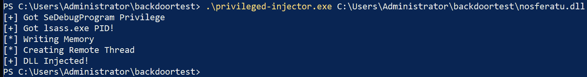
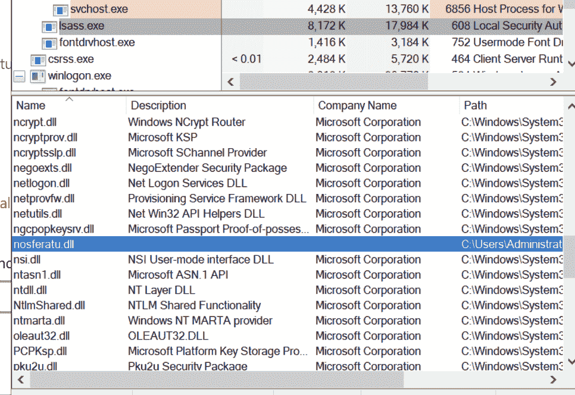
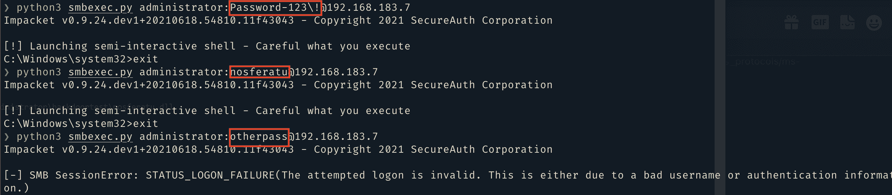

# 诺斯费拉图:Lsass NTLM 认证后门

> 原文：<https://kalilinuxtutorials.com/nosferatu/>

**诺斯费拉图**是 Lsass NTLM 认证后门

**工作原理**

首先，DLL 被注入到`**lsass.exe**`进程中，并将开始挂钩认证 WinAPI 调用。目标功能为`**MsvpPasswordValidate()**`，位于`**NtlmShared.dll**`。为了不被检测到，被挂钩的函数将调用原始函数，并允许正常的身份验证流程。只有在发现认证失败后，钩子才会将实际的 NTLM 散列与后门散列交换出来进行比较。

**用法**

诺斯费拉图必须编译成 64 位 DLL。必须使用具有 SeDebugPrivilege 的 DLL 注入器来注入它。

您可以看到它是使用 Procexp 加载的:

使用 Impacket 的登录示例:

[**Download**](https://github.com/kindtime/nosferatu)