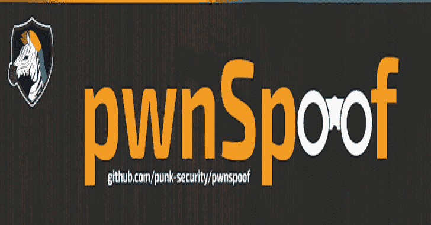

# pwnSpoof:使用可定制的攻击场景为常见的 web 服务器生成逼真的欺骗日志文件

> 原文：<https://kalilinuxtutorials.com/pwnspoof/>

(来自 Punk Security)通过可定制的攻击场景为常见的 web 服务器生成逼真的欺骗日志文件。

每个日志包都是独一无二的，完全可定制的，这使得它非常适合生成 CTF 场景和训练序列。

您能找到攻击者会话并构建事件图吗？

**关于项目**

pwnSpoof 是在 Punk Security 为客户提供的一次威胁追踪训练演习的基础上创建的。培训练习是使用 Splunk(其他日志分析工具可用)等日志分析工具和 IIS 日志来查找登录暴力攻击和命令注入。

pwnSpoof 应用程序背后的思想是:

*   提供快速的 CTF 式培训环境
*   每次运行时创建唯一的日志
*   在 IIS、Apache 和 NGINX 日志中测试威胁追踪

一旦创建了一组日志，就可以将它们加载到 Splunk 中，并使用各种技术来回答以下问题；

*   攻击者的 IP 地址和用户代理是什么？
*   攻击者是否进行了身份验证，如果是，使用的是什么帐户？
*   攻击者的地理位置在哪里？
*   袭击是什么时候发生的？
*   是什么样的攻击？
*   袭击过程中发生了什么？
*   哪些工件可能会留在服务器上？
*   可以采取哪些措施进行补救？

**入门**

下面将解释如何开始使用 pwnSpoof

**先决条件**

pwnSpoof 是用 python 写的，用 python3 测试过。不需要额外的模块，我们只使用标准库。

如果您得到以下错误消息，请在运行 pwnSpoof 时指定 python3。不支持 Python2。

**文件" pwnspoof.py "，第 176 行
打印(" {:6.2f}% "。format(y * x)，end="\r "，flush=True)
^
语法错误:无效语法**

**安装**

*   Git 克隆 pwnSpoof 报告

**git 克隆 https://github.com/punk-security/pwnspoof**

将目录更改为 pwnSpoof

**cd pwnspoof**

运行 pwnSpoof

**python pwn spoof . py–帮助**

**用途**

**开关**

**位置参数:
{banking，wordpress，generic}
应用程序模拟
可选参数:
-h，–帮助显示此帮助消息并退出
–OUT 输出文件(默认:pwnsfof . log)
–iocs 您想知道攻击者的 iocs 以便于搜索吗？(默认值:False)
日志生成器设置:
–日志开始日期 LOG_START_DATE
日志的初始开始，格式为 YYYYMMDD，即“20210727”
–日志结束日期 LOG_END_DATE
日志的结束日期， 格式为 YYYMMDD，即“20210727”
–会话计数 SESSION_COUNT
要欺骗的合法会话数(默认:2000)
–每个用户的最大会话数 MAX_SESSIONS_PER_USER
每个用户的最大合法会话数(默认:3)
–服务器-fqdn SERVER_FQDN
覆盖模拟的网络应用程序默认 FQDN
–服务器-ip SERVER_IP
覆盖 不包括扩展
–噪声文件 NOISE_FILE
包含噪声 uri 以覆盖默认值的文件，包括扩展
攻击设置:
–欺骗攻击欺骗 _ 攻击
要欺骗的攻击者序列数(默认:1)
–攻击类型{ bruteforce，command_injection}
要欺骗的攻击者序列数(默认:brunt force)
–攻击者-GEO _ 攻击者
按 2 个字母区域设置攻击者的地理位置。 将 RD 用于随机(默认:RD)
–攻击者-用户代理攻击者 _ 用户代理
设置攻击者用户代理。随机使用研发(默认:研发)**

**例题**

以下示例将为针对 pwnedbank.co.uk 的暴力创建一组 IIS 日志。

**python pwn spoof . py banking–server-FQDN pwnedbank.co.uk–攻击型 brute forc**e–server-type IIS–out IIS-output . log

下面的例子将为针对 pwnedbank.co.uk 的 command_injection 创建一组 NGINX 日志。

**python pwn spoof . py banking–server-FQDN pwnedbank.co.uk–攻击型 command _ injection–server-type NGINX**

以下示例将创建一组包含 5000 个例行会话和 3 个攻击会话的日志

**python pwn spoof . py banking–会话计数 5000–欺骗攻击 3**

以下示例将创建一组日志并输出攻击者的 IP 地址

**python pwn spoof . py banking–欺骗攻击 3–iocs**

[**Download**](https://github.com/punk-security/pwnspoof)