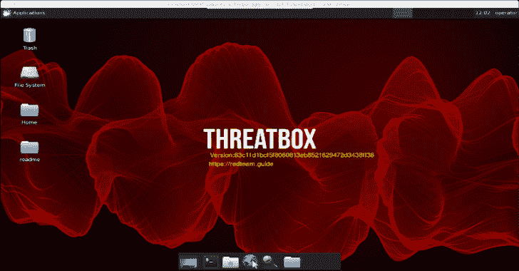

# ThreatBox:一个基于标准受控 Linux 的攻击平台

> 原文：<https://kalilinuxtutorials.com/threatbox/>

ThreatBox 是一个标准的受控的基于 Linux 的攻击平台。我已经用这个版本很多年了。它最初是一个脚本集合，作为一个滚动的虚拟机而存在，作为构建 Linux ISO 的代码而存在，现在已经被转换成一套可翻译的剧本。为什么是 Ansible？为什么不呢？这似乎是标准攻击平台配置的下一个自然发展。

该项目使用 ansible 剧本和角色在 linux 目标上执行部署后配置(在 Ubuntu 18.04 上测试)。

该项目旨在作为创建、管理和使用 red 团队或渗透测试的标准攻击平台的起始流程。

关于标准攻击平台概念的细节可以在 Joe Vest 和 James Tubberville 撰写的《红队开发和运营-实用指南》一书中找到。

**特性**

*   定义为可承担角色的标准工具
*   旨在简化安全测试的定制
*   变量列表来添加或删除 git 存储库、OS 包或 python 模块。(threatbox.yml)
*   已部署实例版本和部署工具版本的版本跟踪。这有助于 it 满足合规性规则，并且可以通过主动跟踪所有工具来帮助最大限度地减少恐惧。
    *   在部署时创建并在桌面壁纸中显示的威胁盒版本
    *   ~/Desktop/readme 中跟踪的已部署软件
*   SSH 端口自动切换。部署从端口 22 开始，但是使用`**threatbox.yml**`中的`**ansible_port**`变量将目标系统重新配置为所需的 SSH 端口
*   下载并编译几个。net 工具包(即来自 https://github.com/GhostPack/Seatbelt ghost pack 的 SeatBelt.exe)
*   大多数 python 项目使用 pipenv 安装。使用项目目录中的`**pipenv shell**`进行访问。有关 pipenv 的使用指南，请参见 https://realpython.com/pipenv-guide/

* * *

**项目文件**

以下列表强调了该项目的主要组成部分。

| 文件/目录 | 描述 | 使用 |
| --- | --- | --- |
| 宿主 | 可转换的主机文件 | 使用目标易受攻击系统的 IP 地址进行更新 |
| group_vars/threatbox.yml | 公共变量 | 用于项目的变量。根据需要进行更新。 |
| -= ytet-伊甸园字幕组=-翻译 | 初级可翻译剧本 | 根据需要更新以添加额外的角色或功能 |
| 角色/常见 | 通用操作系统平台配置 | 设置通用操作系统设置(即在后台或内部设置版本) |
| 角色/。 | 配置或部署工具的其他特定角色 | 在角色/中添加或修改角色 |

* * *

**快速入门**

**条文**

预配一个或多个目标。

*注:本项目在部署于 Digitalocean 的 Ubuntu 18.04 上进行了测试*

**配置**

1.  将`**hosts.sample**`复制到`**hosts**`
2.  使用您的目标系统的 IP 编辑`**hosts**`
3.  将`**group_vars\threatbox.yml.sample**`复制到`**group_vars\threatbox.yml**`
4.  用您想使用的更新变量编辑`**group_vars\threatbox.yml**`
    *   不要忘记使用可以访问远程目标的密钥来更新 SSH 密钥

**可执行命令**

# **OSX 问题 https://github.com/ansible/ansible/issues/32499
如果[[ "$(uname)" == "Darwin" ]]
那么
导出 OBJC _ DISABLE _ INITIALIZE _ FORK _ SAFETY = yes；
fi
#Ansible 测井
rm。/ansible.log
导出 ansi ble _ LOG _ PATH = " ansi ble . LOG "
# ansi ble 调试
导出 ansi ble _ DEBUG = False
#执行剧本
ansi ble-playbook-e ansi ble _ python _ interpreter =/usr/bin/python 3-I hosts threat box _ playbook . yml**

**用这个 ansible.cfg 测试**

**【默认值】
host_key_checking = False
流水线= True
forks = 100
time out = 600
stdout _ callback = YAML
bin _ ansi ble _ callbacks = True
callback _ whitelist = profile _ roles，profile_tasks，timer
mitogen
strategy _ plugins = ~/Documents/mitogen-0 . 2 . 9/ansi ble _ mitogen/plugins/strategy
strategy = mitogen _ linear**

**远程访问系统**

**用 SSH 访问控制台**

注意:SSH 可能在设置过程中被设置为非标准端口。该值在`**group_vars/threatbox.yml**`文件中设置

**threatboxip = 10 . 10 . 10 . 10
ssh port = 52222
ssh-p $ ssh port-I ~/。ssh/threatbox _ id _ RSA root @ threatboxip**

**通过 SSH 使用 VNC 访问 GUI**

注意:VNC 已安装，但不允许通过网络安装。您必须使用 SSH 隧道来访问。

**threatboxip = 10 . 10 . 10 . 10
ssh port = 52222
ssh-p $ ssh port-I ~/。ssh/threatbox _ id _ RSA-L 5901:localhost:5901 root @ threatboxip**

[**Download**](https://github.com/threatexpress/threatbox)