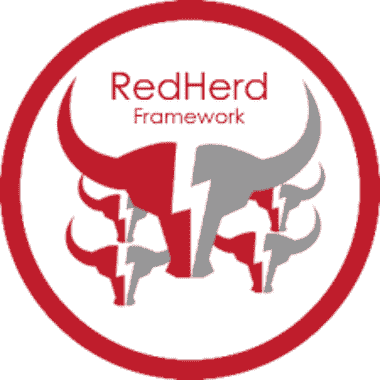
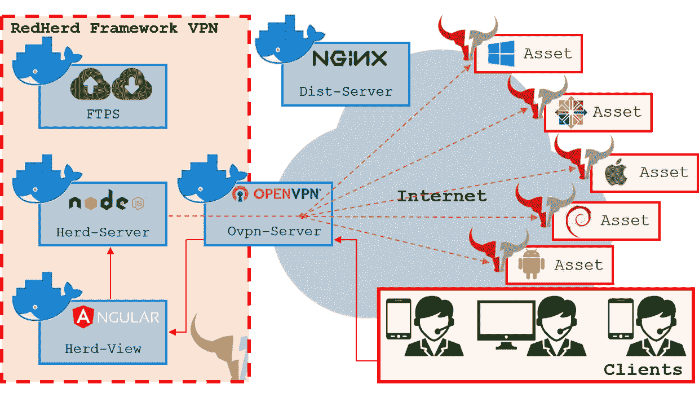
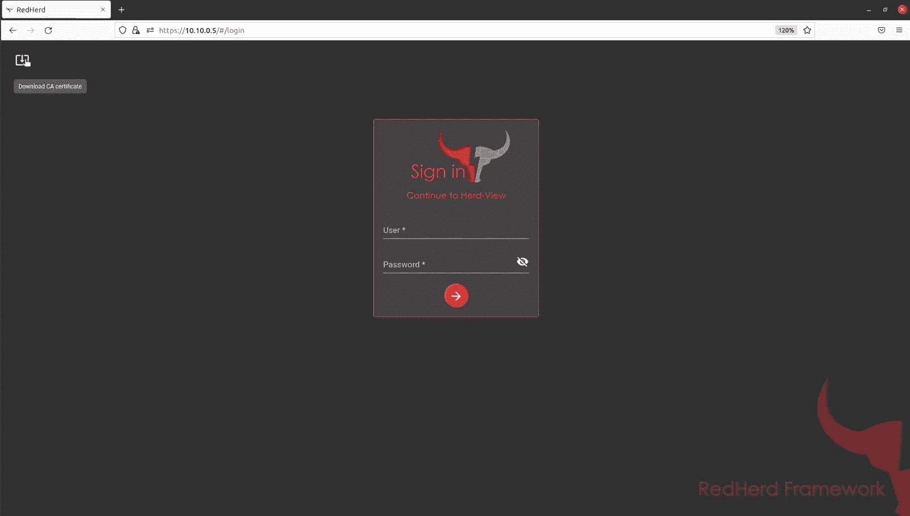
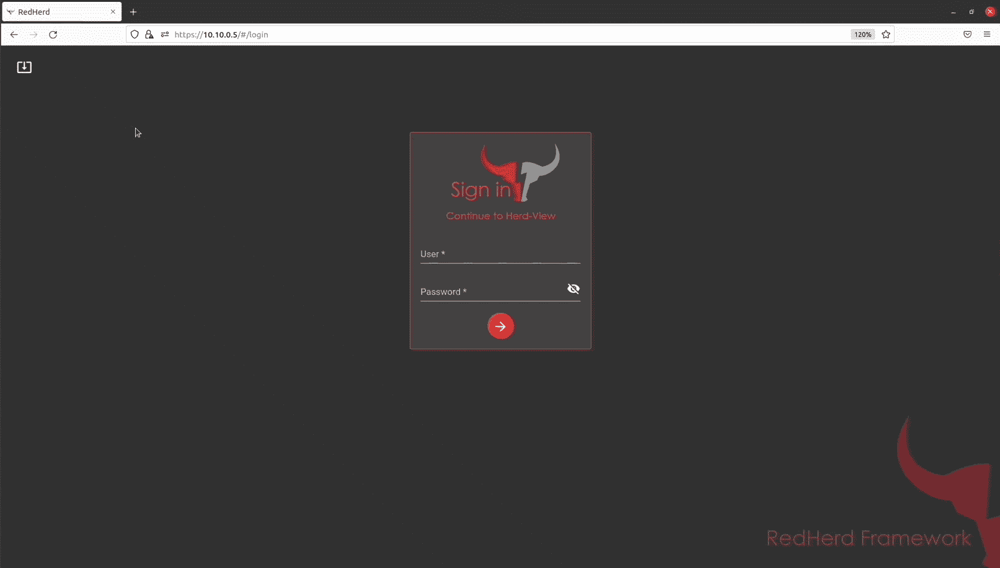

# Redherd 框架:一个协作的、无服务器的框架，用于编排地理上分布的资产组

> 原文：<https://kalilinuxtutorials.com/redherd-framework/>

Redherd Framework 是一个协作和无服务器的框架，用于协调地理上分布的一组资产，能够进行模拟复杂的进攻性网络空间作战的 T2。

该框架利用“即服务”范式，通过可靠地再现红蓝团队可以相互挑战的真实网络空间场景，部署一个可用于有效培训目的的现成基础设施。由于采用了开放标准和广泛传播的开源软件组件，RedHerd 完全符合开放系统架构设计模式。

**术语**

| 名字 | 描述 |
| --- | --- |
| `**asset**` | 可以编排的多平台设备(**`Windows``Debian-like``RHEL-like``MacOS``Androi`**`d`)。 |
| `**client**` | 操作员用来与 RedHerd 组件交互的设备。 |
| `m**odule**` | 可由资产执行的任务的代码实现。 |
| `**process**` | 模块的动态实例。 |
| `**task**` | 运算符意图的抽象表示。 |
| `**topic**` | 一组具有共同目的的模块(例如端口扫描、Wi-Fi 等)。 |

**架构**

RedHerd 使用了一些专门的 Docker 容器，以便将许多社区知名的开源产品与一个定制的应用层集成起来，实现互操作性。这些容器被设计成分隔特征，并在需要时允许水平缩放。所描述的架构通过允许在资产设置过程期间最小化用户交互来提供高级别的自动化，并且通过设计由授予操作安全性(OPSEC)的虚拟专用网络(VPN)来限制。

RedHerd 框架的主要元素如下:

*   **资产**:可编排执行网络作战的多平台设备( **`Windows`、`D`、**、`ebian-like`、`RHEL-like`、`MacOS`、`Android`)；
*   **Herd-Server** :框架的 Node.js 核心，负责与资产交互。借助一套扩展的应用编程接口(API ),它接收并多路传输来自运营商的所有输入，并通过套接字发送从资产接收的输出。IO 通道；
*   **文件服务器**:基于 FTPS 的服务器，允许在操作员和资产之间进行安全的文件传输；
*   **OVPN 服务器**:与框架交互的所有实体的 OpenVPN 网关；
*   **Distribution-Server**:VPN edge 之外唯一可公开访问的组件，它代表一个 Nginx web 服务器，该服务器在认证之后分发试图加入框架的实体所需的所有配置文件；
*   **Herd-View** :一个用 Angular 编写的渐进式 Web 应用程序(PWA)，它提供了一个用户友好的界面来实时监控和分配所有资产；
*   **客户端**:操作员用来与框架组件交互的设备。

最后但同样重要的是， **Herd-CLI** 表示用于管理整个框架的管理应用程序。

**特性**

RedHerd 有几个压倒性的特性，这些特性使它具有强大的编排能力:

*   **直观界面**:通过群体视图提供直观的网络应用程序，方便与资产互动；
*   **多平台**:能够协调多种设备，提供不同操作系统(`**Windows**` **、`Debian-like`、`RHEL-like`、`MacOS`、`Android`** )的加入和任务处理程序；
*   **多用户**:支持多用户协作。团队合作已经成为有效运作的关键。与此相关，加入 RedHerd 许多用户可以分配相同的资产或独立操作；
*   **无代理**:克服了本地代理等待任务完成的需求。具体来说，在任务预热期间，Herd-Server 接收到一个资产的作业，并启动与它的 SSH 连接。随后，它专门化并执行达到预期结果所需的命令集，允许轻量级的计算工作资产端；
*   **易于部署**:它是跨平台的，既可以在本地部署，也可以在基于云的环境中部署。为了实现这一特性，bash 脚本被提议在基于 Debian 的发行版上自动化框架部署过程。考虑到使用 docker 支持的容器化的设计选择，可以很容易地开发一个等价的脚本，允许 RedHerd 在不同的操作系统上托管；
*   **易于扩展**:它提供了开发者就绪的 JavaScript 规范，通过编写定制模块和完成无数任务，提供了一种扩展产品功能的简单方法；
*   **模块热更新**:可以动态添加、删除和更新模块。不需要框架重启或新的部署；
*   **API 驱动**:它由一组广泛的 REST API 驱动，使第三方应用程序能够轻松地与框架特性交互并利用这些特性。

**设置::介绍**

整个解决方案是跨平台的，可以在本地和基于云的环境中部署。发布的实现集中在本地和远程测试的`**Debian**`主机上。

**系统要求**

以下是主机的一些推荐和测试规格:

*   Ubuntu >= 18.04
*   8+ GB 内存
*   50 多 GB 硬盘
*   2 个以上的 CPU

**获取**

第一步是从官方 GitHub `**repository**`获得最新版本的框架克隆:

**$ git 克隆 https://github.com/redherd-project/redherd-framework.git**

**展开**

第二步包括在主机上部署 RedHerd。它可以通过运行专门开发的`**deploy.sh**` bash 脚本来执行，该脚本在基于 Debian 的设备上实现了一个手动触发但完全自动化的过程。

**选择公共接口**

选择所有 **`assets` / `clients`** 将连接的外部 IP 地址:

**$ ip a 1: lo: < LOOPBACK，UP，LOWER _ UP>MTU 65536 q disc no queue 状态未知组默认 qlen 1000 link/LOOPBACK 00:00:00:00:00:00:00:00 inet 127 . 0 . 0 . 1/8 作用域主机 lo 有效 _lft 永远首选 _lft 永远 inet6 ::1/128 作用域主机有效 _lft 永远首选 _lft**

**安装对接器**

在进一步介绍之前，需要安装 Docker 来部署和启动 RedHerd 框架:

**$ cd 红牛-框架$ sudo。/red herd-framework/utils/install _ docker . sh**

**启动部署脚本**

使用下面提供的命令行，部署脚本将初始化数据库(`**-db**`)，生成认证机构(CA) ( `**-ca**`)、SSH 密钥(`**-k**`)、凭证(`**-u**`)和 10 个(`**-a 10**`)端点( **`assets` / `clients`** )的 OpenVPN 配置。您最多可以加入`**256**`个端点的框架。

**$ cd 红牛-框架
$ sudo。/deploy . sh-s 172 . 23 . 163 . 163-d b-ca-k-u-a 10**

*   *** *(
    * *(
    * *(*(* (*(
    )]init db:true
    [！]生成 ca:true
    [！]生成确:真〔t35〕[！]生成关键点:true
    [！]生成用户:true
    [！]公共主机名:172.23.163.163
    [！]资产计数:10
    [！]VPN net cid:10 . 11 . 0 . 0/16
    [！]坞站 OVPNSRV 名称:ovpnsrv
    [！]坞站 OVPNSRV 地址:10.10.0.2
    [！]坞站 HERDSRV 名称:herdsrv
    [！]坞站 HERDSRV 地址:10.10.0.3
    [！]坞站 herdvview 名称:herdvview
    [！]坞站 herdview 地址:10.10.0.5
    [！]FTP SRV 坞站名称:ftpsrv
    [！ftpsrv 坞站地址:10.10.0.4
    [！]对接器 DSTRSRV 名称:dstrsrv
    是否继续？[y/N]: y***

**检查框架状态**

部署程序完成后，检查所有对接设备是否启动并运行:

**$ sudo docker PS CONTAINER ID IMAGE 命令创建的状态端口名称 07839 fcaec 7 e dstr SRV:latest "/docker-entry point。……”大约一分钟前 Up 大约一分钟 80/tcp，0.0.0:8443- > 443/tcp，::::8443->443/TCP dstr SRV 48 beb 5 CB 7 EB 8 herdview:latest "/docker-entry point。…“大约一分钟前向上大约一分钟 80/TCP herdview F3 FEC 616 f 317 FTP SRV:latest "/bin/sh-c '/run . sh…”4 分钟前向上 4 分钟 21/tcp，30000-30009/TCP FTP SRV e 12362 fa 5d ca herd SRV:latest " docker-entry point . s…”4 分钟前向上 4 分钟 3000-3001/TCP herd SRV 4b 5 Fe 466**

**初始化**

最后，为了初始化框架，必须生成第一个用户，也就是**系统用户**:

$ sudo herd-cli user -a firstuser 新用户密码:[-]尝试创建新用户[！]操作成功完成

**框架管理::简介**

本节深入介绍了如何全面管理框架部署过程及其所有特性。

**摧毁**

部署脚本也可用于关闭框架:

**$须藤。/deploy.sh -d**

*   **#
    * *(
    * *((#
    * #(#*((((((#(((
    )((((((((((((((#
    )*)((((((((((((* )* *((((((((
    *)(((((((((#(

    )T8。 * * * *((| _ |*|*|*/| | | _ |*/
    * * *(#
    * * *(((
    [*] Docker 环境清理
    ovpnsrv
    未标记:ovpnsrv:最新
    已删除:sha 256:91e 78 a2 D4 ce 5 FB 45970d 261909 f 113d 0062109702 f 8 EC 0 EC 757 B2 a 7858 ff 5d 23
    已删除:sha 256:5693 be 9 DC 0 DC 0 c0 0 ECF 136 f 37475 a 4 b 9 ADF 31 c0a 72899 sha 256:ECF 85 fbbcde 4 f 995 c 90 ad 19 b 7 da 82314 FD 0 BC ACF 8 BC 085 c 296 e 7 DBA 33 EDF 7551
    已删除:sha 256:96797 af 7230236 Fe 1 aee 96 e 3 bea 3 ad 38453 c 277 f 36 c 8 a 298d 4 ECC 27 CB 1892 eee
    已删除:sha 256:693 d0 d75**

脚本完成后，您可以验证没有 RedHerd dockers 启动:

**$ sudo docker ps 容器 ID 映像命令创建的状态端口名称**

**快速部署**

选择所有 **`assets` / `clients`** 将连接的外部 IP 地址:

**$ IP a
1:lo:MTU 65536 qdisc no queue 状态未知组默认 qlen 1000
link/loopback 00:00:00:00:00:00 brd 00:00:00:00:00:00
inet 127 . 0 . 0 . 1/8 作用域主机 lo
valid _ lft forever preferred _ lft forever
inet 6::1/128 作用域主机
valid _ valid**

部署所需数量的 **`assets` / `client`** (例如`**-a 10**`)的框架:

**$ cd 红牛-框架
$ sudo。172.23.163.163 -a 10**

*   *** *(
    * *(
    * *)(*((* (*(
    )] INIT DB: FALSE
    [！]生成 CA: FALSE
    [！]生成确:假〔t35〕[！]生成密钥:false
    [！]生成用户:FALSE
    [！]公共主机名:172.23.163.163
    [！]资产计数:10
    [！]VPN net cid:10 . 11 . 0 . 0/16
    [！]坞站 OVPNSRV 名称:ovpnsrv
    [！]坞站 OVPNSRV 地址:10.10.0.2
    [！]坞站 HERDSRV 名称:herdsrv
    [！]坞站 HERDSRV 地址:10.10.0.3
    [！]坞站 herdvview 名称:herdvview
    [！]坞站 herdview 地址:10.10.0.5
    [！]FTP SRV 坞站名称:ftpsrv
    [！ftpsrv 坞站地址:10.10.0.4
    [！]对接器 DSTRSRV 名称:dstrsrv
    是否继续？[y/N]: y***

**数据库重新初始化**

部署框架并重新初始化本地数据库:

**$ cd 红牛-框架
$ sudo。/deploy.sh -s 172.23.163.163 -a 十分贝**

*   *** *(
    * *(
    * *)(*((* (*(
    )]init db:true
    [！]生成 CA: FALSE
    [！]生成确:假〔t35〕[！]生成密钥:false
    [！]生成用户:FALSE
    [！]公共主机名:172.23.163.163
    [！]资产计数:10
    [！]VPN net cid:10 . 11 . 0 . 0/16
    [！]坞站 OVPNSRV 名称:ovpnsrv
    [！]坞站 OVPNSRV 地址:10.10.0.2
    [！]坞站 HERDSRV 名称:herdsrv
    [！]坞站 HERDSRV 地址:10.10.0.3
    [！]坞站 herdvview 名称:herdvview
    [！]坞站 herdview 地址:10.10.0.5
    [！]FTP SRV 坞站名称:ftpsrv
    [！ftpsrv 坞站地址:10.10.0.4
    [！]对接器 DSTRSRV 名称:dstrsrv
    是否继续？[y/N]: y***

**认证机构再生**

部署框架并重新生成证书颁发机构:

**$ cd 红牛-框架
$ sudo。/deploy . sh-s 172 . 23 . 163 . 163-a10-ca**

*   *** *(
    * *(
    * *)(*((* (*(
    )] INIT DB: FALSE
    [！]生成 ca:true
    [！]生成确:真〔t35〕[！]生成密钥:false
    [！]生成用户:FALSE
    [！]公共主机名:172.23.163.163
    [！]资产计数:10
    [！]VPN net cid:10 . 11 . 0 . 0/16
    [！]坞站 OVPNSRV 名称:ovpnsrv
    [！]坞站 OVPNSRV 地址:10.10.0.2
    [！]坞站 HERDSRV 名称:herdsrv
    [！]坞站 HERDSRV 地址:10.10.0.3
    [！]坞站 herdvview 名称:herdvview
    [！]坞站 herdview 地址:10.10.0.5
    [！]FTP SRV 坞站名称:ftpsrv
    [！ftpsrv 坞站地址:10.10.0.4
    [！]对接器 DSTRSRV 名称:dstrsrv
    是否继续？[y/N]: y***

**分发服务器凭证重新生成**

部署框架并重新生成与分发服务器相关的所有凭据:

**$ cd 红牛-框架
$ sudo。/deploy . sh-s 172 . 23 . 163 . 163-a10-u**

*   *** *(
    * *(
    * *)(*((* (*(
    )] INIT DB: FALSE
    [！]生成 CA: FALSE
    [！]生成确:假〔t35〕[！]生成密钥:false
    [！]生成用户:true
    [！]公共主机名:172.23.163.163
    [！]资产计数:10
    [！]VPN net cid:10 . 11 . 0 . 0/16
    [！]坞站 OVPNSRV 名称:ovpnsrv
    [！]坞站 OVPNSRV 地址:10.10.0.2
    [！]坞站 HERDSRV 名称:herdsrv
    [！]坞站 HERDSRV 地址:10.10.0.3
    [！]坞站 herdvview 名称:herdvview
    [！]坞站 herdview 地址:10.10.0.5
    [！]FTP SRV 坞站名称:ftpsrv
    [！ftpsrv 坞站地址:10.10.0.4
    [！]对接员 DSTRSRV 名称:dstrsrv
    账号***裸？[y/N]: y

**客户管理::简介**

至于资产，也为客户，我们试图提供高灵活性和减少互动。同样，一行脚本与分发服务器交互，下载与用户相关的`**OpenVPN**`配置文件，并启动 VPN 加密通道。

**码头工人**

文档化的客户案例是最简单的。Herd-CLI 在本地提供的一行程序创建了一个 Ubuntu 容器，该容器连接基础设施并允许主机充当客户端:

**$ herd-cli 端点-s 172.23.16.16 -o docker -m 客户端-i 1**

*   *** *(
    * *(
    * *(*(* (*(
    ) * * * *(| _ |*|*/| | |*/
    * * *(#命令行界面
    * * * sudo 坞站运行-d–RM–cap–add = net _ admin–device/dev/net/tun-e dstrsrv _ public _ address = " 172 . 23 . 16 . 16 ")**

Debian

只需要在 Debian 主机上运行 Herd-CLI 命令行程序:

**$ herd-CLI endpoint-s 172 . 23 . 16 . 16-o debian-m client-I 1**

*   *** *(
    * *(
    * *)(*((* (*(
    ) * * * *(| _ |*|*/| | |*/
    * * *(#命令行界面
    * * * sudo bash-c "【apt 更新】& & apt 安装开放 vpn -y &) /redherd . ovpn&&/usr/sbin/openvpn。/redherd.ovpn**

**窗户**

下载并安装`**OpenVPN-Client**`，然后使用`**PowerShell**`命令行程序下载`**OpenVPN**`配置。

**$ herd-CLI endpoint-s 172 . 23 . 16 . 16-o windows-m client-I 1**

*   **#
    * *(
    * *((#
    * #(#*((((((#(((
    )((((((((((((((#
    )*)((((((((((((* )* *((((((((
    *)(((((((((#(

    )T8。ServicePointManager]::ServerCertificateValidationCallback = { $ true }；$webclient =新对象系统。Net . WebClient$basic = [System。convert]::to base 64 string([System。编码]::ASCII。GetBytes(" hyxqpoox 41 "+":"+" l 9t cuv 6 gkudbytcyt 2 fyecktde 578 cs 1 ")；$webclient。headers[" Authorization "]= " Basic "；
    $webclient。download file(" https://172 . 23 . 16 . 16:8443/f 6865 D8 c 51 bb 7 a1 ba 155 bdfbeb3 f 686 e/config . ovpn "，" red herd . ovpn ")
    }；powershell-EP bypass-nop-c $ block
    [！]使用下载的 redherd.ovpn 配置文件手动运行 OpenVPN****

**安卓**

下载并安装`**OpenVPN-Client**`，然后从提供的链接下载`**OpenVPN**`配置

**$ herd-CLI endpoint-s 172 . 23 . 16 . 16-o Android-m client-I 1**

*   *** *(
    * *(**
    *** *(*(*(【T9]手动下载 OpenVPN 配置文件:
    [！]URL:https://172 . 23 . 16 . 16:8443/f 6865 D8 C51 bb 7 a1 ba 155 bdfbeb 3 f 686 e/config . ovpn
    [！]用户名:hyxqoox 41
    [！]密码:L9 tcuv 6 gkkudbytcyt 2 fyecktde 578 CS1**

**苹果电脑**

下载并安装`**OpenVPN-Client**`，然后使用`**Zsh**`一行程序下载`**OpenVPN**`配置。

**$ herd-CLI endpoint-s 172 . 23 . 16 . 16-o MAC OS-m client-I 1**

*   *(T2)*(T3)*** *(*(****(* ((
    (
    (*) |*****| |***********/| \ * * * *(|******| >。 /redherd.ovpn
    [！]使用下载的软件手动运行 openvpn】配置文件*

**群体浏览访问**

成功加入框架 VPN 后，使用浏览器并访问 URL `**https://10.10.0.5**`连接到 Herd-View，然后点击左上角的按钮下载 RedHerd Certification Authority 证书并将其安装到您的系统中。或者，您可以直接从 **`https://10.10.0.3:3000/ca.crt`获得此证书。**

一旦证书被信任，就可以用您的用户凭据填充登录页面。h

**资产管理::简介**

特别相关的一个方面是资产设置和加入程序。这个特性的实现由两个设计驱动因素决定:高**灵活性**和**低用户交互**。前一个特征是必需的，以便提供与不同操作系统的显著兼容性，而后一个特征是最大限度地减少故障和减少向 RedHerd 添加新资产所需的技能的基础。结果是一个手动触发但完全自动化的过程，只涉及执行一个`**one-line**`脚本，该脚本对于每个兼容平台都是不同的:`**Bash**`用于 Android 和 Linux，`**PowerShell**`用于 Windows，`**Zsh**`用于 MacOS。

这个一行程序与分发服务器交互，充当下载完整安装脚本和相关的`**OpenVPN**`配置文件的下载程序。第二阶段完全配置设备，以满足框架要求，即依赖性管理、证书信任、防火墙和 SSH 守护程序设置。然后，启动 VPN 连接，使用 API 与 Herd-Server 进行交互，并将新资产插入框架数据库。在这一点上，资产实际上是框架的一部分，因此它完全可以被操作者访问。

**码头工人**

**添加**

**$ herd-CLI endpoint-s 172 . 23 . 16 . 16-o docker-m install-I 2**

*   #
    * *(
    ****((#
    * #(#*((((((#((
    】(((((((((((((((#
    )*((((((((((* )* *((((((((((
    *)(((((((((()
    【T12。 * * * *((| _ |**|*/| | | _ |*/
    * * *(#命令行界面
    * * *((
    sudo docker run-d–RM–cap-add = NET _ ADMIN–device/dev/NET/tun-e DSTRSRV _ PUBLIC _ ADDRESS = " 172 . 23 . 16 . 16 "- e USERNAME = " 78 l8 zubjpm "-e PASSWORD = " 2g hduwvv**

**移除**

**$ herd-CLI endpoint-s 172 . 23 . 16 . 16-o dock**e**r-m remove-I 2**

*   **#
    * *(
    * *((#
    * #(#*((((((#(((
    )((((((((((((((#
    )*)((((((((((* )* *((((((((
    *)(((((((((#(

    )T8。****

Debian

**添加**

**$ herd-CLI endpoint-s 172 . 23 . 16 . 16-o debian-m install-I 2 **#** *((*#** * **#(#** * * *(((((((*#(((((** * * * * * * * * * * * * * * * * *(((((((((((((((((((((((((((()((((((((((((((((【T11))。 * * * *((| \ _ | _ _ _ _ _ _ | _ _ _ _ _ _ _/| | _ _ _ _ _ _ | \ _ | _ _ _ _ _ _/* * *((*#命令行界面** * *((sudo bash-c " curl-k-u 78 l8 zubjpm:2g hduwvzxtbn 18 leivo ev 4 umhgv 0 rury https://172 . 23 . 16 . 16:8443/50f 3331 a 80894d 85 bcda 8 C4 b 400**

**移除**

**$ herd-CLI endpoint-s 172 . 23 . 16 . 16-o debian-m remove-I 2**

*   * *(
    * *(
    *** *(*(****(*(
    ((() |***| |*********/| \ * * * *(|******| >。

**厘斯**

**添加**

$ herd-CLI endpoint-s 172 . 23 . 16 . 16-o centos-m install-I 2

*   *(t1)*(T2)*** *(*(****(*(
    ((() |***| |*********/| \ * * * *(|******| >。

**移除**

**$ herd-CLI endpoint-s 172 . 23 . 16 . 16-o centos-m remove-I 2**

*   *** *(
    * *(
    * *)(*((* (*(
    ) * * * *(| _ |*|*/| | |*/
    * * *(#命令行界面
    * * * sudo bash-c " curl-k-u78l 8 zujpm:2 ghduzxtbn 18 leivoev 4 umhgv 0 rural http://172 . 23**

**窗户**

**添加**

**$ herd-CLI endpoint-s 172 . 23 . 16 . 16-o windows-m install-I 2**

*   **#
    * *(
    * *((#
    * #(#*((((((#(((
    )((((((((((((((#
    )*)((((((((((((* )* *((((((((
    *)(((((((((#(

    )T8。ServicePointManager]::ServerCertificateValidationCallback = { $ true }；$webclient =新对象系统。Net . WebClient$basic = [System。convert]::to base 64 string([System。编码]::ASCII。GetBytes(" 78 l 8 zubjpm "+":"+" 2g hduwvzxtbn 18 leivoev 4 umhgv 0 rury "))；$webclient。headers[" Authorization "]= " Basic "；
    $webclient。download file(" https://172 . 23 . 16 . 16:8443/50f 3331 a 80894d 85 bcda 8 C4 b404 a 919 c/windows _ asset _ setup . PS m1 "，" script.psm1")
    导入-模块。\ script.psm1 添加-资产；移除-项目。\ script.psm1
    }；powershell-EP bypass-nop-c $ bloc****

**移除**

**$ herd-CLI endpoint-s 172 . 23 . 16 . 16-o windows-m remove-I 2**

*   # *** *((#
    * *((#
    * #(#*((((((#((((* )(((((((((((#
    *)(((((((((((#* )* *((((((((
    *((((((#(
    【T12。ServicePointManager]::ServerCertificateValidationCallback = { $ true }；$webclient =新对象系统。Net . WebClient$basic = [System。convert]::to base 64 string([System。编码]::ASCII。GetBytes(" 78 l 8 zubjpm "+":"+" 2g hduwvzxtbn 18 leivoev 4 umhgv 0 rury "))；$webclient。headers[" Authorization "]= " Basic "；
    $webclient。download file(" https://172 . 23 . 16 . 16:8443/50f 3331 a 80894d 85 bcda 8 C4 b404 a 919 c/windows _ asset _ setup . PS m1 "，" script.psm1")
    导入-模块。\ script.psm1 移除-资产；移除-项目。\ script.psm1
    }；powershell-EP bypass-nop-c $ block***

**资产禁令**

在 RedHerd 框架的生命周期中，由于*绑架*或简单的管理原因，一些资产可能不得不被排除在运营网络之外。这种情况可能主要涉及两个行动:**全面资产禁令**和**单一资产禁令**。

**全面资产禁令**

在这种情况下最快的方法是`**regenerate**`red herd 认证机构，这个动作切断了当代的所有资产。

**单一资产禁令**

在这种情况下，Herd-CLI 提供了一个管理命令，允许撤销分配给特定资产的 VPN 证书。该命令是*资产*领域的一部分，需要资产名称。

**$ sudo herd-CLI asset-b vvdndduugjb[-]试图吊销客户端证书[** ！]证书已成功吊销

[**Download**](https://github.com/redherd-project/redherd-framework)