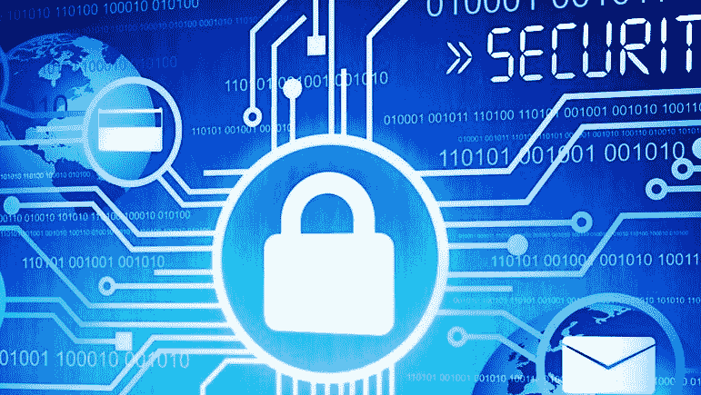

# 学生网络安全

> 原文：<https://kalilinuxtutorials.com/cybersecurity-for-students/>

随着技术成为学生生活中如此重要的一部分，令人担忧的是有多少学生忽视或不关注网络安全威胁。有时候，在可靠的服务机构寻求一些论文帮助比在互联网的可疑网站上寻找你的作业信息更好。

因此，这里有一些基本的网络安全提示，所有学生(和非学生)必须知道，以保护自己！

## **使用授权软件**

记住，如果你使用的是偷来的软件，你永远无法确定它是安全的，因为你不知道是谁黑了它。另外，谁告诉你你软件的黑客只想在你身上赚钱一次？

## 小心使用免费无线网络

当然，在有免费 Wi-Fi 的咖啡馆里坐着工作也很方便。很舒服，而且不用付网费。但是承认吧，你有保证邻桌的访问者不监听同一个接入点？你把你的个人信息。怎么办？实际上有两种选择——使用移动互联网或使用 VPN(虚拟专用网络)。在这种情况下，发送和接收的信息将被加密，因此，入侵者很难窃听您的通信信道。

## **使用 HTTPS 网站**

学习要求学生每天在许多网站之间切换——但是你多久检查一次 URL 搜索栏呢？

请确保您访问的每个网站都使用 HTTPS(安全 HTTP，地址栏有一个挂锁)而不是普通的老式 HTTP。

大多数接受调查的学生不知道 HTTPS 和 HTTP 的区别。

幸运的是，如果一个不安全的网页要求输入密码或其他个人信息，大多数浏览器会警告您不要输入，因为不安全的网络流量中的数据在互联网上传输时很容易被跟踪。

但是，重要的是您自己知道 HTTPS 和 HTTP 之间的区别，以确保所有的通信都被加密，防止在您的浏览器和您访问的网站之间传输时被拦截。

当你在作业中需要帮助时，可以在 reddit 上随意寻找一些好的服务，因为你可以在去网站将你的数据置于危险之前阅读[客户反馈](https://www.reddit.com/r/CertifiedWriters/comments/qmgel7/best_essay_writing_services_reddit/)。

## **警告-网络钓鱼**

大学生每天都会定期收到许多电子邮件，内容包括讲座、研讨会、时事通讯、学生会活动以及其他与大学相关的信息。

尽管电子邮件泛滥，但你需要保持警惕，仔细阅读电子邮件，尤其是如果它们要求你在电脑上做一些事情，如点击链接、下载文件、安装新应用程序或更改系统设置。

为了防止网络钓鱼，确保发件人确实是他们所说的那个人是很重要的。

如果你不小心，你可能最终会暴露本应保密的信息和细节，包括信用卡号、身份证件的细节，如你的驾照或护照，或者你的家庭住址。

当涉及到个人信息时，使用“当有疑问时，不要打开它”的口头禅。

## **锁定你的电脑**

许多学生利用图书馆学习，但即使在图书馆里也有许多令人分心的事情。

如果你在离开无人看管的电脑前没有“费心”注销或锁定电脑，离开你的笔记本电脑两分钟去自动售货机可能会有潜在的危险。

虽然不太可能有人会躲起来等你把账户开着，可以用一段时间，但放心总比后悔好。

与其让别人弄乱你的设置，查看你的文件，或者安装一些会窥探你的恶意应用程序，不如花几秒钟解锁你的屏幕或者重新登录。

令人担忧的是，接受调查的 15 名学生中只有 3 人表示，当他们把笔记本电脑留在图书馆无人看管时，他们会注销自己的账户或锁定系统。

不要依赖“自动锁定”，因为在你离开笔记本电脑后，通常至少需要两分钟才能触发。在 Windows 上使用 Windows+L 或在 Mac 上使用 Control+Command+Q。

## **给自己找一个好的密码管理员**

令人惊讶的是，许多学生表示他们不使用密码管理器。

当您需要记住很多密码时，很容易养成为每个帐户使用相同(或至少非常相似)密码的习惯。

换句话说，如果你的一个账户被黑了，黑它的人会立即知道如何登录你所有其他的账户。

密码管理器会自动为每个帐户选择并记住一个强密码。

它还有助于防止密码被意外发布到冒名顶替的站点(这就是上面描述的“网络钓鱼”)，因为密码管理器为每个帐户保留了正确网页的记录。

只要记住为密码管理器本身选择一个真正强的密码！

## **最后一件事！不要忘记定期更新您的操作系统和应用程序**

使用这些简单的网络安全提示将有助于您保护自己的个人帐户和个人数据！确保你所有的家人和朋友都知道这件事。如果需要的话，为他们准备一个杀手级的演讲，以防止他们把所有的数据交给黑客。