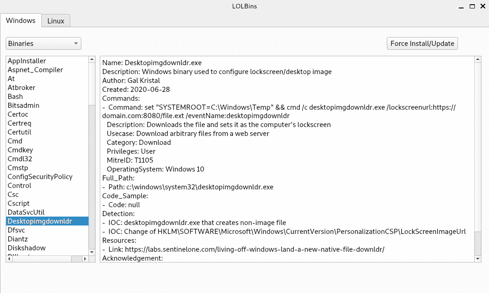
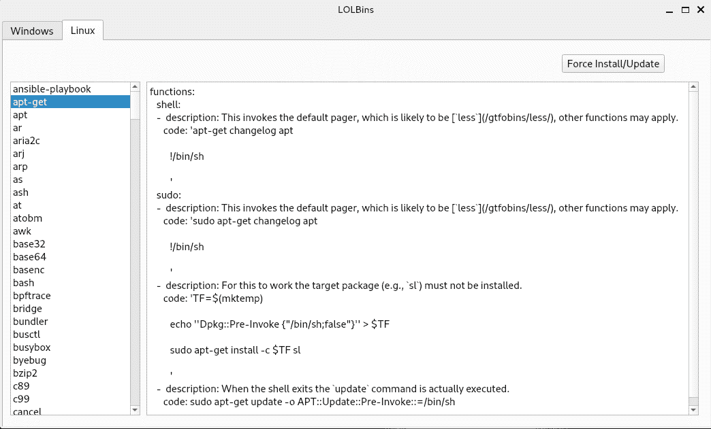

# LOLBins:用于 LOLBAS 和 GTFOBins 的 PyQT5 应用程序

> 原文：<https://kalilinuxtutorials.com/lolbins-2/>

LOLBins 是一个 PyQT 应用程序，列出了 LOLBAS 和 Unix 二进制文件中的所有生活在陆地上的二进制文件和 Windows 脚本，它们可以用来绕过 GTFOBins 错误配置的系统中的本地安全限制。

*Windows*

*Linux*

[**Download**](https://github.com/Hamza-Megahed/LOLBins)