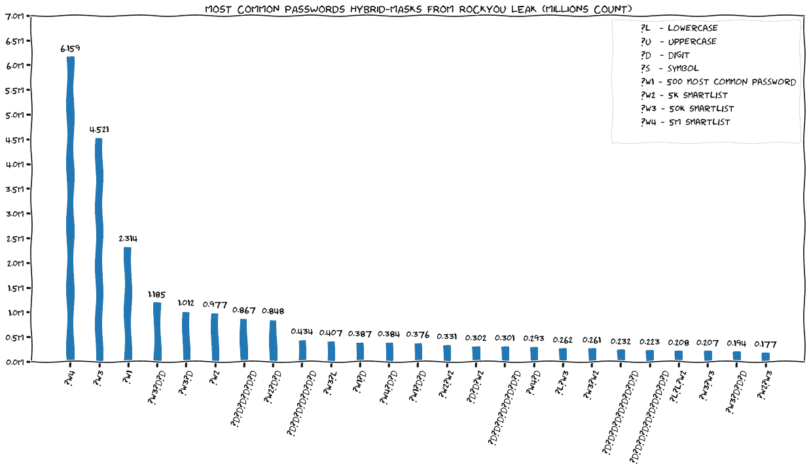

# Cracken:一个快速的密码单词列表生成器，智能列表创建和密码混合掩码分析工具

> 原文：<https://kalilinuxtutorials.com/cracken/>

Cracken 是一个快速的密码单词列表生成器，智能列表创建和密码混合掩码分析工具，用纯安全的 Rust 编写(更多关于 talk/)。受 maskprocessor、hashcat、Crunch 和 HuggingFace 的 tokenizers 等伟大工具的启发。

**什么？为什么？Woot？？**

在 DeepSec2021 大会上，我们提出了一种新的方法，通过利用 NLP 标记化器(更多信息请访问 talk/)利用密码中的公共子串，将密码作为混合掩码进行分析。

我们的方法将密码分成子字，而不仅仅是字符掩码。`**HelloWorld123!**`拆分为`**['Hello', 'World', '123!']**`，因为这三个子字在其他密码中非常常见。

**混合遮罩&智能列表**

*   **智能列表**–压缩&通过利用 NLP 记号化器从密码创建的代表性子词列表
*   **混合掩码**–将密码表示为单词列表&字符的组合(如`**?w1?w2?l?d**`)

#### 使用智能列表分析 RockYou 密码&混合掩码:

**Cracken 用于**

*   ✅生成 **`Hybrid-Masks`** 非常非常快(参见性能部分)
*   ✅大厦**`Smartlists`**–压缩&来自给定密码文件的子词代表列表(使用 HuggingFace 的分词器)
*   ✅为他们的`**Hybrid-Masks**`分析密码–为更好的密码候选人建立统计数据(同样非常快)

**带 Cracken 的可能工作流程**

**简单的**

1.  从混合掩码生成候选单词列表–例如`**cracken -w rockyou.txt -w 100-most-common.txt '?w1?w2?d?d?d?d?s'**`
2.  您可以将 Cracken 生成的密码导入 **`hashcat`、`john`** 或您喜欢的密码破解程序

**高级**

1.  从现有密码创建智能列表-`**cracken create**`
2.  分析明文密码的密码列表–`**cracken entropy**`
3.  使用最常用的`**Hybrid-Masks**`快速生成候选密码—`**cracken generate -i hybrid-masks.txt**`

更多细节见用法部分

**入门**

**下载(目前仅限 Linux):**最新版本

*更多安装选项见`**installation**`章节*

**运行 Cracken:**

生成长度为 8 的所有单词，以大写字母开头，后跟 6 个小写字符，然后是一个数字:

**饼干-o pwdz .是吗？-u？l 吗？l 吗？l 吗？l 吗？l 吗？l 吗？d′t1″**

从带有年份后缀的两个单词列表中生成单词(1000-2999) `**<firstname><lastname><year>**`

**$ cracken–word list first names . txt–word list last names . lst–charset ' 12 '？w1？w2？1?d？d？d'**

从 rockyou.txt 中提取的子词创建一个大小为 50k 的智能列表

**$ cracken create-f rock you . txt-m 50000–smart list smart . lst**

估计密码 HelloWorld123 的混合掩码的熵！使用智能列表

$ cracken entropy-f smart . lst ' hello world 123！'
hybrid-min-split: ["hello "，" world1 "，" 2 "，" 3 "，"！"】
混血——面具:？w1？w1？d？d？s
混合最小熵:42.73
字符集掩码:？l？l？l？l？l？l？l？l？l？l？d？d？d？s
字符集掩码熵:61.97

**性能**

在撰写本文时，Cracken 可能是世界上最快的单词表生成器:

Cracken 的性能比 hashcat 用 c 编写的快速 mask 处理器提高了大约 25%。

Cracken 每个内核可以产生大约 2 GB/s 的速度。

关于基准测试的更多详细信息

为什么速度很重要？根据密码哈希函数，典型的 GPU 每秒可以测试数十亿个密码。当单词表生成器每秒产生的单词数少于破解工具能够处理的数量时，破解速度将会降低。

**混合-面具分析性能**

Cracken 使用`**A***`算法分析密码的速度非常快。它能以 **~100k 密码/秒** ( `**cracken entropy -f words1.txt -f words2.txt ... -p pwds.txt**`)的速度找到密码文件的最小混合掩码

**安装**

安装破解或从源代码编译

**下载二进制(目前仅 Linux】**

从版本[下载最新版本](https://github.com/shmuelamar/cracken/releases)

**从源代码构建(所有平台)**

Cracken 是用 Rust 编写的，需要 rustc 来编译。Cracken 应该支持所有信任支持的平台。

货物安装说明

有两种选择从源代码构建——从 crates.io 安装货物(首选)或从源代码手动编译。

**从板条箱安装。io(首选)**

**安装货物**

**$货物安装破解**

**从源代码构建**

**克隆克拉肯:**

**$ git 克隆 https://github.com/shmuelamar/cracken**

**建造裂缝:**

**$ CD cracken
$ cargo build–release**

**运行它:**

**$。/target/release/cracken–help**

用法信息

**$ Cracken–help
Cracken V 1 . 0 . 0–一个快速密码单词列表生成器
用法:
Cracken[子命令]
标志:
-h，–help 打印帮助信息
-V，–version 打印版本信息
子命令:
生成(默认)–根据给定的掩码和单词列表文件生成换行符
创建从输入文件创建新的智能列表
熵
计算密码的估计熵
密码的熵是密码的 log2(len(keyspace))。
有两种类型的键空间大小估计:
mask–每个字符的键空间(数字=10，小写=26…)。
混合——找到分成子词和字符集的最小分裂。
具体子命令帮助运行:cracken–help
示例用法:
生成子命令示例:
从 00000000 到 9999999 的所有数字
cracken？d？d？d？d？d？d？d？d
从 0 到 99999999 的所有数字
cracken -m 1？d？d？d？d？d？d？d？d
带 pwd 前缀的单词–pwd 0000 到 pwd9999
cracken pwd？d？d？d？d
所有长度为 8 的密码都以大写字母开头，然后是 6 个小写字母，然后是数字
cracken？u？l？l？l？l？l？l？d
同上，将输出写入 pwds.txt 而不是 stdout
cracken -o pwds.txt？u？l？l？l？l？l？l？d
自定义字符集–所有十六进制值
cracken-c 0123456789 abcdef’？1?1?1?1'
4 个自定义字符集–顺序决定了字符集的 id
cracken-c 01-c a B- c de-c ef '？1?2?3?4'
4 个小写字符，带 2000-2019 年后缀
cracken -c 01 '？l？l？l？l20？1?d'
以单词列表中的名字开头，后跟 4 个数字
cracken -w firstnames.txt '？w1？d？d？d？d'
以单词表中的名字开始，以单词表中的姓氏结束，以符号
cracken-w first names . txt-w last names . txt-c 结束！@#$' '?w1？w2？1'
多次重复单词列表并组合字符集
cracken-w verbs . txt-w noons . txt '？w1？w2？w1？w2？w2？d？d？d'
创建智能列表子命令示例:
从单个文件创建智能列表到 smart . txt
cracken Create-f rock you . txt–smart list smart . txt
使用多种标记化算法从多个文件创建智能列表
cracken Create-t bpe-t unigram-t word piece-f rock you . txt-f passwords . txt-f Wikipedia . txt–smart list smart . txt
创建最小子单词长度为 3、最大数字为的智能列表
用字符集掩码熵估计密码文件的熵(默认为混合)
cracken 熵–smart list vocab . txt-t charset-p passwords . txt
估计密码文件的熵
cracken 熵–smart list vocab . txt-p passwords . txt
cracken-v 1 . 0 . 0 Linux-x86 _ 64 编译器:rustc 1 . 56 . 1(59 eed 8 a2a 2021-11-01)**

**生成子命令使用信息**

**$ cracken generate–help
cracken–generate
(默认)–根据给定的掩码和词表文件生成换行符
用法:
cracken generate【标志】【选项】–masks-file
标志:
h，–help
打印帮助信息
s，–stats
打印该命令将生成的字数并退出
V，–version
打印版本信息
选项:
c，–自定义多达 9 个自定义字符集-？1 对？9.使用？1 在 mask 上为第一个 charset
i，–masks-file
一个文件，包含生成
x 的掩码，–maxlen
最大掩码长度从
m 开始，–minlen
最小掩码长度从
开始-o，–output-file
输出要写入单词列表的文件，默认为 stdout
-w，–word list……
文件名包含换行符(0xA)分隔的单词。注意:当前所有的单词表都被加载到内存中
ARGS:
要生成的单词表掩码。
可用的掩码有:
内置字符集:
？d 位数字:“0123456789”
？l–小写:" abcdefghijklmnopqrstuvwxyz "
？u-大写:" ABCDEFGHIJKLMNOPQRSTUVWXYZ "
？s 符号:"！\"#$% & '()*+，-。/:;< = >？
@[\]^_`{|}~？a–所有字符:？d +？l +？u +？s
？b–所有二进制值:(0-255)
自定义字符集？1 对？9:
？1–由–charset ' mychars '
单词表指定的第一个自定义字符集？w1 到？w9:
？w1–由单词表' my-wordlist.txt '指定的第一个单词表**

**创建智能列表子命令使用信息**

**$ cracken Create–help
cracken-Create
从输入文件创建一个新的智能列表
用法:
cracken create【标志】【选项】–file…–smart list
标志:
-h，–help 打印帮助信息
-q，–quiet 禁用打印进度条
-V，–version 打印版本信息
选项:
-f，–file…输入文件名，可以为多个文件指定多次
–min –min-word-len 过滤短于指定长度的单词
–numbers-max-size 过滤长于指定长度的数字(所有数字)
-o，–smartlist 输出 smart list 文件名
-t，–tokenizer…要使用的 tokenizer，可以指定多次。**
**bpe，unigram，word piece[默认值:bpe][可能值:bpe，unigram，wordpiece]
-m，–vocab-max-size 最大词汇量**

**熵子命令使用信息**

**$ cracken 熵–帮助
cracken 熵
计算密码或密码文件的估计熵。
密码的熵是密码的 log2(len(keyspace))。
有两种类型的键空间大小估计:
mask–每个字符的键空间(数字=10，小写=26…)。
混合——找到最小的子词和字符集划分。
用法:
cracken entropy[FLAGS][OPTIONS]–smartlist…
FLAGS:
-h，–help 打印帮助信息
-s，–summary 输出密码的熵摘要
-V，–version 打印版本信息
OPTIONS:
-t，–mask-type 要输出的掩码类型，其中一个:charsets(仅字符集)，hybrid(字符集+单词列表)[可能值:hybrid，charset]
-p，–passwords-file**

[**Download**](https://github.com/shmuelamar/cracken)