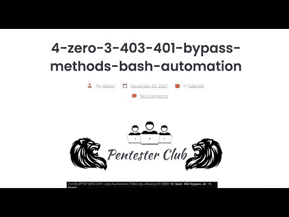
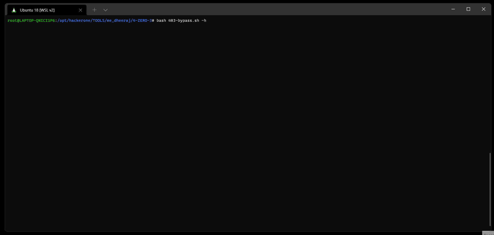
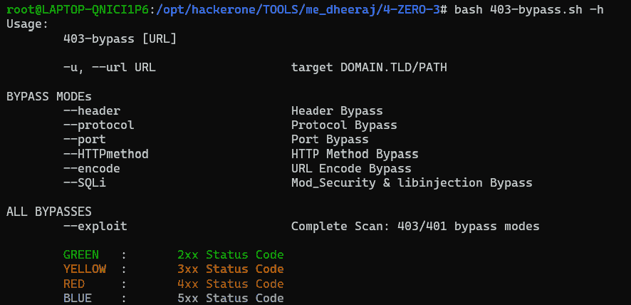

# 4-0-3:403/401 旁路方法+ Bash 自动化

> 原文：<https://kalilinuxtutorials.com/4-zero-3/>

**4-零-3** 工具绕过 403/401。这个脚本包含了所有可能的技术来做同样的事情。

*   **注意**:如果您看到多个[200 Ok]/旁路作为输出，您必须检查内容长度。如果多个[200 Ok]的内容长度相同，则绕过意味着误报。原因可以是“301/302”或“../【有效载荷】不要慌。
*   如果发现可能的旁路，脚本将打印`**cURL**`有效载荷。

**预览**

**帮助**

**root @ me _ dheeraj:$ bash 403-bypass . sh-h**

**用途/模式**

*   使用特定有效负载扫描:

[ `**--header**` ]支持基于报头的旁路/有效负载

**root @ me _ dheeraj:$ bash 403-bypass . sh-u https://target.com/secret–header**

[ `**--protocol**` ]支持基于协议的旁路/有效负载

root @ me _ dheeraj:$ bash 403-bypass . sh-u https://target.com/secret-协议

`**--port**` ]支持基于端口的旁路/有效负载

**root @ me _ dheeraj:$ bash 403-bypass . sh-u https://target.com/secret-port**

`**--HTTPmethod**` ]支持基于 HTTP 方法的旁路/有效负载

**root @ me _ dheeraj:$ bash 403-bypass . sh-u https://target.com/secret–http method**

[ `**--encode**` ]支持 URL 编码旁路/有效负载

root @ me _ dheeraj:$ bash 403-bypass . sh-u https://target.com/secret–编码

**`--SQLi`** ]支持 MySQL mod _ Security&libinject bypasses/payloads[* *新**]

root @ me _ dheeraj:$ bash 403-bypass . sh-u https://target.com/secret-SQLi

*   完整扫描终端的{包括所有漏洞/有效负载}[–漏洞]

**root @ me _ dheeraj:$ bash 403-bypass . sh-u https://target.com/secret-exploit**

[**Download**](https://github.com/Dheerajmadhukar/4-ZERO-3)