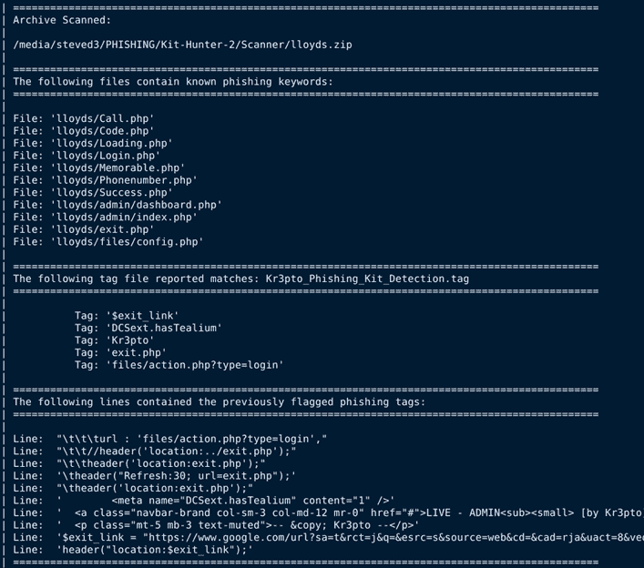

# Kit_Hunter:一个基本的钓鱼工具包扫描器，用于专用和半专用主机

> 原文：<https://kalilinuxtutorials.com/kit_hunter/>

**Kit_Hunter** 是一个学习 Python 的个人项目，也是一个基本的扫描工具，会根据已建立的标记搜索目录并定位钓鱼工具包。检测发生时，会为管理员生成一份报告。

默认情况下，该脚本将生成一个报告，显示被检测为有潜在问题的文件，列出指示它们有问题的标记(也称为标签)，然后显示发生检测的确切代码行。

**用途**

**帮助**

获得快速帮助:`**python3 kit_hunter_2.py -h**`

**默认扫描**

使用默认设置启动完全扫描:`**python3 kit_hunter_2.py**`

**快速扫描**

使用最小检测规则启动快速扫描:`**python3 kit_hunter_2.py -q**`

**自定义扫描**

启动自定义扫描:`**python3 kit_hunter_2.py -c**`

**注意:**当使用`**-c**`开关时，你必须将一个标签文件放在与 Kit Hunter 相同的位置。您可以随意命名这个文件，但是扩展名必须是`**.tag**`。请记住格式很重要。每行应该只有一个项目，没有空白。如果需要示例，您可以查看其他标记文件。

**目录选中扫描**

您可以使用`**-d**`开关选择要扫描的目录，从任何位置运行`**kit_hunter_2.py**`:

`**python3 kit_hunter_2.py -d /path/to/directory**`

然而，如果你把`**kit_hunter_2.py**`放在你的网络根目录上面的目录中(例如`**/www/**`或者 **`/public_html`** `/`)，从那里调用脚本会更容易。

最终报告将在被扫描的目录中生成。

在我的使用中，我从保存新钓鱼工具包的目录中调用工具包猎人。然后生成我的报告并保存到该文件夹中。然而，如果我调用 Kit Hunter 并使用`-d`开关扫描我的`**/PHISHING/Archive/**`文件夹，那么报告将保存到`**/PHISHING/Archive/**`。

**炮弹探测**

最新发布的 Kit Hunter 带有外壳检测功能。Shell 脚本通常与钓鱼工具包打包在一起，或者用于在 web 服务器上部署钓鱼工具包。Kit Hunter 将扫描一些常见的 shell 脚本元素。该过程的工作方式与常规扫描完全相同，只是使用`-s`开关调用外壳检测。这是一个独立的扫描，所以不能与其他类型一起运行。然而，您可以通过 shell 扫描来利用`**-m**`和`-l`标志。有关更多详细信息，请参见脚本的帮助部分。

扫描完成后，脚本的输出会将您指向保存的扫描报告的位置。

**标签文件**

谈到标记文件，v2.5.8 Kit Hunter 附带了 41 个标记文件。这些标记文件检测有针对性的网络钓鱼活动，以及各种类型的网络钓鱼伎俩，如混淆、模板化、主题化，甚至像 Kr3pto 和 Ex-Robotos 这样的品牌工具包。将添加新的标记文件，现有的标记文件将定期更新。有关详细信息，请参见变更日志。

与 1.0 版一样，标记文件越长，脚本读取它的时间就越长。

[Download](https://github.com/SteveD3/kit_hunter)