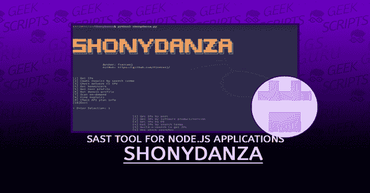

# ShonyDanza:一个可定制的、易于导航的工具，用于研究、笔测试和利用 Shodan 的力量进行防御

> 原文：<https://kalilinuxtutorials.com/shonydanza/>

ShonyDanza 是一个可定制的、易于导航的工具，用于研究、笔测试和借助 Shodan 的力量进行防御。

使用 ShonyDanza，您可以:

*   根据搜索标准获取 IP
*   根据您预先配置的阈值，自动从结果中排除蜜罐
*   预配置所有 IP 搜索以过滤您指定的网络范围
*   预配置搜索限制
*   使用 build-a-search 通过简单的构建块来创建搜索
*   使用股票搜索并预先配置您自己的股票搜索
*   检查 IP 是否是已知的恶意软件 C2
*   获取主机和域配置文件
*   按需扫描
*   寻找漏洞
*   获取搜索和攻击的总数
*   自动将漏洞代码、IP 列表、主机配置文件、域配置文件和扫描结果保存到 ShonyDanza 中的目录

**安装**

**git 克隆 https://github . com/fierceoj/sh**onydanza . git

**要求**

*   python3
*   庄丹图书馆

**CD ShonyDanza
pip 3 install-r requirements . txt**

**用途**

编辑 config.py 以包含您想要的配置

**CD config
sudo nano config . py**

【shonydanza 搜索的配置文件
必需的
每次搜索将返回的最大结果数
默认为 100
SEARCH_LIMIT = 100
必需的
超过 honeyscore 限制的 IP 将不会显示在 IP 结果中
范围为 0.0 到 1.0
调整到所需的概率以通过阈值限制结果， 或者保持在 1.0 以包括所有结果
HONEYSCORE_LIMIT = 1.0
必需-至少一个键:值对
将 shodan dork 添加到下面的字典以将其添加到您的 shonydanza stock searches men
查看 https://github.com/jakejarvis/awesome-shodan-queries 的大量查询来源
如果您有小型企业计划或更高计划，请查看“vuln:”filter(例如 vuln:CVE-2019-11510)
STOCK _ SEARCHES = {【T15
' APACHE _ DIR _ LIST ':' HTTP . title:" Index of/" '，
' SPRING _ BOOT ':' HTTP . favicon . hash:116323821 '，
'HP_PRINTERS ':" "序列号:" " build:" " Server:HP HTTP " '，
' DOCKER _ API ':" " DOCKER Containers:" port:2375 '，
' ANDROID _ ROOT _ BRIDGE ':" " ANDROID Debug BRIDGE " " Device " port:5555 '，"
}
可选的
IP 或 cidr 范围约束搜索返回的 IP 地址列表
使用逗号分隔的列表来指定多个(例如 1 . 1 . 1 . 1 . 1，2.2.0.0/16，3.3.3.3，3 . 3 . 4)
NET _ RANGE = ' 0 . 0 . 0 . 0/0 '

**运行**

**cd../
python3 shonydanza。** py

[**Download**](https://github.com/fierceoj/ShonyDanza)