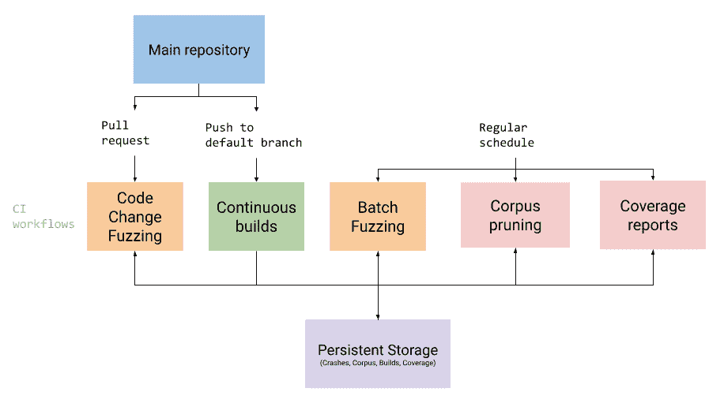

# ClusterFuzzLite:在 CI 中运行的简单连续模糊化

> 原文：<https://kalilinuxtutorials.com/clusterfuzzlite-simple-continuous-fuzzing-that-runs-in-ci/>

**ClusterFuzzLite** 是一款持续模糊化解决方案，作为持续集成(CI)工作流的一部分运行，以前所未有的速度发现漏洞。只需几行代码，GitHub 用户就可以将 ClusterFuzzLite 集成到他们的工作流中，并在提交请求之前模糊 pull 请求以捕获 bug。

ClusterFuzzLite 基于 ClusterFuzz。

**特色**

*   快速代码更改(拉请求)模糊化，以便在错误出现之前找到它们
*   崩溃测试案例的下载
*   连续较长时间运行的模糊化(批处理模糊化)，异步查找代码更改模糊化过程中遗漏的更深的错误，并构建一个用于代码更改模糊化的语料库
*   覆盖率报告显示你的代码的哪些部分是模糊的
*   模块化功能，因此您可以决定要使用哪些功能

**支持的语言**

*   C
*   C++
*   Java(和其他基于 JVM 的语言)
*   去
*   计算机编程语言
*   锈
*   迅速发生的

**支持的 CI 系统**

*   GitHub 操作
*   谷歌云构建
*   机头
*   对更多 CI 系统的支持正在进行中，并且很容易将支持扩展到其他 CI 系统

**支持 Fuzzing 引擎和杀毒软件**

*   用于覆盖引导测试的 libFuzzer
*   AddressSanitizer 用于查找内存安全问题
*   内存初始化器
*   用于查找未定义行为(如整数溢出)的未定义行为初始化器

**介绍用起毛剂和消毒剂起毛。**

本节概述了模糊化过程，并定义了常用术语。如果您已经熟悉了 libFuzzer 和清理程序，可以随意跳到步骤 1:构建集成，开始编写 Fuzzer 并与 ClusterFuzzLite 的构建系统集成。

**起毛**

模糊化是一种技术，其中随机输入被自动创建并作为输入馈送到(目标)程序，以便发现该程序中的错误。产生输入的程序被称为模糊器。Fuzzing 在寻找手工编写的测试、代码审查或审计遗漏的 bug 方面非常有效。Fuzzing 在 Chrome、OpenSSL、Curl 等成熟软件中发现了数千个 bug。做得好的话，fuzzing 几乎可以在任何代码中找到 bug。

**libFuzzer**

LibFuzzer 是一个 Fuzzer(有时称为 fuzzing 引擎),它变异输入，并在一个循环中将它们提供给目标代码。在对输入执行目标的过程中，libFuzzer 使用编译器插入的检测来观察被测代码的覆盖率。LibFuzzer 使用这种覆盖率反馈来逐步“进化”更有趣的输入，并达到更深层次的程序状态，这使得它可以用很少的开发人员的努力找到有趣的 bug。

**模糊目标**

要模糊目标代码，您必须使用以下 API 定义一个称为模糊目标的函数:

**fuzz _ target . cc
extern " C " int LLVMFuzzerTestOneInput(const uint 8 _ t * Data，Size _ t Size){
dosometinginterestingwithmyapi(Data，Size)；
返回 0；//非零返回值保留供将来使用。
}**

Clang 的`**-fsanitizer=fuzzer**`选项将把这个 Fuzzer 目标函数与 libFuzzer 链接起来，生成一个 fuzzer 二进制文件，在运行时模糊你的目标代码。请注意，在 ClusterFuzzLite 中，您不会直接使用该标志。相反，您应该使用`**$LIB_FUZZING_ENGINE**`环境变量，这将在步骤 1:构建集成中详细讨论。

**消毒剂**

杀毒器是检测代码(通常是 C/C++、Rust、Go 和 Swift 等“本机代码”)中的 bug，并通过崩溃来报告 bug 的工具。ClusterFuzzLite 依靠杀毒程序来检测可能会被遗漏的 bug。清理程序通过指示 clang 添加编译时工具来工作，因此不同的构建需要使用不同的清理程序。

ClusterFuzzLite 使用的清理程序有:

*   AddressSanitizer (ASan):用于检测内存安全问题。这是最重要的消毒剂。AddressSanitizer 还检测内存泄漏。
*   undefinedbehaviorsinitiazer(UBSan):用于检测未定义的行为，如整数溢出。
*   内存初始化器(MSan):用于检测未初始化内存的使用。MSan 是最难使用的杀毒程序，因为 MSan 检测的二进制文件必须完全用 MSan 检测。如果二进制文件的任何部分没有使用 MSan，MSan 将报告误报。

ClusterFuzzLite 基本代码对杀毒程序使用较短的名称。当提到一种消毒剂作为 ClusterFuzzLite 的输入时，as an 是`**address**`，UBSan 是`**ubsan**`，MSan 是`**memory**`。

**构建集成**

本页解释了如何将您的项目与 ClusterFuzzLite 的构建系统集成，以便 ClusterFuzzLite 可以使用清理程序构建您的项目的模糊目标。ClusterFuzzLite 与消毒剂和 libFuzzer 密切相关。通过与我们的构建系统集成，ClusterFuzzLite 将能够使用这些工具的最新版本来保护您的代码。

在本文档结束时，您将能够使用 libFuzzer 和各种杀毒工具来构建和运行您的 fuzz 目标。

**先决条件**

ClusterFuzzLite 支持在 Linux 上用 Clang 构建的 libFuzzer 目标。

ClusterFuzzLite 重用 OSS-Fuzz 工具链，使构建更容易。这意味着 ClusterFuzzLite 将在 docker 容器中构建您的项目。如果你熟悉 OSS-模糊，这里的大多数概念是完全一样的，只有一个关键的区别。与使用`**git clone**`检查`**Dockerfile**`中的源代码不同，`**Dockerfile**`在`**docker build**`期间直接复制源代码。另一个小区别是 ClusterFuzzLite 只支持 libFuzzer，不支持其他 fuzzing 引擎。如果你不熟悉 OSS-警察，不要害怕！这份文件是写在你的脑海中，并假设没有 OSS-模糊的知识。

在开始为模糊化设置新项目之前，必须执行以下操作以使用 ClusterFuzzLite 工具链:

*   将模糊目标与您的代码库集成在一起。更多详情请见本页。
*   安装 docker 如果你想在没有`**sudo**`的情况下运行`**docker**`，你可以**创建一个 docker 组**。**注意:** Docker 镜像会消耗大量的磁盘空间。定期运行 docker-cleanup 对未使用的图像进行垃圾收集。
*   克隆 https://github.com/google/oss-fuzz.git

**生成空构建集成**

接下来，您需要配置您的项目以在 ClusterFuzzLite 上构建 fuzzers。为此，您的项目需要在项目根目录下的 **`.clusterfuzzlite`** 目录中有三个配置文件:

*   。clusterfuzzlite/project . YAML–提供关于项目的元数据。
*   。clusterfuzzlite/docker file——使用构建项目及其 [fuzz](https://github.com/google/fuzzing/blob/master/docs/glossary.md#fuzz-target) 目标所需的依赖关系信息来定义容器环境。
*   。clusterfuzzlite/build . sh–定义在 Docker 容器内部执行的构建脚本，并构建您的项目及其模糊目标。

您可以使用以下命令生成这些文件的空版本:

**CD/PATH/TO/OSS-fuzz
export PATH _ TO _ PROJECT =
python infra/helper . py generate–external–language = c++＄PATH _ TO _ PROJECT**

请注意，如果您的项目是用另一种语言编写的，您可能需要将`**--language**`参数更改为另一个值。这将在语言部分详细讨论。

一旦生成了配置文件，您应该修改它们以适合您的项目。让我们逐个查看每个文件，并解释应该向它们添加什么。

**project.yaml**

此配置文件存储项目元数据。目前它只被`**helper.py**`用来构建你的项目。您必须在该文件中填写的唯一字段是:

**语言**

编写项目所用的编程语言。您可以指定的值包括:

*   **T2`c`**
*   **T2`c++`**
*   **T2`go`**
*   **T2`rust`**
*   **T2`python`**
*   **T2`jvm`**
    *   这应该用于 Java、Kotlin、Scala 和其他基于 JVM 的语言。
*   `swift`

本指南的大部分内容直接适用于 C/C++项目。请参阅相关的子指南，了解如何为该语言构建 fuzzers。注意`**c**`和`**c++**`同为 ClusterFuzzLite。

**Dockerfile**

这个集成文件定义了用于构建项目的 Docker 映像。您的 build.sh 脚本将在该文件定义的映像中执行。对于大多数项目，docker 文件很简单:

**从 gcr.io/oss-fuzz-base/base-builder:v1 # Base image with clang tool chain
运行 apt-get update&&apt-get Install-y…#安装所需的包来构建您的项目。
临摹。$SRC/ #复制项目的源代码。
WORKDIR＄SRC/# build . sh .
的工作目录副本。/.clusterfuzzlite/build.sh $SRC/ #将 build.sh 复制到** $SRC 目录中。

**build.sh**

这个脚本必须为项目中的模糊目标构建二进制文件。该脚本在从 docker 文件构建的映像中执行。

通常，该脚本应该执行以下操作:

*   使用带有 ClusterFuzzLite 编译器的构建系统来构建项目。
*   向构建系统提供 ClusterFuzzLite 的编译器标志(定义为环境变量)。
*   构建您的模糊目标并将它们与`**$LIB_FUZZING_ENGINE**` (libFuzzer)环境变量链接起来。
*   将任何模糊的目标二进制文件放在由环境变量 **`$OUT`定义的目录中。**

确保模糊目标的二进制名称只包含字母数字字符、下划线 **( `_`** )或破折号(`**-**`)。它们不应包含句点(`**.**`)或文件扩展名。否则，他们不会跑。您的 build.sh 不应删除任何源代码。代码覆盖率报告需要源代码。

`**$WORK**`环境变量定义了 build.sh 可以存储中间文件的目录。

以下是来自 Expat 的 build.sh 示例:

**编译用 build.sh 环境变量**

您*必须*使用 ClusterFuzzLite 的编译器和编译器标志来构建您的模糊目标。这些在以下环境变量中提供:

| 环境变量 | 描述 |
| --- | --- |
| **`$CC``$CXX``$CCC`** | C 和 C++编译器。 |
| **`$CFLAGS`，`$CXXFLAGS`** | C 和 C++编译器标志。 |
| `**$LIB_FUZZING_ENGINE**` | C++编译器参数将 fuzz target 链接到 libFuzzer。 |

这些编译器标志是用杀毒器和覆盖率检测来正确检测模糊器所必需的。

注意，即使你的项目是用纯 C 写的，你也必须用 T2 链接你的模糊目标二进制文件。

许多构建工具会自动使用这些环境变量(除了`**$LIB_FUZZING_ENGINE**`)。如果没有，请手动将它们传递给构建工具。

你也可以在你的`**build.sh**`中用`**$LIB_FUZZING_ENGINE**`做最后的链接步骤。

关于`**build.sh**`可用的环境变量的更多细节，请参见 OSS-模糊的`**base-builder**`图像文档中提供的环境变量页面。

**Fuzzer 执行环境**

您不应该对执行环境中依赖包的可用性做任何假设，构建的 fuzzers 应该静态链接依赖关系。

**本地测试**

当您完成 build.sh 和 Dockerfile 的编写后，您应该测试它们的工作情况。这包括运行您的模糊目标，这是我们强烈建议的。您用来生成配置文件的 helper.py 脚本提供了几种不同的方式:

1.  建立你的 docker 形象和模糊目标:

**python infra/helper . py build _ image–external＄PATH _ TO _ PROJECT
python infra/helper . py build _ fuzzers–external＄PATH _ TO _ PROJECT–sanitizer**

1.  构建的二进制文件出现在主机上的`**/path/to/oss-fuzz/build/out/$PROJECT_NAME**`目录中(容器中的`**$OUT**`)。请注意，`**$PROJECT_NAME**`是您的项目的根目录的名称(例如，如果`**$PATH_TO_PROJECT**`是`**/path/to/systemd**` , `**$PROJECT_NAME**`是`**systemd**`)。
2.  通过运行`**check_build**`命令找到要修复的常见构建问题:

**python infra/helper . py check _ build–external＄PATH _ TO _ PROJECT–sanitizer**

1.  这将检查您的模糊目标是否使用正确的杀毒软件编译，并且在模糊几秒钟后不会崩溃。
2.  要运行特定的模糊目标，请使用`**run_fuzzer**`:

**python infra/helper . py run _ fuzzer–external–corpus-dir = $ PATH _ TO _ PROJECT**

如果您打算使用 ClusterFuzzLite 的代码覆盖率报告特性，那么测试覆盖率报告的生成是一个好主意。这将使用在本地语料库目录中从前面的`**run_fuzzer**`步骤生成的语料库。

**python infra/helper . py build _ fuzzers–external–sanitizer coverage＄PATH _ TO _ PROJECT
python infra/helper . py coverage–external＄PATH _ TO _ PROJECT–fuzz-target =–corpus-dir =**

您可能需要运行`**python infra/helper.py pull_images**`来使用最新的覆盖工具。

**确保用** `**build_fuzzers**`、`**check_build**` **和`run_fuzzer`测试每种消毒剂。**

如果一切都在本地工作，那么它也应该在 ClusterFuzzLite 上工作。如果您在 ClusterFuzzLite 上运行 fuzzers 时遇到故障，请检查您的依赖项。

**调试问题**

如果遇到问题，调试页面会列出调试构建脚本和模糊目标的方法。

**高效模糊化**

为了提高 fuzz target 更快发现 bug 的能力，请阅读本节。

**运行集群 FuzzLite**

下一步:步骤 2:运行 ClusterFuzzLite，了解如何设置 ClusterFuzzLite 以在您的配置项上运行。

运行 ClusterFuzzLite

在运行 ClusterFuzzLite 之前，必须将您的项目与 ClusterFuzzLite 的构建系统集成，以构建您的项目的模糊器。如果您还没有采取这一步骤，请参见步骤 1:构建集成。

概观

运行 ClusterFuzzLite 的确切方法取决于您使用的 CI 系统。本页的其余部分解释了与您使用的 CI 系统无关的重要概念和配置选项。阅读完本页后，请参阅子指南，了解特定于您的 CI 系统的说明(例如 GitHub Actions 或 Google Cloud Build)。

**聚类模糊模式**

ClusterFuzzLite 提供了两种主要的模糊化模式:代码更改模糊化和批量模糊化。ClusterFuzzLite 还为运行 fuzzers 提供了两种助手模式，它们实际上并不模糊，但提供了有用的功能:修剪和覆盖。可以使用“模式”选项指示 ClusterFuzzLite 执行这些功能中的任何一个。

**【变码模糊】**

使用 ClusterFuzzLite 的核心方法是模糊化在拉请求/代码审查或提交中引入的代码更改。代码更改模糊化允许 ClusterFuzzLite 在 bug 被提交到您的代码之前找到它们，同时它们也是最容易修复的。

代码更改模糊化设计得很快，因此可以轻松集成到您的开发工作周期中:

*   它默认为 10 分钟，虽然这是可以改变的。
*   它在发现一个单一的崩溃后退出，即使有其他 fuzzers 运行。

仅运行代码更改模糊化是使用 ClusterFuzzLite 的最简单方法。但是，我们建议将代码更改模糊化与其他模式结合使用，以获得 ClusterFuzzLite 的全部好处。

例如，运行 batch fuzzing 将开发一个可供代码更改 fuzzing 使用的语料库。(如果批量模糊化中没有可用的语料库，代码更改模糊化将从零开始或从提供的种子语料库开始。)此外，当您第一次使用 ClusterFuzzLite 时，代码更改模糊化不会报告您的代码库中已经存在的错误，而批量模糊化会。更多功能请参见代码覆盖率报告生成和连续构建。

**批量起毛(“批量”)**

在批量模糊化模式中，所有模糊化器都运行预设的较长时间。与代码更改模式不同，批量模糊化不会在发现 bug 后立即退出。它将继续运行其他模糊器，直到达到分配的模糊时间。

考虑到较长的运行时间，我们建议批量模糊化应该按计划运行，比如每天一次，而不是在代码更改时运行。

通过运行更长的时间，批量起毛有两个重要目的:

*   它可以发现代码更改模糊化遗漏或未报告的错误。请注意，批量模糊化会报告所有崩溃，而不仅仅是“新”崩溃。
*   它为你的每个模糊目标建立一个语料库，导致更多的代码覆盖和更好的 bug 发现。这个语料库将被代码  覆盖报告生成、代码变更模糊化以及随后运行的批量模糊化所使用。使用 CI 系统的文件存储功能保存语料库。

**【语料修剪】**【prune】

随着时间的推移，在批量模糊化的过程中，冗余的测试用例会被引入到模糊化器的语料库中。

语料库修剪是一个助手功能，它通过删除不会增加模糊器代码覆盖率的语料库文件(测试用例)来最小化语料库。

如果您使用批量模糊化，您应该每天运行一次语料库修剪，以防止这些冗余测试用例的累积，并保持模糊化的效率。当你使用批量模糊化时，语料库修剪应该被认为是强制性的，否则就不应该使用。

**代码覆盖率报告生成【覆盖率】**

代码覆盖率报告生成是一个助手功能，可以在启用批量模糊化时使用。这种模式使用批量模糊化期间开发的语料库来生成 HTML 覆盖报告，该报告显示模糊化覆盖了代码的哪些部分。

代码更改模糊化也使用来自覆盖率报告的数据来确定哪些模糊化器受到代码更改的影响。如果代码更改模糊化可以确定哪些模糊化器受到影响，它将只运行那些模糊化器。否则，它将运行所有这些程序。覆盖率报告生成使用通过批量模糊化保存的搜索集，因此只有在启用了批量模糊化的情况下才应该使用。如果启用了批量模糊化，则不需要这样做，但强烈建议这样做。

**连续构建**

连续构建实际上并不是运行 fuzzers 的一种模式，而是您可以设置的 ClusterFuzzLite 的一项附加“任务”。连续构建任务不是在构建之后运行模糊化器，而是保存构建供以后通过[代码更改模糊化](https://google.github.io/clusterfuzzlite/running-clusterfuzzlite/#code-change)模式使用。

连续构建任务使代码更改模糊化能够识别崩溃的原因是否是由代码更改引起的。对于连续构建任务，如果崩溃的原因是预先存在的，则代码更改模糊化不会报告崩溃。如果在没有连续构建任务的情况下运行代码更改模糊化，将会报告所有崩溃。

## 配置选项

本节概述了运行 ClusterFuzzLite 时可以设置的配置选项。请参见[子指南](https://google.github.io/clusterfuzzlite/running-clusterfuzzlite/#subguides)了解如何在您的特定 CI 系统中设置每个配置的详细信息。

*   目标代码所用的语言。默认为`c++`。这应该与您在`project.yaml`中设置的值相同。详见[本解释](https://google.github.io/clusterfuzzlite/build-integration/#language)。
*   `fuzz-seconds`:指示 ClusterFuzzLite 进行模糊化的时间，以秒为单位。默认值为 600 秒，这是代码更改模糊化的合适起点。你应该增加这个数字，花更多的时间批量模糊。
*   `sanitizer`:确定构建和运行模糊目标的杀毒程序。选项有`'address'`、`'undefined'`、`'memory'`和`'coverage'`(用于生成覆盖报告)。默认为`'address'`。更多信息见[消毒剂](https://google.github.io/clusterfuzzlite/overview/#sanitizers)。
*   `mode`:ClusterFuzzLite 执行的模式。`code-change`默认情况下。关于如何运行不同模式的更多细节，请参见[集群模糊模式](https://google.github.io/clusterfuzzlite/running-clusterfuzzlite/#clusterfuzzlite-modes)。
*   `dry-run`:确定 ClusterFuzzLite 是否报告 bugs 崩溃。默认值为`false`。当设置为`true`时，ClusterFuzzLite 将永远不会报告失败，即使它在您的项目中发现崩溃，用户将不得不手动检查日志中检测到的错误。这应该仅用于测试 ClusterFuzzLite。

**注意:**您的特定 CI 系统将决定如何将选项传递给 ClusterFuzzLite。因为一些 CI 系统会使用环境变量来传递它们，所以环境变量的名称可能与相应选项的名称略有不同。特别是，环境变量将全部大写，并使用下划线(`_`)而不是连字符(`-`)。例如:`fuzz-seconds`的环境变量是`FUZZ_SECONDS`。

此时，您已经准备好使用您的特定 CI 系统运行 ClusterFuzzLite 了！

接下来:为您的 CI 系统选择[子指南](https://google.github.io/clusterfuzzlite/running-clusterfuzzlite/#subguides)。

## 支持持续集成系统

*   [GitHub 动作](https://google.github.io/clusterfuzzlite/running-clusterfuzzlite/github-actions/)
*   [谷歌云构建](https://google.github.io/clusterfuzzlite/running-clusterfuzzlite/google-cloud-build/)
*   [船头](https://google.github.io/clusterfuzzlite/running-clusterfuzzlite/prow/) (beta)

运行库行为 on

本页解释了如何设置 ClusterFuzzLite 在 [GitHub 动作](https://docs.github.com/en/actions)上运行。为了充分利用这个页面，您应该已经设置了您的[构建集成](https://google.github.io/clusterfuzzlite/build-integration/)，并且阅读了关于运行 ClusterFuzzLite 的更多[高级文档。](https://google.github.io/clusterfuzzlite/running-clusterfuzzlite/)

## 工作流文件

对于基本的 ClusterFuzzLite 功能，您只需要一个工作流文件就可以对您的 pull 请求进行模糊处理。

*   `.github/workflows/cflite_pr.yml`(用于感光模糊)

要启用更多功能，我们建议使用以下附加文件:

*   `.github/workflows/cflite_build.yml`(用于连续构建)
*   `.github/workflows/cflite_batch.yml`(批量起毛)
*   `.github/workflows/cflite_cron.yml`(对于在 cron 时间表上完成的任务:修剪和覆盖)

GitHub 操作使用这些工作流文件来运行 ClusterFuzzLite 操作。有关真实项目的完整示例，请参见[https://github.com/oliverchang/curl](https://github.com/oliverchang/curl)。

## 模式配置

以下配置指南显示了每个工作流文件的默认配置设置。简单地复制默认设置应该适用于大多数项目，或者您可以选择编辑文件来定制设置。

### 公关模糊化

要添加一个模糊化工作流来模糊化您的 repo 中的所有 pull 请求，请将以下默认配置添加到`.github/workflows/cflite_pr.yml`:

**name:ClusterFuzzLite PR fuzzing
on:
pull _ request:
paths:
' * * '
权限:read-all
jobs:
PR:
runs-on:Ubuntu-latest
策略:
fail-fast:false
matrix:
sanitizer:
–address
#用您想要的杀毒程序覆盖它。
#–未定义
#–内存
步骤:
名称:构建 Fuzzers($ { { matrix . sanitizer } })
id:Build
用途:Google/clusterfuzzlite/actions/Build _ Fuzzers @ v1
with:
sanitizer:$ { { matrix . sanitizer } }
#可选但推荐:仅用于运行受 PR 影响
#的 Fuzzers。
#参见后面的“Git 存储回购”部分。
# storage-repo:https://$ { { secrets。个人 _ 访问 _ 令牌}}@github.com/OWNER/STORAGE-REPO-NAME.git
#存储-回购-分支:主#可选。默认为" main "
# storage-repo-branch-coverage:GH-pages #可选。默认为“高页数”。
名称:Run Fuzzers($ { { matrix . sanitizer } })
id:Run
用途:Google/clusterfuzzlite/actions/Run _ Fuzzers @ v1
with:
github-token:$ { { secrets。GITHUB _ TOKEN } }
fuzz-seconds:600
mode:' code-change '
sanitizer:$ { { matrix . sanitizer } }
#可选但推荐:用于下载
#批量 fuzzing 产生的语料库。
#参见后面的“Git 存储回购”部分。
# storage-repo:https://$ { { secrets。个人 _ 访问 _ 令牌}}@github.com/OWNER/STORAGE-REPO-NAME.git
#存储-回购-分支:主#可选。默认为【主  #存储-回购-分支-覆盖:GH-页数#可选。默认为“高页数”。**

或者，编辑以下字段来自定义您的设置:

*   `sanitizers`更改或启用更多杀毒软件。
*   `fuzz-seconds`改变起毛时间。
*   `storage-repo`、`storage-repo-branch`、`storage-repo-branch-coverage`启用[存储回购](https://google.github.io/clusterfuzzlite/running-clusterfuzzlite/github-actions/#storage-repo)(对于初始运行不是必需的，但是稍后在中讨论的[的有用特性)。](https://google.github.io/clusterfuzzlite/running-clusterfuzzlite/github-actions/#storage-repo)

将此文件合并到您的 GitHub repo 中。若要测试工作流，请打开对项目的请求。

要从代码更改模糊中下载崩溃，请参见关于下载工件的[部分。](https://google.github.io/clusterfuzzlite/running-clusterfuzzlite/github-actions/#downloading-artifacts)

### 批量起毛

批量模糊化允许在你最新的头部上进行连续的、有规律的模糊化，并允许随着时间的推移建立一个输入语料库，这极大地提高了模糊化的效率。批量模糊化可以在 cron 时间表上运行。

要启用批量模糊，将以下内容添加到`.github/workflows/cflite_batch.yml`:

**名称:ClusterFuzzLite 批量模糊化
时间:
时间:
cron: '0 0/6 * * *' #每 6 小时一次。把这个换成任何合适的。
权限:read-all
作业:
BatchFuzzing:
runs-on:Ubuntu-latest
策略:
fail-fast: false
矩阵:
杀毒器:
地址
#用你想要的杀毒器覆盖这个。
#–未定义
#–内存
步骤:
名称:构建 Fuzzers($ { { matrix . sanitizer } })
id:构建
用途:google/clusterfuzzlite/actions/Build _ Fuzzers @ v1
with:
sanitizer:$ { { matrix . sanitizer } }
名称:运行 Fuzzers($ { { matrix . sanitizer } })
id:运行
用途:Google/clusterfuzzlite/actionsGITHUB _ TOKEN } }
fuzz-seconds:3600
模式:' batch '
sanitizer:$ { { matrix . sanitizer } }
#可选但推荐:用于存储 fuzzing 的某些工件。
#参见后面的“Git 存储回购”部分。
# storage-repo:https://$ { { secrets。个人 _ 访问 _ 令牌}}@github.com/OWNER/STORAGE-REPO-NAME.git
#存储-回购-分支:主#可选。默认为“主”
#存储-回购-分支-覆盖:GH-页数#可选。默认为“高页数”。**

或者，编辑以下字段来自定义您的设置:

*   `cron`更改批量起毛的运行频率。参见 GitHub 的文档。
*   `sanitizers`更改或启用更多杀毒软件。
*   `fuzz-seconds`改变起毛时间。
*   `storage-repo`、`storage-repo-branch`、`storage-repo-branch-coverage`启用[存储回购](https://google.github.io/clusterfuzzlite/running-clusterfuzzlite/github-actions/#storage-repo)。

虽然不推荐，但是您可以配置批处理模糊化在每次推送到您的主分支时运行，将`on`字段更改为:

**开:
推:
分支:
主#这里使用你实际默认的分支。**

确保将`branches`切换到您希望模糊的实际分支。

注意:如果正在运行批量模糊化，您还必须运行[语料库修剪](https://google.github.io/clusterfuzzlite/running-clusterfuzzlite/github-actions/#corpus-pruning)。

### 连续构建

每当有新的 push 到 main/default 分支时，连续构建任务都会触发一个构建，并作为 GitHub Actions 工件上传。

当在 PR fuzzing 期间发现崩溃时，使用连续构建来确定崩溃是否是新引入的。如果撞车不新奇，PR fuzzing 就不报道了。这意味着在运行代码更改模糊化时，不相关的故障会更少。

**免责声明**:如果你的构建很大，它们可能会超过免费的 [GitHub 动作配额](https://docs.github.com/en/billing/managing-billing-for-github-actions/about-billing-for-github-actions#included-storage-and-minutes)。在这种情况下，建议不要启用连续构建。

要设置连续构建，将以下内容添加到`.github/workflows/cflite_build.yml`:

**name:ClusterFuzzLite continuous builds
on:
push:
branches:
main #在这里使用你实际默认的分支。
权限:read-all
作业:
构建:
runs-on: ubuntu-latest
策略:
fail-fast: false
矩阵:
杀毒程序:
地址
#用你想要的杀毒程序覆盖这个。
#–未定义
#–内存
步骤:
名称:Build fuzz ers($ { { matrix . sanitizer } })
id:Build
用途:Google/clusterfuzzlite/actions/Build _ fuzz ers @ v1
with:
sanitizer:$ { { matrix . sanitizer } }
uplo**ad-Build:true

注意:一定要更改`branches`字段以匹配您项目的主分支。

如果您计划使用多种杀毒软件，请将它们全部添加到`sanitizer`字段(以启用每种杀毒软件的版本)

### 语料库修剪

语料库修剪通过删除冗余项同时保持相同的代码覆盖率来最小化批量模糊化产生的语料库。为此，将以下内容添加到`.github/workflows/cflite_cron.yml`:

**name:ClusterFuzzLite cron tasks
on:
schedule:
cron:' 0 0 * * * ' #每天午夜一次。
权限:read-all
作业:
剪枝:
runs-on: ubuntu-latest
步骤:
名称:Build Fuzzers
id: build
用途:Google/clusterfuzzlite/actions/Build _ Fuzzers @ v1
名称:Run Fuzzers
id: run
用途:Google/clusterfuzzlite/actions/Run _ Fuzzers @ v1
with:
github-token:$GITHUB _ TOKEN } }
fuzz-seconds:600
模式:' prune'
#可选但推荐。
#参见后面的“Git 存储回购”部分。
# storage-repo:https://$ { { secrets。个人 _ 访问 _ 令牌}}@github.com/OWNER/STORAGE-REPO-NAME.git
#存储-回购-分支:主#可选。默认为" main "
# storage-repo-branch-coverage:GH-pages #可选。默认为“高页数”。**

或者，编辑以下字段来自定义您的设置:

*   `storage-repo`、`storage-repo-branch`、`storage-repo-branch-coverage`启用[存储回购](https://google.github.io/clusterfuzzlite/running-clusterfuzzlite/github-actions/#storage-repo)。

### 覆盖率报告

要生成定期覆盖报告，请在`Pruning`作业后的`.github/workflows/cflite_cron.yml`中的`jobs`字段添加以下内容:

或者，编辑以下字段以在`https://USERNAME.github.io/STORAGE-REPO-NAME/coverage/latest/report/linux/report.html`查看承保范围报告:

*   设定`storage-repo`(此处[指示](https://google.github.io/clusterfuzzlite/running-clusterfuzzlite/github-actions/#storage-repo))
*   将`storage-repo-branch-coverage`设置为“gh-pages”(默认)
*   将`owner`和`storage-repo-name`设置为适合您的存储报告的值

## 额外配置

### Git 存储回购

这是可选的，但是建议您设置一个单独的 git repo 来存储语料库和覆盖率报告。在某些情况下，存储 repo 将使语料库管理更好，并允许您在 web 上查看覆盖报告，而不是将它们作为工件下载。

一个空的存储库就足够了。

您需要设置一个对存储库具有写权限的个人访问令牌，并将其添加为名为`PERSONAL_ACCESS_TOKEN`的[存储库秘密](https://docs.github.com/en/actions/security-guides/encrypted-secrets#creating-encrypted-secrets-for-an-environment)。这是因为默认的 GitHub auth 令牌不能写入其他存储库。注意:如果您遇到存储库的[问题，您可能会不小心将机密设置为*环境机密*，而不是*存储库机密*。](https://github.com/google/oss-fuzz/issues/6668)

如果您希望 PR fuzzing 只运行受当前更改影响的 fuzzer，您需要将这些相同的选项添加到上面的[“构建 fuzzer”步骤中。“受影响的模糊者”通过使用覆盖报告来确定。](https://google.github.io/clusterfuzzlite/running-clusterfuzzlite/github-actions/#pr-fuzzing)

如果没有指定存储库，那么语料库和覆盖率报告将作为 GitHub 工件上传。

### 私人回购

为了让 ClusterFuzzLite 使用私有 repos，需要将 GitHub 令牌传递给构建和运行步骤。这个令牌是由 GitHub actions 自动设置的，所以除了传递它来构建 fuzzer 和在每个工作流文件中运行 fuzzer 之外，不需要您执行任何额外的操作:

**谷歌云构建**

本文解释了如何在 [Google Cloud Build (GCB)](https://cloud.google.com/build) 上设置 ClusterFuzzLite。本文假设读者之前已经使用 GCB 建立了构建。关于使用 GCB 的文档可以在[这里](https://cloud.google.com/build/docs/quickstart-build)找到。为了充分利用这个页面，您应该已经设置了您的[构建集成](https://google.github.io/clusterfuzzlite/build-integration/)，并阅读了关于运行 ClusterFuzzLite 的更多[高级文档。本文档还假设您的代码托管在 GitHub 上，但是如果您的代码托管在其他地方，它应该是最适用的。](https://google.github.io/clusterfuzzlite/running-clusterfuzzlite/)

我们建议为 ClusterFuzzLite 的每个部分创建单独的工作流文件:

*   `.clusterfuzzlite/cflite_build.yml`(用于构建/连续起毛)
*   `.clusterfuzzlite/cflite_pr.yml`(用于代码更改(拉取请求)模糊化)
*   `.clusterfuzzlite/cflite_batch.yml`(批量起毛)
*   `.clusterfuzzlite/cflite_prune.yml`(用于语料修剪)
*   `.clusterfuzzlite/cflite_coverage.yml`(适用于覆盖率报告)

首先，您必须[创建一个 Google 云存储桶](https://cloud.google.com/storage/docs/creating-buckets)。在本文档的配置示例中，这将被称为`<your-cloud-bucket>`。存储桶将用于存储崩溃、构建、语料库和覆盖报告。您还需要设置环境变量`REPOSITORY`。在本文件中，`REPOSITORY`的值将由`<your-repo-name>`表示。注意，这必须与您的项目代码所在的`/src`中的目录相同。还要注意，配置示例设置了环境变量:`CFL_PLATFORM`这个值对于所有 GCB 用户都是通用的。不要改变它。

## 连续构建

每当在代码更改模糊化期间发现崩溃时，就使用连续构建来确定这个崩溃是否是新引入的。

将以下内容添加到`.clusterfuzzlite/cflite_build.yml`:

**步骤:
姓名:gcr.io/oss-fuzz-base/clusterfuzzlite-build-fuzzers:v1
环境:
–' CLOUD _ BUCKET = '
–' REPOSITORY = '
–' SANITIZER = address ' #这个可以改成你用的其他杀毒软件。
-' LANGUAGE = c++ ' #将此更改为您项目的语言。
–‘上传 _ 构建=真’
–‘CFL _ 平台= gcb’**

使用[控制台](https://console.cloud.google.com/cloud-build/triggers/add)设置一个[触发器](https://cloud.google.com/build/docs/automating-builds/create-manage-triggers)来运行该作业。选择“推至分行”事件，并选择您的回购主分行。该触发器将导致为您的 repo 主分支的每个提交保存一个构建。

## 代码更改模糊化

要向您的项目添加一个在所有 pull 请求上运行的模糊工作流，请将以下内容添加到`.clusterfuzzlite/cflite_pr.yml`:

设置一个触发器，在“pull request”事件上运行此工作流，以便它可以在审查代码更改时模糊代码更改。您可以在运行模糊器时设置`FUZZ_SECONDS`值，以更改 ClusterFuzzLite 将模糊 PRs 的时间。

## 批量起毛

要启用批量模糊，将以下内容添加到`.clusterfuzzlite/cflite_batch.yml`:

这可以在推送到默认分支时运行，但是我们建议在 cron 时间表上运行。

手动设置运行此工作流*的触发器*。然后按照[文档](https://cloud.google.com/build/docs/automating-builds/create-scheduled-triggers)让工作流程按计划运行。

您可以在运行模糊器时设置`FUZZ_SECONDS`值，以更改 ClusterFuzzLite 将模糊 PRs 的时间。

## 语料库修剪

语料库修剪通过移除冗余项同时保持相同的代码覆盖率来最小化语料库。为此，将以下内容添加到`.clusterfuzzlite/cflite_cron.yml`:

## 覆盖率报告

还可以使用最新的语料库来生成周期性的覆盖报告。为此，将以下内容添加到`.clusterfuzzlite/cflite_coverage.yml`:

要定期运行此工作流:设置手动运行此工作流*的触发器*。然后按照[文档](https://cloud.google.com/build/docs/automating-builds/create-scheduled-triggers)让工作流程按计划运行。我们建议安排每天运行一次覆盖率报告。

## 查看崩溃

Google Cloud Build 没有提供一种简单的方法来下载与构建相关的文件。因此，要下载 ClusterFuzzLite 发现的崩溃，检查日志以找到崩溃文件的名称，然后从`<your-cloud-bucket>/crashes/<fuzzer>/<sanitizer>/<crash-file>`下载它，其中`<crash-file>`是 ClusterFuzzLite 发现的崩溃输入的名称，`<fuzzer>`是发现崩溃输入的模糊器，`<sanitizer>`是用于发现崩溃的杀毒器。请注意，这些文件可以通过网络浏览器下载到`https://console.cloud.google.com/storage/browser/<your-cloud-bucket-without-gs>/crashes/<fuzzer>/<sanitizer>`，其中`<your-cloud-bucket-without-gs>`是`<your-cloud-bucket>`，开头没有`gs://`。比如`<your-cloud-bucket>`是`gs://clusterfuzzlite-storage`，那么`<your-cloud-bucket-without-gs>`就是`clusterfuzzlite-storage`。

## 测试它

您可以通过使用 [web 界面](https://console.cloud.google.com/cloud-build/triggers)或者在命令行上使用 [gcloud](https://cloud.google.com/sdk/gcloud) 手动触发构建来测试每个工作流。`gcloud`既可以用于[提交构建以在 Google Cloud](https://cloud.google.com/build/docs/running-builds/start-build-command-line-api) 上运行，也可以使用 [cloud-build-local](https://cloud.google.com/build/docs/build-debug-locally) 在本地模拟构建。如果你想手动提交构建在 Google Cloud 上运行，请在你的库的根目录下创建一个名为`.gcloudignore`的空文件，或者查看[这个 github 问题](https://github.com/GoogleCloudPlatform/cloud-builders/issues/236#issuecomment-374629200)，因为 Google Cloud Build 默认情况下不会包含手动提交构建的库的`.git`文件夹。

## 存储布局

ClusterFuzzLite 产生的工件存储在`<your-cloud-bucket>`中。铲斗具有以下布局。

*   崩溃:

*   `<your-cloud-bucket>/crashes/<fuzzer>/<sanitizer>/<crash-file>`
*   `<your-cloud-bucket>/crashes/<fuzzer>/<sanitizer>/<crash-file>.summary`(崩溃输出)。