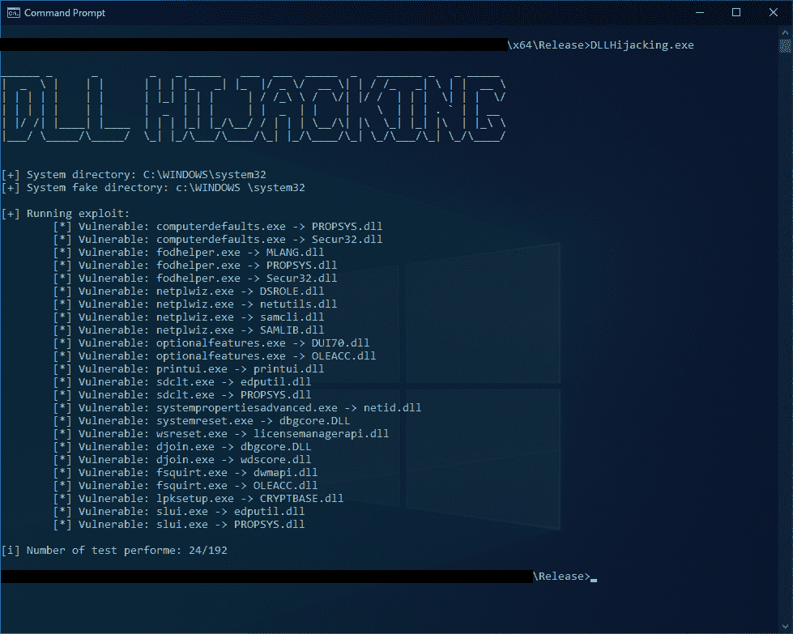

# DLLHijackingScanner:这是一个使用 DLL 劫持和滥用“可信目录”验证绕过 UAC 的概念验证

> 原文：<https://kalilinuxtutorials.com/dllhijackingscanner/>

**DLLHijackingScanner** 是一个使用 DLL 劫持和滥用“可信目录”验证绕过 UAC 的 PoC。

**从 CSV 生成标题**

python 脚本`**CsvToHeader.py**`可以用来生成一个头文件。默认情况下，它将使用 CSV 文件`**dll_hijacking_candidates.csv**`，可以在这里找到:dll _ hijacking _ candidates.csv。

该脚本将检查每个可移植可执行文件(PE)的以下条件:

*   如果 PE 存在于文件系统中。
*   在 PE 的清单中，如果 *requestedExecutionLevel* 被设置为下列值之一:
    *   `**asInvoker**`
    *   `**highestAvailable**`
    *   `**requireAdministrator**`
*   在清单中，如果 autoElevate 设置为 true: <autoelevate>true</autoelevate>
*   如果用户指定了`**-c**`参数，脚本将检查要劫持的 DLL 是否在从 PE 表导入的 DLL 列表中。

**论据**

**python。\CsvToHeader.py -h
用法:CSV toheader . py-f[DLL _ PATH]-c
CSV toheader 可用于从 CSV 生成头文件。
可选参数:
-h，–help 显示此帮助消息并退出
-f [DLL_PATH]要转换的 csv 的路径(default = " DLL _ jacking _ candidates . CSV ")
-c Enable import DLL in PE(default = False)
-v，–version 显示程序的版本号并退出**

要生成头文件，您可以使用以下命令:

**python csvtoheader . py>dll _ 劫持 _ 候选人** s.h

**生成易受攻击的 PE 和 DLL 列表**

将要使用的文件是`**DLLHijacking.exe**`和`**test.dll**`。

**DLLHijacking.exe**

DLLHijacking.exe 是将用于生成易受攻击 PE 列表的文件。它将执行以下步骤:

1.  CreateFakeDirectoryFunction 在`**C:\windows \system32**`中创建一个目录。
2.  将文件复制到新目录中
    *   从`**C:\windows\system32\[TARGET.EXE]**`到`**C:\windows \system32\[TARGET.EXE]**`
    *   从`**[CUSTOM_DLL_PATH]**`到`**C:\windows \system32\[TARGET.DLL]**`
3.  触发器从`**C:\windows \system32\[TARGET.EXE]**`运行可执行文件
4.  CleanUpFakeDirectoryFunction 删除步骤 1 中创建的目录和步骤 2 中的文件。
5.  检查利用检查文件`**C:\ProgramData\exploit.txt**`的内容，看看利用是否成功。

**日志文件**

DLLHijacking.exe 将始终生成一个包含以下内容的日志文件`**exploitable.log**`:

*   0 或 1 表示该漏洞是否能够绕过 UAC。
*   可执行文件名称
*   dll 名称

例如

**1，computerdefaults.exe，PROPSYS.dll
0，computerdefaults.exe，Secur32.dll**

**执行**

要运行的命令:

**DLLHijacking.exe【DLL _ PATH】**

如果没有传递参数，脚本将使用存储在`**DLLHijacking.exe**`资源中的 DLL `**test.dl**l`。

**成绩**

在 Windows 10 Pro(10 . 0 . 19043N/A Build 19043)上测试。

**test.dll**

`**test.dll**`是一个简单的动态库，将被用来查看漏洞是否被成功利用。DLL 将创建包含以下内容的文件`**C:\ProgramData\exploit.txt**`:

*   0 或 1 表示该漏洞是否能够绕过 UAC。
*   可执行文件名称
*   DLL 名称

一旦攻击完成，该文件将被删除。

[**Download**](https://github.com/SecuProject/DLLHijackingScanner)