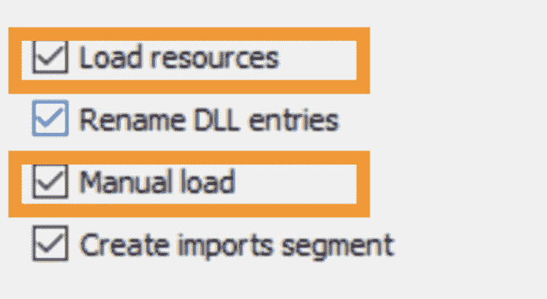

# IDA2Obj:静态二进制插装

> 原文：<https://kalilinuxtutorials.com/ida2obj/>

**IDA2Obj** 是实现**SBI**的工具。

工作流程很简单:

*   直接从一个可执行文件**二进制文件**中转储**目标文件(COFF)** 。
*   将**目标文件**链接成一个新的二进制文件，几乎和旧的一模一样。
*   在转储过程中，您可以**在任何位置**插入任何数据/代码。
    *   **SBI** 只是使用场景之一，对黑盒模糊特别有用。

**如何使用**

*   准备环境:
    *   在`**idapython.cfg**`中设置`**AUTOIMPORT_COMPAT_IDA695 = YES**`以支持旧 IDA 6.x 风格的 API。
    *   安装依赖项:`**pip install cough**`
*   创建一个文件夹作为工作区。
*   将您想要模糊化的目标二进制文件复制到工作区中。
*   将二进制文件加载到 IDA Pro 中，选择**加载资源**和**手动加载**来加载**二进制文件中的所有**段。
*   等待自动分析完成。
*   通过运行脚本`**MagicIDA/main.py**`转储目标文件。
    *   输出目标文件将在`**${workspace}/${module}/objs/afl**`中。
    *   如果在工作空间中创建一个名为`**TRACE_MODE**`的空文件，那么输出对象文件将在`**${workspace}/${module}/objs/trace**`中。
    *   顺便说一下，它还会在`**${workspace}/${module}**`中生成 3 个文件:
        *   exports_afl.def(用于链接)
        *   exports_trace.def(用于链接)
        *   hint.txt(用于打补丁)
*   通过运行脚本`**utils/LibImports.py**`生成 lib 文件。
    *   输出的 lib 文件将在`**${workspace}/${module}/libs**`中，用于以后的链接。
*   打开终端，将目录切换到工作区。
*   使用`**utils/link.bat**`链接所有的目标文件和库文件。
    *   例如`**utils/link.bat GdiPlus dll afl /RELEASE**`
    *   它将生成新的二进制文件，pdb 文件在`**${workspace}/${module}**`中。
*   使用 **`utils/PatchPEHeader.py`对新构建的二进制文件打补丁。**
    *   例如`**utils/PatchPEHeader.py GdiPlus/GdiPlus.afl.dll**`
    *   第一次，你可能需要以管理员身份运行`**utils/register_msdia_run_as_administrator.bat**`。
*   运行和模糊。

[Download](https://github.com/jhftss/IDA2Obj)