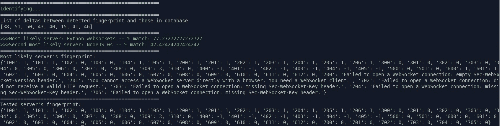
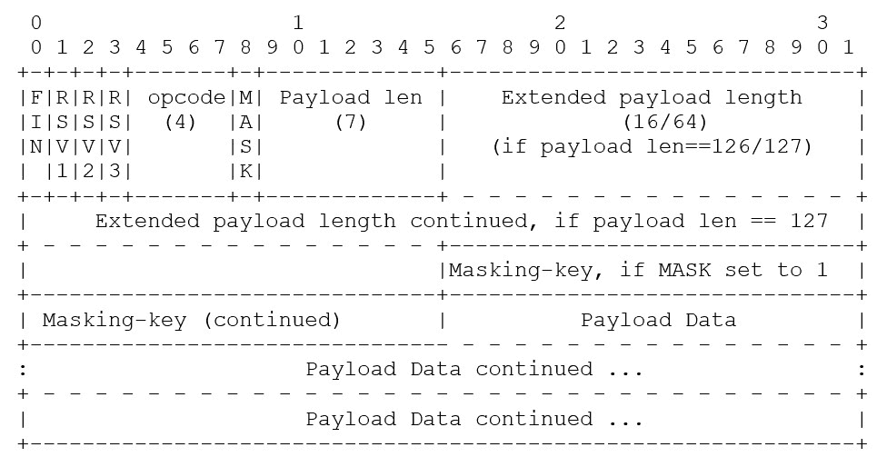

# STEWS:一个枚举 Web 套接字的安全工具

> 原文：<https://kalilinuxtutorials.com/stews/>

STEWS 是一个用于 Web 套接字安全测试的工具套件

这项研究首次在 OWASP 全球应用安全会议 US 2021 上提出

**特色**

STEWS 能够:

*   **发现**:通过测试一系列域来发现 web 上的 WebSockets 端点
*   **指纹**:确定端点上运行的是什么 WebSockets 服务器
*   **漏洞检测**:测试 WebSockets 服务器是否易受已知 WebSockets 漏洞的攻击

该存储库中包含的白皮书提供了所开展研究的更多详细信息。随附的幻灯片在 OWASP AppSec US 2021 上展示。

作为这项研究的一部分，创建的补充资料库包括:

*   Awesome Web Socket Security repository，为未来的研究人员编译 Web Socket 安全信息
*   Web Sockets-Playground 存储库，这是一个可以轻松地并行启动多个本地 Web Socket 服务器的脚本

**安装&使用**

STEWS 的每个部分(发现、指纹识别、漏洞检测)都有单独的说明。请查看各自文件夹中的自述文件。

**网络套接字发现**

**炖品发现工具**

STEWS(用于枚举 WebSockets 的安全工具)发现工具使用 ZGrab2 的自定义分支，通过发送 WebSocket 连接握手的第一部分来测试 WebSocket 支持的 URL。如果服务器用 HTTP 101“交换协议”响应来响应这个 WebSocket 连接请求，则可以认为服务器支持 WebSockets。用于 WebSocket 端点发现的方法是一种依赖于单词列表的强力方法。这是因为 WebSockets 可能只能在服务器的特定路径上访问。通过发送大量的 WebSocket 握手请求，并过滤响应 101 状态代码的服务器，可以发现许多 WebSocket 端点。但是，这种方法有一些缺点:

*   测试特定的 URL 路径，这意味着不会检测到不在此位置的 WebSocket 端点。
*   ZGrab2 是一项正在进行的工作，在过去的一两年中，一些用于改进 HTTP 支持的关键 PRs 被合并
*   ZGrab2 最初并不是为在 HTTP 层运行而设计的，而是在 TCP/IP 层运行。因此，ZGrab2 不能解决高吞吐量的 DNS 查找，根据您的配置，这可能是一个问题点。有关当前推荐的方法，请参见以下 DNS 提示。

**DNS 提示**

如果您使用过常见的 web fuzzer 或 URL 暴力工具(如 gobuster 或 ffuf ),您可能会针对单个域使用此工具。因为 STEWS 发现过程正在测试许多不同的域，所以将会出现大量的 DNS 请求。DNS 查找过程花费的时间与发送实际的 WebSockets 请求一样多，如果不是更多的话。如果您使用 ISP 的默认 DNS 服务器，您可能会达到查找速率限制，并开始遇到 DNS 错误，这可能会导致错过 Web 套接字端点。

在依赖/etc/resolv.conf 文件作为 DNS 服务器的普通 Ubuntu 系统上进行测试的方法是将几个众所周知的公共 DNS 服务器，如 Google(8.8.8.8 和 8.8.4.4)、Quad9 (9.9.9.9)和 cloud flare(1.1.1.1 和 1.0.0.1)添加到/etc/resolve.conf 文件中。当您的系统正在执行 DNS 查找并且没有从第一个 DNS 名称服务器获得响应时，它将使用/etc/resolv.conf 中的其他 DNS 服务器，这有助于平衡 DNS 请求负载，以防/etc/resolv.conf 文件中的其他名称服务器达到速率限制。

除了上述方法之外，还有一些优化可以加快发现速度。例如，zgrab2 接受格式为`**IP,domain**`的包含域 IP 的输入文件，以允许 zgrab2 跳过 DNS 查找步骤。如果要测试许多 URL 路径，这种方法可以节省时间(每个域一次 DNS 查找，而不是每个域一次 DNS 查找每个测试的 URL 路径)。

如果您没有发现任何 WebSockets 端点，并且怀疑 DNS 查找可能是问题所在，您可以使用 Wireshark 或 tcpdump 来解决该问题。

**域名列表提示**

有许多方法可以获得一长串用于测试 WebSockets 的域。

*   如果您想要手动查找端点来发现 WebSockets 可能存在于示例发现结果表之外的新 URL 路径，除了手动浏览之外，没有多少已知的快捷方式。在 GitHub 上寻找包含许多 WebSockets 端点的存储库(比如这个 cryptofeed repo)。
*   如果您专注于测试一个特定的域或一组域，您可以使用范围内的域和子域的列表。
*   如果你在浏览网页，你可以在你最喜欢的搜索引擎上搜索“前 100 万个域名”或者“前 100 万个域名”。最后，要获得更全面的域列表，您可以请求访问顶级 DNS 服务器使用的相同资源，即区域文件。您可以向 ICANN 提交请求以获取这些区域文件。作为警告。com 区域文件是一个 21+ GB 的文本文件，而。org 区域文件为 1.5+ GB。此外，区域文件包含许多解析为 0.0.0.0 的域、内部 IP 等。可以在使用前清洗或缩小。

**用法和依赖关系**

`**STEWS-discovery.sh**`脚本是在 Linux 上测试的 bash 脚本。唯一的依赖项是 jq 和来自自定义回文技术 zgrab2 分支的 zgrab2 二进制文件(可以从这里下载一个可用的二进制文件)。此 zgrab2 分支做出以下更改(截至 2021 年 11 月):

*   添加了`**DynamicOrigin**`标志，以将“Origin”报头设置为不带路径的目标域(如果检查了用于 CSWSH 缓解的 Origin)
*   为了简化 Web Sockets 握手 HTTP 请求，用户代理头、Accept-Encoding 头和 Accept 头都被删除了，后者使用了一个新的`**RemoveAcceptHeader**`标志
*   因为端点路径包含在作为输入提供的 URL 列表中，所以移除了`**Endpoint**`标志

该脚本默认使用`**known-endpoints.txt**`(这些已知的 Web Sockets 服务器是 bug bounty 程序的一部分)，但是域的任何文本文件都可以作为输入提供。

可以修改`**STEWS-discover.sh**`脚本来查看每个服务器的附加信息。例如，将`**.data.http.result.response.headers**`加到提供给`**jq**`的值上将会输出来自每个服务器的头。

**样本发现结果**

从 2021 年 11 月测试的约 300 万个域的样本中，下表说明了发现的支持每种 URL 模式的 WebSockets 的服务器数量。xxx 字符意味着测试了多种 TLD。

| 统一资源定位器 | 找到 WebSocket 服务器 |
| --- | --- |
| domain.xxx | Two thousand two hundred and eighty-one |
| domain.xxx/ws | One thousand nine hundred and ninety-one |
| domain.xxx/ws/v1 | One thousand six hundred and five |
| domain.xxx/ws/v2 | One thousand six hundred and six |
| domain.xxx/socket.io/?EIO=3&transport=websocket | One thousand three hundred and eighty-nine |
| domain.xxx/stream | Four hundred and forty-eight |
| domain.xxx/feed | Four hundred and fifty-two |
| www.domain.xxx | One thousand five hundred and eighty-two |
| ws.domain.xxx | Eight hundred and ninety-one |
| stream.domain.xxx | Five hundred and seventy-four |
| **总计** | **12819** |

**网络套接字指纹识别**

**炖菜指纹识别工具**

STEWS(用于枚举 WebSockets 的安全工具)指纹工具使用流行的 WebSocket 实现中的实现级差异来尝试识别正在运行的 WebSocket 服务器。STEWS 指纹识别工具在 WebSocket 握手(使用 HTTP 协议)和 WebSocket 协议帧(使用 WebSocket 协议)中都使用了服务器特性，要求该工具处理两种不同的协议。

**网络套接字指纹测试**

在测试不同 WebSocket 服务器的过程中，发现了实现上的差异，这有助于识别不同的 WebSocket 服务器。这些差异可能允许用户通过发送精心编制的消息来识别服务器，这些消息会触发服务器以其识别特征进行响应。发现一些识别器比其他识别器更好(或识别信噪比更高)。

例如，WebSocket 握手响应中 HTTP 头的大小写可以由反向代理或其他中间网络元素修改，而不管 WebSocket 实现的源代码如何。类似地，当使用不同的屏蔽键向服务器发送消息时，在服务器响应中没有发现重大差异。为了检查其他可能的指纹客户端请求，检查来自 RFC6455 的 WebSocket 数据帧的格式会很有帮助。

**基本用法**

首先，确保使用`**pip3 install -r requirements.txt**`安装了必要的 Python 3 依赖项。然后，如果您运行`**python3 STEWS-fingerprint.py -h**`，您将看到以下选项:

**用法:STEWS-fingerprint . py[-h][-v][-d][-u URL][-f FILE][-n][-k]
[-o ORIGIN][-g][-a][-1][-2][-3][-4][-5][-T2][-6][-7]
web sockets(STEWS)指纹工具的安全测试和枚举
可选参数:
-h，–help 显示此帮助消息并退出
–FILE FILE 提供一个包含 URL 的文件，用于检查有效的
WebSocket 连接
-n，–无加密连接使用 ws://，而不是 wss://(默认为 wss://)
-k，–no cert 忽略无效的 SSL 证书
-o ORIGIN，–ORIGIN ORIGIN
Set ORIGIN
-g，–Generate-fingerprint
为已知服务器生成指纹
-a，–all-tests 运行所有测试
-1，– –300 系列运行 300 系列(版本)测试
-4、–400 系列运行 400 系列(扩展)测试
-5、–500 系列运行 500 系列(子协议)测试
-6、–600 系列运行 600 系列(长有效载荷)测试
-7、–700 系列运行 700 系列(hybi 及类似)测试**

每个系列的测试都列举了 Web 套接字协议的特定部分。如果您想了解这个工具是如何工作的，可以先尝试运行一个系列的测试，比如 500 系列测试。添加调试标志`**-d**`是很有用的，可以在测试用例运行时观察进度。如果您有一个运行在本地端口 8080 上的服务器，并且想要测试 500 系列的测试用例，您可以使用:

`**python3 STEWS-fingerprint.py -5 -d -n -u 127.0.0.1:8080**`

相反，如果您希望使用 TLS 测试公共服务器，并且不希望看到详细的调试信息，您可以使用:

`**python3 STEWS-fingerprint.py -1 -k -u streamer.finance.yahoo.com**`

使用`**-a**`标志运行所有测试用例可以提供最精确的指纹匹配，但这也需要花费大量时间，并且需要向被采集指纹的端点发送大量数据。600 系列测试用例尤其会向服务器发送很长的负载。

如果您有几个想要采集指纹的 Web 套接字端点，那么您可以使用`**-f**`标志来提供一个 Web 套接字端点文件进行测试。

**工作原理**

WebSocket 连接过程可以分为两个主要部分:

*   HTTP 通信(带有 HTTP 101 响应的 WebSocket 握手)
*   WebSocket 通信

WebSocket 连接的两个部分都支持指纹识别。

HTTP 通信包含几个字段，这些字段可以提供有关服务器上支持的功能的信息，包括:

*   sec-web socket-版本(300 系列)
*   sec-web socket-Extensions(400 系列)
*   sec-web socket-协议(500 系列)

WebSocket 通信包含几个可以确定服务器大小的支持特性的字段，包括:

*   操作码(100 系列)
*   保留位(200 系列)
*   最大有效负载长度(600 系列)
*   旧 WebSocket hybi 草案协议功能支持(700 系列)

通过向 WebSocket 服务器发送意外或边缘情况输入，STEWS 指纹识别工具可以从 WebSocket 服务器接收不同的响应，这取决于运行的服务器。例如，比较三种不同的 WebSocket 实现对测试用例 200 的服务器响应:

*   王菲:`**One or more reserved bits are on: reserved1 = 0, reserved2 = 0, reserved3 = 1**`
*   大猩猩:`**unexpected reserved bits 0x10**`
*   爪哇 Spring Boot: `**The client frame set the reserved bits to**`
*   棘轮:`**Ratchet detected an invalid reserve code**`

通过收集许多这样不同的响应，STEWS finger printer 可以将任何 Web Socket 服务器的指纹与已知 Web Socket 服务器的数据库进行比较，以尝试识别它。当前的指纹数据库是使用 Web Sockets-Playground 存储库创建的，这简化了启动多个本地 Web Sockets 服务器的过程。当前的指纹匹配算法非常基础，并且为每个测试用例分配一个或两个点，以使一些测试用例结果比其他测试用例结果更重。STEWS 指纹打印机数据库中具有最小点数增量的指纹被认为是识别匹配的最佳候选。

**添加新的 Web Socket 服务器指纹**

如果您有要添加的 Web 套接字指纹，请提交拉请求(PR)。WebSocket 服务器的指纹定义以列表的形式创建。您可以使用 STEWS fingerprint 工具的`**-g**`或`**--generate-fingerprint**`标志为一个已知的 Web Socket 服务器生成这个列表。基于测试用例，建议对自动生成的指纹进行手动编辑。例如,“包含实例”数组中的测试实例(当前测试实例 104-206)使用字符串查找测试而不是精确匹配来确定指纹增量。

**误报和错误**

如果通过互联网测试 Web Socket 服务器，额外的网络元素可能会干扰指纹结果。通过 HTTP 发生的握手过程中的指纹识别标识符可以被反向代理或 WAF 修改。在这种情况下，最好集中使用 Web Socket 连接后指纹识别标识符(参见“它是如何工作的”一节中的分类)，尤其是特定 Web Socket 服务器特有的错误消息。

**Web 套接字漏洞检测**

**STEWS 漏洞检测工具**

STEWS(用于枚举 WebSockets 的安全工具)漏洞检测工具允许用户测试 WebSockets 端点是否易受已知 CVEs 或其他 WebSockets 漏洞的攻击。

该工具目前支持漏洞测试，包括:

*   跨站点 WebSocket 劫持
*   CVE-2020-27813(大猩猩 DoS 整数溢出)
*   CVE-2020-7662 和 CVE-2020-7663(faye sec-WebSocket regex dos 扩展)
*   CVE-2021-32640(ws Sec-web socket-协议 Regex DoS)

在 Awesome web socket Security资源库中可以找到该工具将来可能支持的 CVE 的更完整列表。

**基本用法**

首先，确保使用`**pip3 install -r requirements.txt**`安装了必要的 Python 3 依赖项。然后，如果您运行`**python3 STEWS-vuln-detect.py -h**`，您将看到以下选项:

**用法:STEWS-vuln-detect . py[-h][-v][-d][-u URL][-f FILE][-n][-k][-o ORIGIN][-1][-2][-3][-4]
web sockets(STEWS)漏洞检测工具的安全测试和枚举
可选参数:
-h，–help 显示此帮助消息并退出
-v，–verbose 启用详细的通信跟踪
-d，–debug 打印每个测试 –FILE FILE 包含用于检查有效 WebSocket 连接的 URL 的文件
-n，–无加密使用 ws://，而不是 wss://(默认为 wss://)
-k，–nocert 忽略无效的 SSL 证书
-o ORIGIN，–ORIGIN ORIGIN
Set ORIGIN
-1 测试通用跨站点 WebSocket 劫持(CSWSH)
-2 测试 CVE-2021-32640–ws Sec-web socket-Protocol Regex DoS**

测试 1 提供了一个通用的 CSWSH 测试。这可以与`**-o**`标志结合使用，以指定一个特定的起点来尝试绕过任何服务器端检查。

测试 2、3 和 4 检查特定的 cv。这些测试用例是基于作为这些 CVE 发现的一部分而发布的 PoC 代码创建的。例如，要在端口 8084 的本地服务器上运行 test 4，您可以运行:`**python3 STEWS-vuln-detect.py -4 -n -u 127.0.0.1:8084**`

**为什么是这个工具？**

WebSocket 服务器在很大程度上被安全圈忽视了。这部分是由于 WebSocket 端点的三个障碍没有被清楚地解决:

*   发现
*   计数/指纹识别
*   漏洞检测

STEWS 试图解决这三个问题。需要一个定制工具，因为在当前的安全测试工具中明显缺乏对手动配置的 WebSocket 测试的支持:

*   普遍缺乏支持的和可脚本化的 Web Socket 安全测试工具(例如，NCC 不支持的 wssip 工具，nuclei 缺乏 Web Socket 支持，nmap 缺乏 Web Socket 支持)
*   Burp Suite 缺乏对 Web Socket 扩展的支持(例如，参见这个 Port Swigger 论坛线程和这个)。
*   缺乏更深入的特定于 Web Socket 的安全性研究(Awesome Web Socket Security repository 列出了已发布的 Web Socket 安全性研究)
*   现代网络中网络套接字的激增(如 STEWS 发现工具的结果所示)

[**Download**](https://github.com/PalindromeLabs/STEWS)