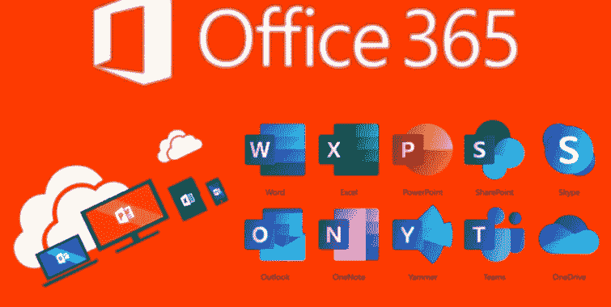

# O365Spray:针对微软 O365 的用户名枚举和密码喷涂工具

> 原文：<https://kalilinuxtutorials.com/o365spray/>

**O365Spray** 一款针对微软 Office 365 (O365)的用户名枚举和密码喷涂工具。该工具重新实现了致谢中提到的那些人研究和识别的枚举和喷射技术的集合。

警告:用户枚举的 oAuth2 模块是通过为每个用户提交一次身份验证尝试来执行的。如果模块在单次执行中与密码喷射一起运行，o365spray 将在执行密码喷射之前自动重置锁定计时器—如果枚举单独运行，用户应了解每次身份验证尝试的次数和时间，并在执行任何密码喷射之前手动重置锁定计时器。

如果遇到任何 bugs 错误，请打开一个问题并提供详细信息(或提出修复请求)。有关使用以前版本的更多信息，请参见下一节。

**用法**

验证一个域是使用 O365:
`**o365spray --validate --domain test.com**`

针对给定的域执行用户名枚举:
`**o365spray --enum -U usernames.txt --domain test.com**`

对给定的域进行密码喷涂:
`**o365spray --spray -U usernames.txt -P passwords.txt --count 2 --lockout 5 --domain test.com**`

**用法:o 365 spray[-h][-d DOMAIN][–validate][–enum][–spray]
[-U USERNAME][-P PASSFILE][-P PASSFILE]
[–PAIRED][-c COUNT][-l lock out]
[–enum-module { office，onedrive，oauth 2 }]
[–spray-module { oauth 2，activesync，autodiscover，reporting，adfs }]
[–t。
–仅验证运行域验证。
–枚举运行用户名枚举。
–喷涂运行密码喷涂。
-u 用户名，–用户名用户名
用户名，用逗号分隔。
-p 密码，–密码密码
用逗号分隔的密码。
-U 用户文件，–用户文件用户文件
包含用户名列表的文件。
-P 密码文件，–密码文件密码文件
包含密码列表的文件。
–包含用户名:密码
格式的证书列表的配对文件。
-c COUNT，–COUNT COUNT
在重置
锁定帐户计时器之前，每个用户尝试运行密码的次数。默认值:1
-l 锁定，–锁定锁定
锁定策略的重置时间(分钟)。默认值:15 分钟
–enum-module { office，onedrive，oauth2}
指定要运行哪个枚举模块。
默认:office
–spray-module { oauth 2，activesync，autodiscover，reporting，adfs}
指定运行哪个密码喷洒模块。
默认:oauth 2
–目标域的 adfs 登录页面的 adfs-url ADFS_URL AuthURL 进行密码
喷涂。
–sleep[-1，0-120]每隔`N`秒对 HTTP 请求进行一次节流。这可以通过传递值`-1`(在 1 秒和 2
分钟之间)进行
随机化。默认值:0
–抖动[0-100]抖动延长–按给定百分比(0-100)的睡眠周期。
默认值:0
–RATE RATE 枚举
和喷射期间的并发连接(尝试)数。默认:10
–如果观察到`N`锁定的账户
，安全终止密码喷洒运行。默认值:10
–超时超时 HTTP 请求超时，以秒为单位。默认值:25
–代理代理 HTTP/S 代理通过
传递流量(例如 http://127.0.0.1:8080)。
–输出结果和测试用例文件的输出目录。
默认:当前目录
-v，–版本打印工具版本。
–调试启用调试输出。**

**模块**

o365spray 已经打包，允许在自动化场景中使用。如果域验证、用户枚举或密码喷洒是您提议的攻击/侦察自动化的一部分，请参见以下模块和导入使用示例。

**验证**

*   getuserrealm
*   openid-config — *当前禁用*

验证器可以通过以下方式导入和使用:

**from o365spray.core 导入验证器
v = Validator()
valid，adfs _ URL = v . validate(' domain . com ')**

**枚举**

*   办公室
*   oauth2
*   微软云储存
*   动态同步— *当前被禁用*
*   自动发现— *当前已禁用*

onedrive 模块依赖于之前已登录 OneDrive 的目标用户。如果有效用户尚未使用 OneDrive，他们的帐户将显示为“无效”。

枚举器可以通过以下方式导入和使用:

**from o365spray.core 导入枚举器
loop = asyncio . get _ event _ loop()
e = Enumerator(loop，writer = False)
loop . run _ until _ complete(
e . run(
userlist，
password，
domain，

)
)
loop . run _ until _ complete()
loop . close()
list _ of _ VALID _ users = e . VALID**

**喷洒**

*   oauth2
*   动态同步
*   自动发现
*   报告
*   adfs

oAuth2 模块可用于联邦喷涂，但需要注意的是，这只有在目标启用了密码同步的情况下才有效——否则认证总是会失败。默认机制是在识别联盟时默认使用“adfs”模块。

喷雾器可以通过以下方式进口和使用:

**from o365spray.core 导入喷雾器
loop = asyncio . get _ event _ loop()
s = Sprayer(loop，writer = False)
loop . run _ until _ complete(
s . run(
密码，
域，
模块，
userlist，
)
)
loop . run _ until _ complete()
loop . close()
list _ of _ VALID _ creds = s**

**Omn** 我**喷**

o365spray 框架已经移植到一个新工具:Omnispray。该工具旨在模块化原始枚举和喷涂框架，以允许通用目标，而不仅仅是 O365。Omnispray 包括用于枚举和喷射的模板模块，可以针对任何目标进行修改和利用。

[**Download**](https://github.com/0xZDH/o365spray/)