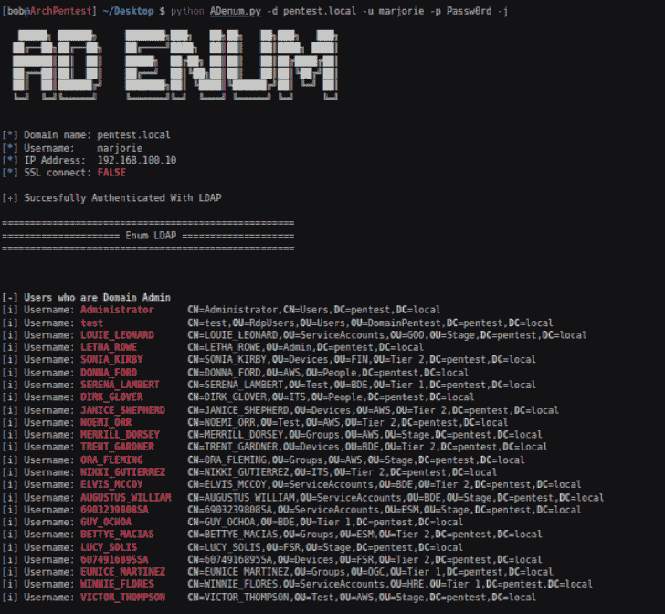

# ADenum:一个测试工具，允许通过 LDAP 协议发现错误配置，并利用 Kerberos 的一些弱点

> 原文：<https://kalilinuxtutorials.com/adenum/>

ADenum 是一个测试工具，允许通过 LDAP 协议发现错误配置，并利用 Kerberos 的一些弱点。

**要求**

*   impacket(https://github.com/SecureAuthCorp/impacket)
*   约翰(https://github.com/openwall/john)
*   python3
*   如果你用的是 **debian** 或者 **ubuntu**

**$ sudo apt-get 安装 libsas L2-dev python-dev libldap 2-dev libssl-dev**

如果你用的是**卡利**

**$ sudo apt-get 安装 libsas L2-dev python 2-dev libldap 2-dev libssl-dev**

pip3

**$ pip 3 install-r requirements . txt**

**特性和功能**

**LDAP**

*   枚举域管理用户
*   枚举域控制器
*   密码未过期的枚举域用户
*   使用旧密码的枚举域用户
*   带有有趣描述的枚举域用户
*   不使用默认加密的枚举域用户
*   具有保护特权域帐户的枚举域用户

**Kerberos**

*   AS-REP 可漫游
*   Kerberoastable
*   用 john 破解密码(krb5tgs 和 krb5asrep)

[**Download**](https://github.com/SecuProject/ADenum)