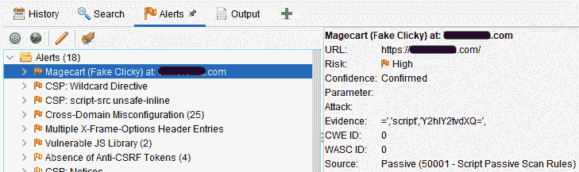
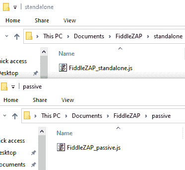
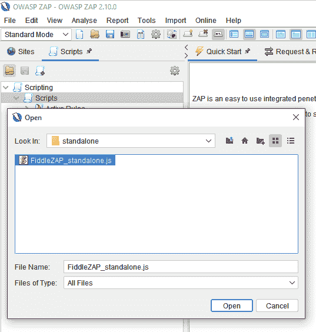
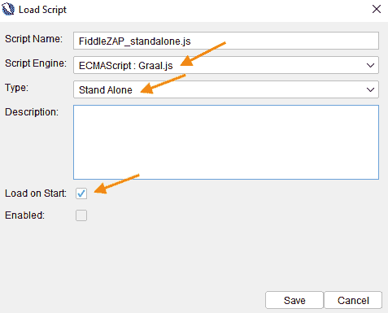
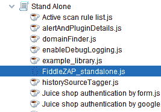
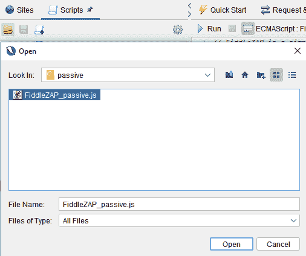
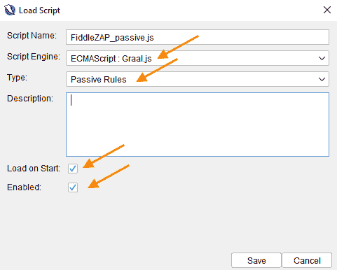
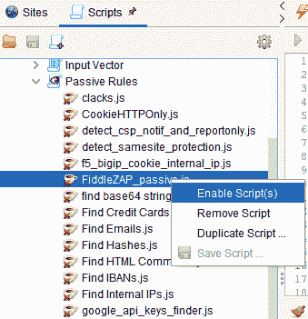
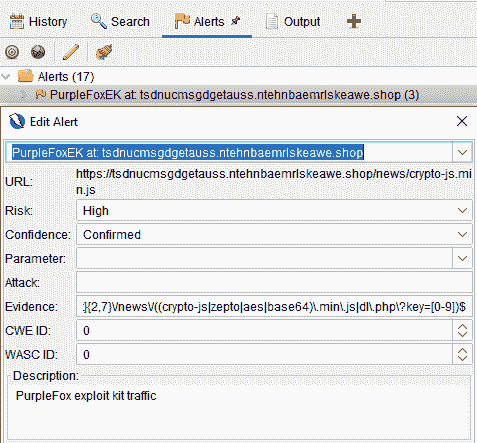

# FiddleZAP:OWASP ZAP 的简化版 EKFiddle

> 原文：<https://kalilinuxtutorials.com/fiddlezap/>

**FiddleZAP** 是 OWASP ZAP 的简化版 EKFiddle。

使用 ZAP 作为您的 web 代理，您可以基于预定义的正则表达式标记恶意流量。

示例:当正则表达式与受损网站的 HTML 源代码中的字符串匹配时，发出警报、突出显示和标记

**安装**

*   下载并安装 ZAP:https://www.zaproxy.org/download/
*   将 FiddleZAP 目录下载或克隆到 Documents 文件夹中。

它应该具有以下结构:

有 2 个脚本(独立的、被动的规则)。前者用于在当前加载的会话(web 流量)上手动运行，后者在记录流量时自动运行。

**独自一人**

首先，安装独立脚本:

*   单击加载脚本图标:

*   选择以下参数:

*   它现在显示在“独立”下:

**被动规则**

接下来，安装被动规则脚本:

*   单击加载脚本图标:

*   选择以下参数:

*   FiddleZAP 脚本现在应该显示在被动规则下。如果没有启用，右键单击它并选择 Enable script。

**特性**

**检测恶意流量的正则表达式(规则)**

FiddleZAP 的规则可以寻找 URI 模式和源代码模式(会话体)。

*   一个`**community_rules.txt**`文件提供了一些例子。
*   `**user_rules.txt**`是您自己的规则文件。

规则会自动加载并用于扫描传入流量(如果启用了被动规则脚本)。如果您想要对以前捕获的流量运行规则，您需要运行独立脚本。

**匹配 web 会话的颜色编码和标记**

(此功能需要 neonmarker 附件)

**详细警报**

[**Download**](https://github.com/malwareinfosec/FiddleZAP)