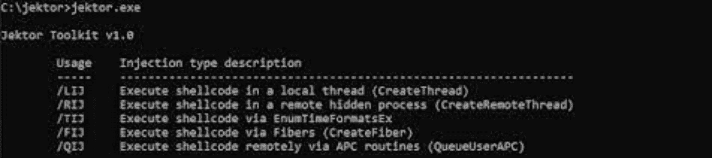
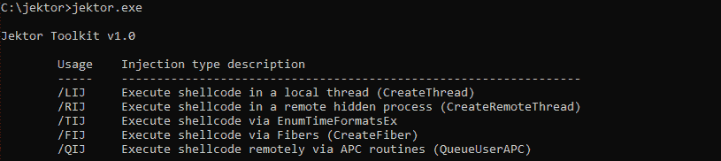
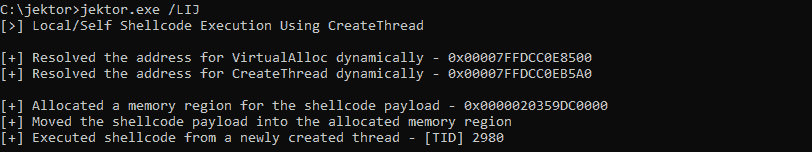
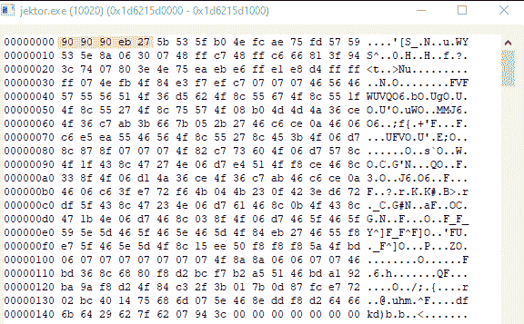
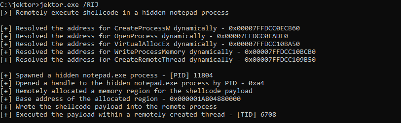
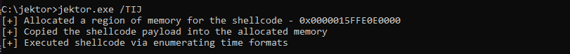
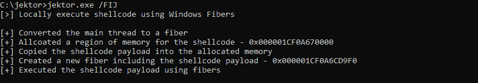
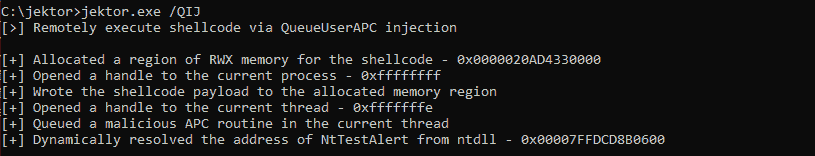

# Jektor:一个 Windows 用户模式外壳代码执行工具，演示了恶意软件使用的各种技术

> [https://kallinuxxtauthorities . com/projector/](https://kalilinuxtutorials.com/jektor/)

Jektor 实用程序专注于外壳代码注入技术，以展示恶意软件可能用来在受害系统上执行外壳代码的方法

*   动态解析 API 函数以规避 IAT 包含
*   包括使用未记录的 NT Windows API 函数
*   通过 CreateThread 支持本地外壳代码执行
*   通过 CreateRemoteThread 支持远程外壳代码执行
*   通过 QueueUserAPC 支持本地外壳代码注入
*   通过 EnumTimeFormatsEx 支持本地外壳代码注入
*   通过 CreateFiber 支持本地外壳代码注入

**反病毒检测？**

在使用动态函数地址解析时，将一组 nop 预先挂起到 Msfvenom XOR 加密外壳代码有效负载似乎会绕过 Windows Defender。

**IAT 进口逃税**

Jektor 使用 LoadLibrary 和 GetProcessAddress 进行动态函数地址解析，使得静态分析更加困难。

不直接调用诸如 VirtualAlloc 之类的重要函数，这使得通过断点调试和转储外壳代码更加困难。

* * *

**通过 CreateThread 执行本地外壳代码**

在 Windows 上，当您想要为当前进程创建一个新线程时，您可以调用 CreateThread 函数，这是在一个进程中执行恶意代码或外壳代码的最基本的技术。您可以简单地为您的外壳代码分配一个内存区域，将您的外壳代码移动到所分配的区域中，然后使用指向所分配区域的地址的指针调用 CreateThread。当您调用 CreateThread 时，您传递了 lpStartAddress 参数，它是一个指向应用程序定义的函数的指针，该函数将由新创建的线程执行。

*   使用 VirtualAlloc 为外壳代码分配足够大的内存区域
*   用 memcpy/RtlCopyMemory 将全局定义的外壳代码缓冲区移动到新分配的内存区域
*   用 CreateThread 创建一个新线程，该线程包含已分配内存区域的基址
*   等待使用 WaitForSingleObject 创建/执行新线程，以确保有效负载引爆

在将外壳代码有效负载的内存区域分配为 RWX 并将有效负载移入其中后，您可以通过在进程中查找任何标记为 RWX 的内存区域来轻松发现此内存区域，然后如果您检查它，可以看到外壳代码有效负载被移入其中，下面突出显示的是在受害系统上执行计算器的外壳代码有效负载的前五个字节。

搜寻 RWX 内存区域是一种快速识别系统上潜在恶意活动的方法。请记住，参与者也可以将内存区域分配为 PAGE_READWRITE，将外壳代码写入其中，然后通过 VirtualProtect 将其切换为 exectuable，这有助于规避对 PAGE_EXECUTE_READWRITE 内存区域的检测。

**通过 CreateRemoteThread 执行远程外壳代码**

另一种为外壳代码执行创建线程的技术是调用 CreateRemoteThread 函数，这将允许您在另一个进程中远程创建线程。但是问题是，您还希望将 shellcode 有效负载分配并写入远程进程，因为您将远程创建一个线程来执行在该进程中分配的有效负载地址。为了远程分配有效负载，您需要使用 virtualallocx 函数，该函数不同于 VirtualAlloc，它可以在远程进程中分配内存区域。为此，Jektor 使用 CreateProcessW 创建一个带有 CREATE_NO_WINDOW 标志集的新进程，这用于生成一个新的隐藏记事本进程。一个新的进程产生它远程分配的内存，然后使用 WriteProcessMemory 将外壳代码有效负载写入分配的内存区域。此后，它调用 CreateRemoteThread 来执行 shellcode 有效负载。

*   使用 CreateProcessW 和 CREATE_NO_WINDOW 集合生成一个新进程
*   使用来自 PROCESS_INFORMATION 的 OpenProcess 和 dwProcessId 打开由 PID 新派生的进程的句柄
*   使用 VirtualAllocEx 在衍生进程中为外壳代码远程分配内存
*   使用 WriteProcessMemory 将外壳代码有效负载写入分配的内存区域
*   使用 CreateRemoteThread 和 OpenProcess 中的句柄引爆远程创建的外壳代码有效负载

**通过 EnumTimeFormatsEx 执行本地外壳代码**

`**EnumTimeFormatsEx**`是一个 Windows API 函数，枚举提供的时间格式，它对执行外壳代码很有用，因为它的第一个参数接受用户定义的被执行的指针。

**BOOL EnumTimeFormatsEx(
[in]time fmt _ enum procex lpTimeFmtEnumProcEx，
[in，可选] LPCWSTR lpLocaleName，
[in] DWORD dwFlags，
[in]LPARAM LPARAM
)；**

*   使用 VirtualAlloc 在本地为外壳代码负载分配内存
*   使用 memcpy/RtlCopyMemory 将外壳代码有效负载移动到新分配的区域
*   通过将外壳代码作为 EnumTimeFormatsEx 的 lpTimeFmtEnumProcEx 参数传递来引爆它

**通过 CreateFiber 执行本地外壳代码**

MSDN 将纤程定义为需要由应用程序手动调度的执行单元。类似于使用 CreateThread 执行外壳代码，我们可以使用纤程。我们将进程主线程转换成纤程，分配外壳代码，并通过调用 SwitchToFiber 来执行它，switch to fiber 执行我们创建的新纤程。

*   使用 GetCurrentThread 获取当前线程的句柄
*   使用 ConvertThreadToFiber 将主线程转换为纤程
*   使用 VirtualAlloc 为外壳代码有效负载分配内存
*   用 memcpy 将外壳代码缓冲区复制到新分配的内存区域
*   使用分配的内存区域的基址创建一个新纤程，作为 CreateFiber 的 lpStartAddress 参数
*   通过使用 SwitchToFiber 调度纤程来引爆外壳代码
*   通过使用 DeleteFiber 删除创建的纤维来执行清理

**通过 QueueUserAPC 执行本地外壳代码**

*   用 VirtualAlloc 为外壳代码缓冲区分配内存
*   用 GetCurrentProcess 获取当前进程的句柄
*   用 WriteProcessMemory 将外壳代码有效负载写入新分配的内存区域
*   用 GetCurrentThread 获取当前线程的句柄
*   Queue 一个新的 APC 例程将分配的内存区域的地址作为 pfnAPC 参数传递给 QueueUserAPC
*   通过调用未记录的 NtTestAlert 函数触发外壳代码负载，该函数清除当前线程的 APC 队列
*   通过关闭当前线程和当前进程的句柄来执行清理

[**Download**](https://github.com/FULLSHADE/Jektor)