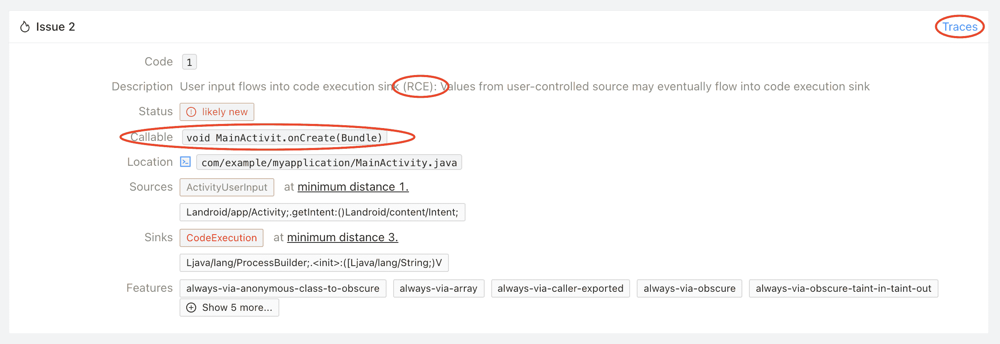
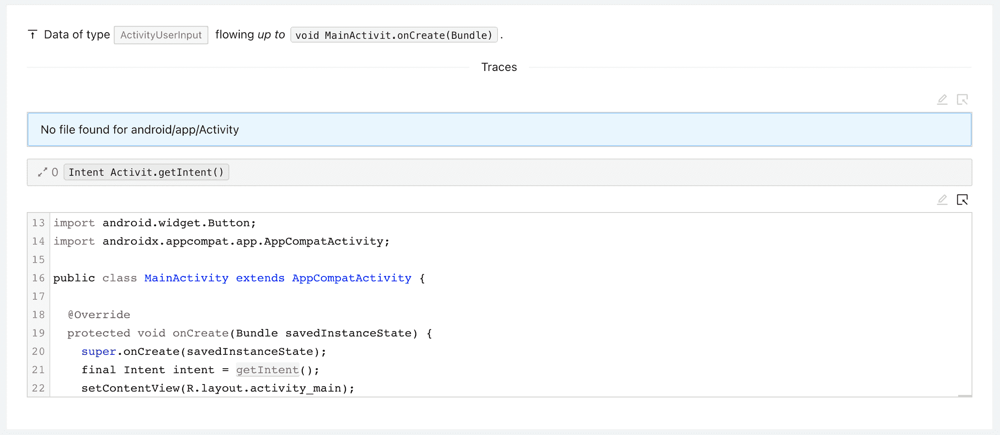
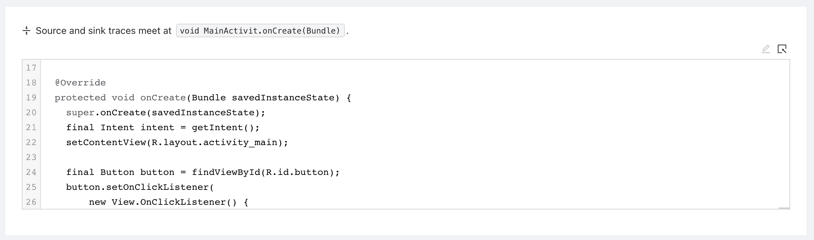

# Mariana Trench:面向 Android 和 Java 应用的安全静态分析工具

> 原文：<https://kalilinuxtutorials.com/mariana-trench/>

[](https://blogger.googleusercontent.com/img/a/AVvXsEjqIfxg4wLA2A9p6_3ACvZKqxLBUn4WPrsRXrDouS9wHTsnDw8vLHYFmadDaUb74x2N3_3kRGLJ3BUap7FGXE_UJpCVMevsnCUoe9lAlyBsFDxFhsw9eExDn-QrHd612NstSsP-KLAvpJGrDocN4iXq2ysfZeBGtJvDVAvoEGaH3SVFFRCzxvDrGGj6=s1138)

**Mariana Trench** 是一款针对 Android 的安全静态分析平台。

本指南将引导您在您的机器上设置 Mariana Trench，并让您在一个小型示例应用程序中找到您的第一个远程代码执行漏洞。我们的网站上也有这些说明。

**先决条件**

马里亚纳海沟需要 Python 的最新版本。在 MacOS 上，你可以通过 homebrew 获得最新版本:

```
$ brew install python3
```

在 Debian 风格的 Linux (Ubuntu、Mint、Debian)上，可以使用`**apt-get**`:

```
$ sudo apt-get install python3 python3-pip python3-venv
```

本指南还假设您已经安装了 Android SDK，并且环境变量`**$ANDROID_SDK**`指向 SDK 的位置。

在本指南的其余部分，我们假设您在虚拟环境中工作。您可以通过以下方式进行设置

```
$ python3 -m venv ~/.venvs/mariana-trench
$ source ~/.venvs/mariana-trench/bin/activate
(mariana-trench)$
```

shell 提示符前面的虚拟环境名称表示该虚拟环境是活动的。

**安装马里亚纳海沟**

在你的虚拟环境中安装马里亚纳海沟就像跑步一样简单

```
(mariana-trench)$ pip install mariana-trench
```

**奔跑的马里亚纳海沟**

我们将使用一个小应用程序，它是我们文档的一部分。你可以通过跑步得到它

**(马里亚纳-海沟)$吉特克隆 https://github.com/facebook/mariana-trench
(马里亚纳-海沟)$ cd 马里亚纳-海沟/文档/样本-应用**

我们现在准备运行分析

(mariana-trench)$ mariana-trench \
–system-jar-configuration-path = $ ANDROID _ SDK/platforms/ANDROID-30/ANDROID . jar \
–apk-path = sample-app-debug . apk \
–source-root-directory = app/src/main/Java
……
I**NFO 分析了 4.04s 中的 68886 款，发现 4 个问题！
…**

分析在我们的示例应用程序中发现了 4 个问题。分析的输出是应用程序的每种方法的一组规范。

**后期处理**

这些规范本身并不意味着可以被人类阅读。我们需要一个额外的处理步骤，以使结果更好看。我们通过为我们安装的 SAPP PyPi 来实现这一点:

**(马里亚纳海沟)$ sapp–tool =马里亚纳海沟分析。
(mariana-trench)$ sapp–database-name = sapp . db server–source-directory = app/src/main/Java
……
2021-05-12 12:27:22，867 [INFO] *运行于 http://localhost:5000/(按 CTRL+C 退出)**

输出的最后一行告诉我们，SAPP 启动了一个本地 web 服务器，让我们可以查看结果。打开链接，您将看到分析发现的 4 个问题。

**探索成果**

让我们关注一下在示例应用程序中发现的远程代码执行问题。您可以通过它的发布代码`**1**`(对于所有远程代码执行)和可调用代码`**void MainActivity.onCreate(Bundle)**`来识别它。只有 4 个问题可以查看，很容易手动识别问题，但一旦运行更多的规则，页面右上角的过滤器功能就会派上用场。



这个问题告诉您，Mariana Trench 在`**MainActivity.onCreate**`中发现了一个远程代码执行，其中数据来自一个调用之外的`**Activity.getIntent**`，并流入 3 个调用之外的`**ProcessBuilder**`的构造函数中。点击问题右上角的“跟踪”查看跟踪示例。

马里亚纳海沟表面的痕迹由三部分组成。

*源轨迹*代表数据来自哪里。在我们的例子中，轨迹很短:`**Activity.getIntent**`直接在`**MainActivity.onCreate**`中调用。



*踪迹根*表示源踪迹与宿踪迹相遇的地方。在我们的例子中，这是 activitie 的`**onCreate**`方法。



跟踪的最后一部分是*接收器跟踪*:这是来自源的数据向下流入接收器的地方。在我们的例子中从`**onCreate**`，到`**onClick**`，到`**execute**`，最后进入`**ProcessBuilder**`的构造函数。

**配置马里亚纳海沟**

您可能会问自己，“工具如何知道什么是用户控制的数据，什么是接收器？”。本指南旨在让你快速入门一款小型应用。我们没有介绍如何配置马里亚纳海沟。您可以在我们的网站“配置”下了解更多信息。

[**Download**](https://github.com/facebook/mariana-trench)