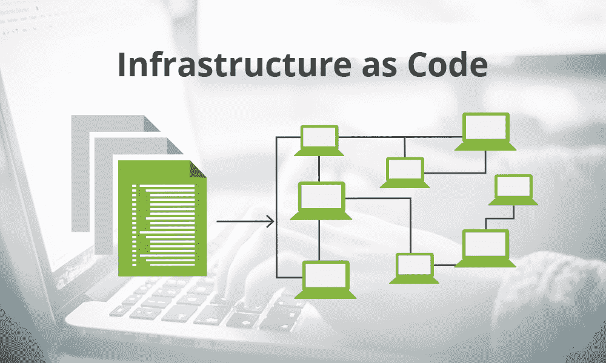

# Cloud的基础设施代码管理

> 原文：<https://kalilinuxtutorials.com/infrastructure-as-code-iac-management-in-the-cloud/>

在云时代，基础设施即代码(IaC)是当今最关键、最重要的组件之一。在这篇文章中，我决定[写我的论文](https://www.wowessays.com/)来解释基础设施管理如何作为云中的代码。

不久前，系统管理员的工作并不容易。必须维护和配置所有的硬件和软件，以便应用程序能够正常工作。如果一台服务器坏了，不得不重新组装，你必须拿出文档，而这些文档很少是最新的。当您重新组装服务器时，您永远不知道它是否与以前完全一样，从而使新服务器处于未知和未经测试的状态。

有了基础设施即代码，所有这些流程都得到了改进，并且避免了由于手动操作或记录不良的操作而可能发生的大量风险和潜在的技术灾难。

## **到底什么是基础设施即代码(IaC)？**

简化其定义，IaC 意味着以编程方式维护基础设施，从而消除了手动配置的需要。

## **作为云中代码的基础设施管理的优势**

## **IaC 和 DevOps**

通过将我们的基础设施转化为代码，我们可以应用 DevOps 提供给我们的所有优势。我们可以将我们的代码添加到 Git 存储库中，并将我们的基础设施版本化，以便与团队合作来维护它。此外，我们可以应用持续改进和集成，以便自动部署批准的变更。

## **更快**

另一个优势是我们启动和运行基础架构的速度。在短时间内，我们可以创建一个完全运行的基础设施。这种速度意味着甚至备份策略也需要审查。因为如果我们可以使用 IaC 在几分钟内重建基础架构，我们为什么要备份所有内容呢？

## 无风险

通过自动创建资源，在任何配置中出错的风险几乎降至零，从而使部署更加安全，并将风险降至最低。

## **降低成本**

从逻辑上讲，基础架构创建的自动化降低了成本，因为工程师不需要手动配置和维护基础架构。此外，重用代码的能力极大地减少了新基础设施的设计。

## 可变还是不可变？

随着所有这些变化和思维方式，引入了诸如“可变”和“不可变”的概念。但是这些概念是什么意思呢？

可变意味着设置的服务器会随着时间而变化。也许你从运行 Linux 和 Tomcat 4.2 的服务器开始，但是后来决定使用 Nginx。为此，您必须卸载 Tomcat，并在同一台服务器上安装 Nginx 和所有这些。这有什么不好？好吧，也许在一台服务器上什么也没发生，但是想象一下，我们必须将它应用到一个场中的 100 台服务器上，其中所有服务器都用于相同的应用程序。很有可能某些服务器的配置与其他服务器不同，并且可能存在我们不知道每个服务器处于什么状态的情况。它也被称为“配置漂移”这意味着应用程序可以开始随机生成错误，我们必须找出是哪个服务器导致了这个问题。

不可变意味着服务器一旦装载，就不会改变。如果我们目前有一个安装了 Tomcat 4.2 的 Linux 服务器，并且想要转到一个安装了 Nginx 的 Linux 服务器的环境，我们将这个新环境挂载到一个全新的服务器上。一旦新服务器经过测试和验证，我们就用旧服务器替换它，并将所有流量传递到新服务器。

随着 IaC 的引入，我们正慢慢走向一个所有或大部分基础设施都是不可变的世界，因为用 IaC 建立基础设施非常快。

## **宠物还是牛？**

一个很好的例子就是把基础设施想象成“宠物或牛”过去，我们习惯于将我们的服务器或基础设施视为宠物，我们给它们取了熟悉的名字，并悉心照料它们，以便它们能尽可能长时间地与我们在一起。

然而，今天，随着 IaC 和不可变概念的引入，我们不得不开始将我们的服务器或基础设施视为牲畜。在家畜中，动物没有名字，最多是一个数字，如果一只动物生病了或者不再对我们有帮助，我们就把它剔除，换上一只新的动物。

## 将基础设施作为代码管理的缺点

在应用 IaC 时，并不是所有的都是优点，至于缺点，我想强调的是，没有任何人规定在云中创建资源的方式要标准化。我还认为，鉴于不同云的多样性，目前这是不可能的。因此，如果不进行必要的更改，为云提供商所做的设计在另一个提供商那里是无效的。

## **工具**

目前，市场上有几种工具允许我们生成 IaC 代码。其中一些是特定于云提供商的，例如:

-云形成(AWS)

–Azure 资源管理器(Azure)

–谷歌云部署管理器(谷歌)

然后是多云工具。它们是用于从同一设备在不同提供商中创建基础设施的那些。

–地形

–ansi ble

–木偶厨师

-普拉米

大多数工具的缺点是它们使用特定领域语言(DSL ),这意味着我们必须在使用设备之前学习一种新的语言。当开始一个项目时，它会产生一个学习曲线。

然而，它是第一个将自己从 DSL 中分离出来并允许用最适合团队的语言生成基础设施的。它目前支持 Javascript、TypeScript、Python、GO 和 C#。它甚至吸引了 Terraform 的注意，Terraform 创建了一个用编程语言生成基础设施栈的 CDK。

## **结论**

基础设施即代码已经是云世界中的一个基本概念，并且是许多组织中开发运维周期的一部分。多亏了 IaC，我们部署甚至设计基础设施的想法发生了根本的变化，给我们带来了我们刚刚看到的多种优势。

***生物:***

 **Jana Rooheart 是一名博主，在创意写作、心理学和数字学习工具方面拥有丰富的专业知识。贾娜在 WowEssays.com 的博客上分享了她的专业知识，特别是分享了学术写作领域的技巧。Jana 给出了一些实用的建议，帮助了很多上大学的学生。**