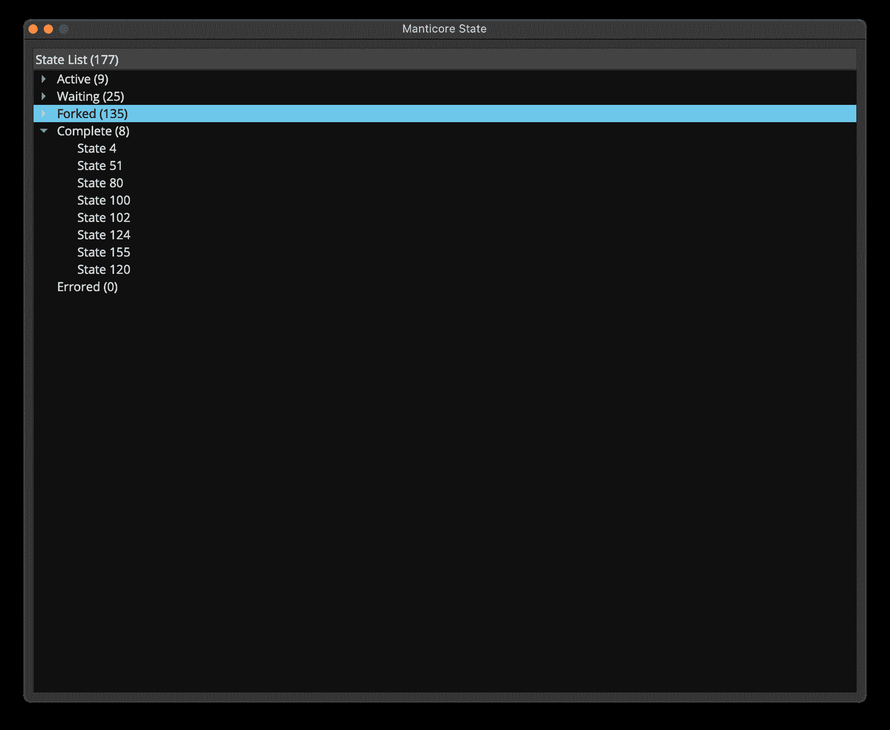
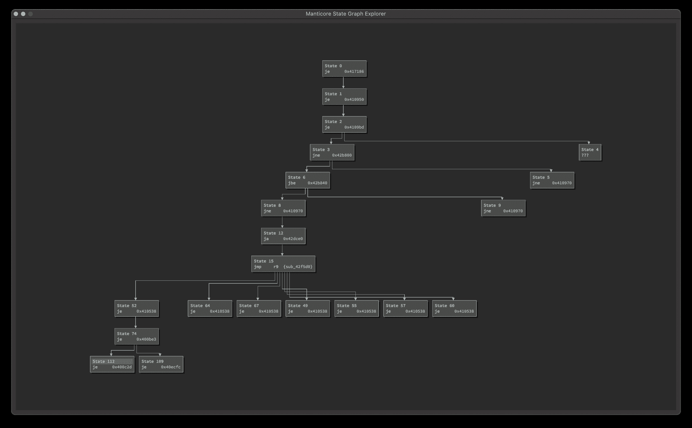
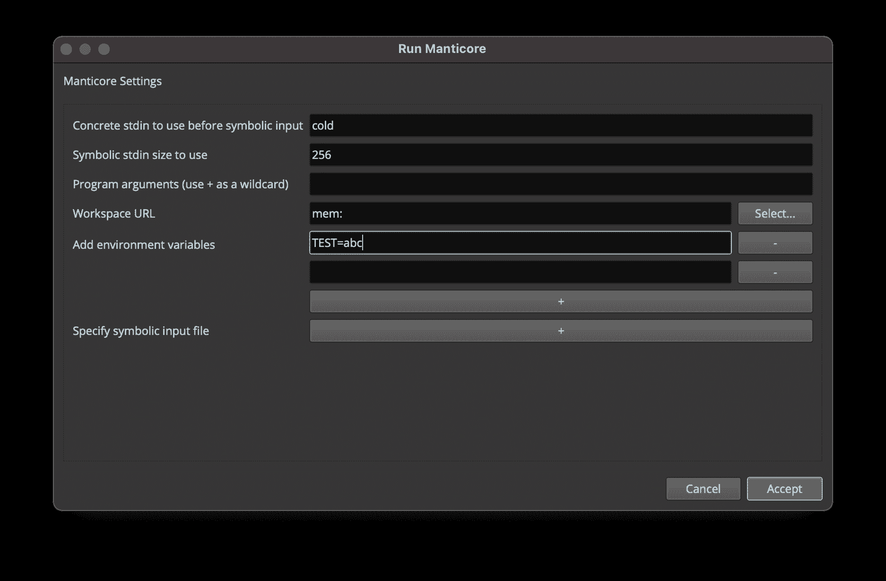
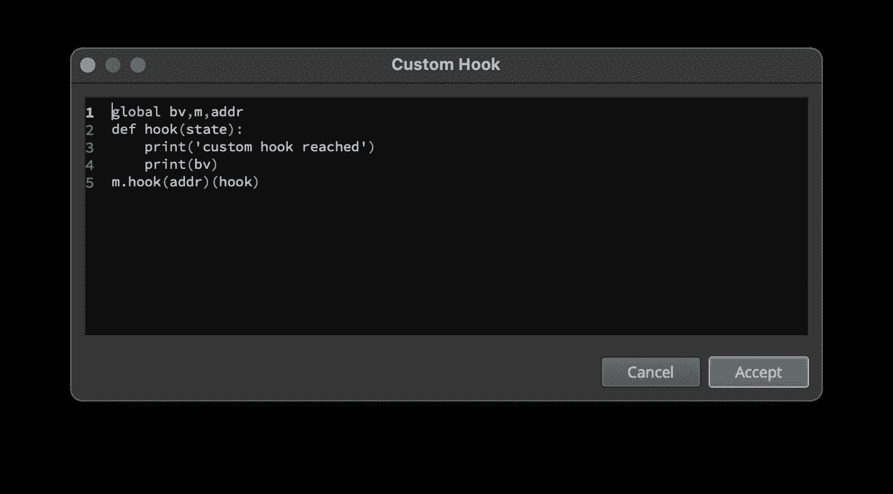
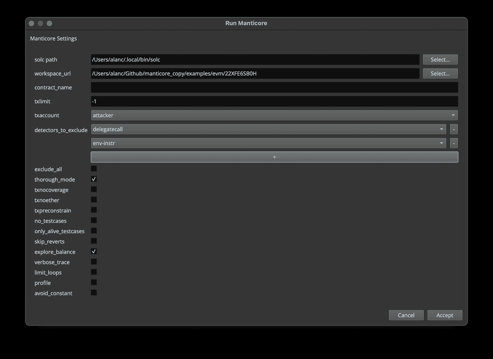
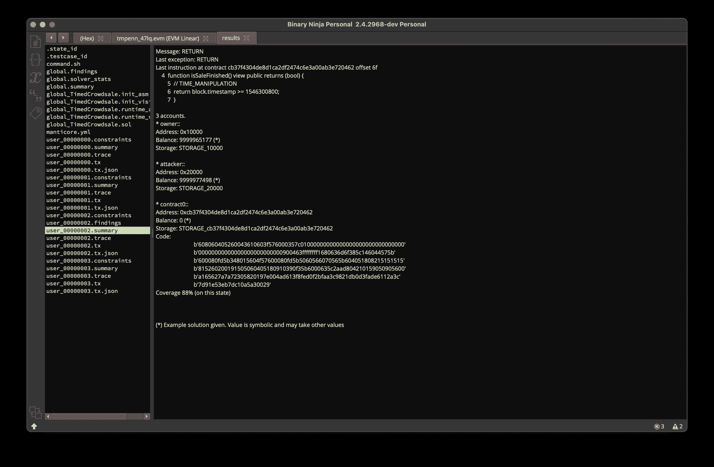

# MUI:一个用于二进制忍者交互和查看蝎狮进度的 GUI 插件

> 原文：<https://kalilinuxtutorials.com/mui/>

[](https://blogger.googleusercontent.com/img/a/AVvXsEh-sE3mPKYCY5bfbPGNhpEmoolUYZSymNFhHI4rp5Bk22DmT2BTuzqvnSsy_n6hUQ69QntE2jDsXMpikumpc4K-mFmq3hp56Q9GqTl_zm3H3Vhe7SE36JOgsgq5_Yqe8u6CQXvJZZTzO3OGl6Lx2NPUaQPy_jpuhJCGUC1pgkajq-W6AwLsTiHt6sAG=s482)

**MUI** (蝎狮用户界面)项目，我们为 Binary Ninja 提供了一个图形用户界面插件，允许用户轻松地与蝎狮符号执行引擎进行交互并查看其进度，以分析智能合约和本机二进制文件。

注意:该项目正在开发中，可能不稳定或不可用。如果您在使用现有功能时遇到任何困难，请提出问题。新功能开发将根据具体情况进行考虑。

**要求**

除了 Python 要求之外，我们还需要以下内容:

*   带 GUI 的二进制忍者(最新开发版本)
*   `**git submodule update --init --recursive**`对于蝎狮子模来说

**安装**

MUI 需要一个带有 GUI 的二进制 Ninja 副本。目前我们正在测试最新的`**dev**`版本(在撰写本文时为`**2.4.2901**-**dev**`)。

蝎狮只在 Linux 环境下的本地二进制文件上运行。EVM 支持只在 Mac 和 Linux 上测试过，它需要安装 ethersplay。

Python 依赖关系目前是使用`**requirements.txt**`和`**requirements-dev.txt**`来管理的。你可以运行`**make** **init**`来建立一个开发环境。

*   通过创建一个指向插件目录的符号链接，使项目对 Binary Ninja 可用。从该回购的根目录中，运行以下命令:

**For Mac
ln-s " $(pwd)/mui " " $ { HOME }/Library/Application Support/Binary Ninja/plugins/mui "
For Linux
ln-s " $(pwd)/mui " " $ { HOME }/。二进制忍者/插件** s/mui "

*   确保二进制忍者了解我们的 Python 虚拟环境。
    *   打开 Binary Ninja 的“首选项”->“设置”->“Python”，确保“Python 解释器”正确设置为与当前虚拟环境关联的 Python 路径。参考`**venv/pyvenv.cfg**`找到基本路径。
    *   将 MUI 项目的绝对路径复制并粘贴到 Binary Ninja 的“Python 虚拟环境站点包”中，并为站点包路径添加所需的`**/venv/lib/python3.<minor_version>/site-packages**`后缀。
    *   如有必要，重启二进制忍者。

**发展**

正在安装当前列出的依赖项:

**make init
For Mac(将类似于 Linux)
export python path = "/Applications/Binary Ninja.app/Contents/Resources/python:/Applications/BinaryNinja.app/Contents/Resources/python3″**

激活 python 虚拟环境(在运行其他 make 命令之前执行此操作):

**$。venv/bin/activate**

可以通过运行以下命令来遵循代码样式和林挺:

```
$ make format
$ make lint

```

如果您有可用的无头版本的二进制 ninja，则可以运行没有二进制 Ninja 交互的代码测试，否则将只运行非二进制 Ninja 测试:

```
$ make test
```

通过编辑`**requirements.txt**`或`**requirements-dev.txt**`，然后在虚拟环境中运行以下程序，可以添加新的依赖关系:

```
$ pip install -r requirements-dev.txt -r requirements.txt
```

**用法(原生)**

所有 MUI 功能都可以通过右键单击上下文菜单或命令选项板来访问。常见功能包括:

*   查找此指令的路径/从查找列表中删除指令
*   避免此指令/从避免列表中删除指令
*   添加/编辑自定义挂钩
*   与蝎狮一起解决/阻止蝎狮

以下小部件可用:

*   状态列表显示 manticore 执行期间的所有活动/等待/完成/出错状态。双击某个状态会导航到该状态的当前指令，并在 graph 小部件中呈现其出处树。



*   状态图小部件显示在列表小部件中选择的特定状态的起源树。`Tab`可用于展开/折叠图形，双击任一状态节点可导航至该状态的当前指令。



*   运行对话框调用`**Solve with Manticore**`命令时，显示运行对话框。它允许您配置各种 manticore 选项，并且更改将被保存到`**bndb**`文件中。一些示例配置包括使用`**LD_PRELOAD**`和`**LD_LIBRARY_PATH**`环境变量的组合来运行带有自定义 glibc 的二进制文件。



*   定制钩子对话框可使用`**Add/Edit Custom Hook**`命令进入定制钩子对话框。它允许你在选定的地址定义一个自定义的蝎尾狮钩子。您还可以完全访问二进制 Ninja API，它允许您添加高亮显示、注释等等。通过将代码输入字段设置为空白，可以删除已定义的挂钩。



**用法(EVM)**

EVM 的支持目前有点有限。MUI EVM 仅支持与[蝎狮 CLI 工具](https://github.com/trailofbits/manticore)相同的功能集。可用命令包括:

*   载入以太坊契约
*   与蝎狮一起解决/阻止蝎狮

并且实现了以下视图:

*   EVM 运行对话框当你调用`**Solve with Manticore**`命令时，显示运行对话框。它允许您配置各种 manticore 选项，并且更改将被保存到`**bndb**`文件中。



*   运行报告报告页面显示 manticore 执行的结果。它显示了使用二进制 Ninja UI 生成的所有文件。

[**Download**](https://github.com/trailofbits/ManticoreUI)