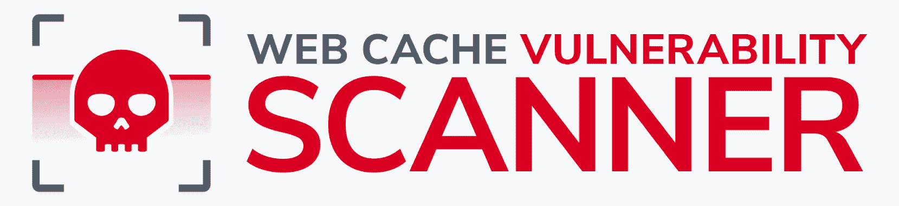

# Web 缓存漏洞扫描器:一个基于 Go 的 CLI 工具，用于测试 Web 缓存中毒

> 原文：<https://kalilinuxtutorials.com/web-cache-vulnerability-scanner/>

**Web Cache Vulnerability Scanner**(WCVS)是一款由 Hackmanit 开发的针对 Web Cache 中毒的快速通用 CLI 扫描器。

该扫描器支持许多不同的 web 缓存中毒技术，包括一个爬虫来识别要测试的更多 URL，并且可以适应特定的 web 缓存以进行更有效的测试。它是高度可定制的，可以很容易地集成到现有的 CI/CD 管道中。

**特性**

*   支持 9 种 web 缓存中毒技术:
    *   无锁头中毒
    *   未知参数中毒
    *   参数隐藏
    *   脂肪获取
    *   HTTP 响应拆分
    *   HTTP 请求走私
    *   HTTP 报头超大号(HHO)
    *   HTTP 元字符(HMC)
    *   HTTP 方法覆盖(HMO)
*   在测试之前分析 web 缓存，并对其进行调整以提高测试效率
*   生成 JSON 格式的报告
*   对网站进行爬网以获取更多要扫描的 URL
*   通过代理路由流量(例如，Burp 套件)
*   限制每秒请求数以绕过速率限制

**安装**

**选项 1:预建二进制(推荐)**

预构建的 WCVS 二进制文件在发布页面上提供。这些版本还包括 2 个默认的单词表。

**选项 2:使用 Go 获取存储库**

可以使用 Go 获取存储库。

go1.17 及更高版本

**去安装-v github.com/Hackmanit/Web-Cache-Vulnerability-Scanner@latest**

go1.16 及以下

**go get-u https://github . com/Hackmanit/we B- Cache-Vulnerability-Scanner**

**选项 3: Docker**

*   克隆存储库或下载最新的源代码版本

*   构建图像(单词列表文件夹也将被复制)

**$ docker 构建。
发送构建上下文到 Docker 守护进程 29.54MB**
**步骤 1/10:来自 golang:最新 AS 构建器
— > 05c8f6d2538a
步骤 2/10:WORKDIR/go/src/app
—>使用缓存
— > f591f24be8cf
步骤 3/10:复制。。
— > 38b358dd3472
第 4/10 步:运行 go get -d -v ./…
— >运行 41f53de436c5
…。
移除中间容器 9e 2e 84d 14 ff 3
—>1668 edcf 6 ee 3
成功建造 1668edcf6ee3**

运行 wcvs

**$ docker run-it 1668 edcf 6 ee 3/wcvs–help
https://github . com/Hackmanit/we B- Cache-Vulnerability-Scanner
版本 1.0.0**

**用途**

WCVS 是高度可定制的使用它的旗帜。许多标志可以直接包含值，也可以包含文件的路径。

唯一强制的标志是`**-u/--url**`来提供目标 URL，应该对其进行 web 缓存中毒测试。目标 URL 可以以不同的格式提供，

WCVS 需要两个单词表来测试前 5 种技术——一个单词表包含标题名，另一个包含参数名。单词表可以出现在执行 WCVS 的同一个目录中，也可以使用`**--headerwordlist/-hw**`和`**--parameterwordlist/-pw**`标志指定。

**例题**

w**CVS-u 127 . 0 . 0 . 1
wcvs-u http://127 . 0 . 0 . 1
wcvs-u https://example.com
wcvs-u file:path/to/URL _ list
wcvs-u https://example.com-HW " file:/home/user/Documents/word list-header . txt "
wcvs-u https://example.com-pw " file:/home/user/Documents/word list-parameter . txt "
wcvs-u https://example.com**

**指定标题、参数、Cookies 等**

*   `**--setcookies/-sc**`指定应添加到请求中的 cookies
*   `**--setheaders/-sh**`指定应添加到请求中的标题
*   `**--setparameters/-sp**`指定应添加到请求中的参数。虽然也可以简单地将它们添加到 URL 中，但是在某些情况下通过这个标志添加它们可能更有用。
*   `**--post/-post**`将 HTTP 方法从 GET 更改为 POST
*   `**--setbody/-sb**`指定应添加到请求中的正文
*   `**--contenttype/-ct**`指定内容类型头的值
*   `**--useragentchrome/-uac**`将用户代理从`**WebCacheVulnerabilityScanner v{Version-**` **`Number}`变更为** o `**Mozilla/5.0 (Windows NT 10.0; Win64; x64) AppleWebKit/537.36 (KHTML, like Gecko)** **Chrome/92.0.4515.131 Safari/537.36**`。虽然使用`**-sh "Mozilla/5.0 (Windows NT 10.0;** **Win64; x64) ...**`也可以达到同样的效果，但此标志提供了一种更快捷的方式。

**例子**

**wcvs-u https://example.com-sc " PHPSESSID = 123 "
wcvs-u https://example.com-sc " file:/home/user/Documents/cookies . txt "
wcvs-u https://example.com-sh " Referer:localhost "
wcvs-u https://example.com-sh " file:/home/user/Documents/headers . txt "
wcvs-u https://example.com-sp " admin = true "
wcvs-u https://example.com-sp " file:/home/user/Documents/parameters . txt**

**生成 JSON 报告**

如果设置了标志`**--generatereport/-gr**`，则每次扫描 URL 后都会生成并更新 JSON 报告。该报告就像日志文件一样，写入执行 WCVS 的同一个目录中。为了改变所有输出文件的目录，使用`**--generatepath/-gp**`。如果报告中需要编码 HTML 特殊字符，使用 **`--escapejson/-ej`。**

**例子**

**wcvs-u https://example.com-gr
wcvs-u https://example.com-gr-EJ
wcvs-u https://example.com-gr-gp/首页/用户/文档
wcvs-u https://example.com-gr-gp/首页/用户/文档-ej**

**使用代理**

要使用代理，需要 PEM 格式的代理 CA 证书。例如，Burp 套件证书以 DER 格式提供。要转换它们，可以使用下面的命令:`**openssl x509 -inform DER -outform PEM -text -in cacert.der -out cacert.pem**`。可以用`**--proxycertpath/-ppath**`指定证书的路径。代理的默认 URL 是`**http://127.0.0.1:8080**`。为了改变它，使用 **`--proxyurl/-purl`。**

**例子**

wcvs-u https://example.com-ppath/home/user/Documents/cacert . PEM
wcvs-u https://example.com-ppath/home/user/Documents/cacert . PEM-purl http://127 . 0 . 0 . 1:8081

**油门或加速**

每秒允许的最大请求数可以用`**--reqrate/-rr**`设置。默认情况下，该数字不受限制。相反，如果使用`**--threads/-t**`来增加 WCVS 使用的并发线程数，每秒的请求数可能会增加。默认值为 20。

**例子**

**wcvs-u https://example.com-RR 10
wcvs-u https://example.com-RR 1
wcvs-u https://example.com-RR 0.5
wcvs-u https://example.com-T50**

**其他标志**

WCVS 提供了比前面提到的更多的标志和选项。 **`--help/-h`** 提供了每一种旗帜的清单，它的含义，以及如何使用它。

**例子**

**wcvs -h**

[**Download**](https://github.com/Hackmanit/Web-Cache-Vulnerability-Scanner)