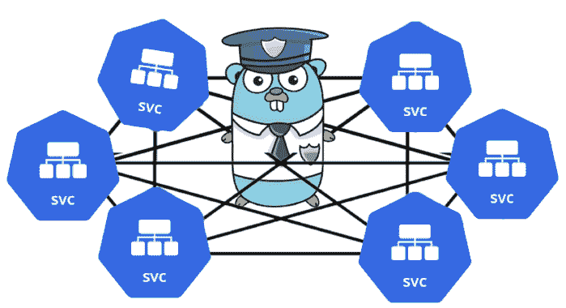

# Mesh-Kridik:一个在 Kubernetes 集群上执行安全检查的开源安全检查器

> 原文：<https://kalilinuxtutorials.com/mesh-kridik/>

Mesh-Kridik 是一个开源的安全检查器，它使用 istio 服务 Mesh 在 Kubernetes 集群上执行各种安全检查，并输出安全报告

安全检查测试是 istio 安全最佳实践的全面实施

在具有 istio 服务网格的 Kubernetes 集群上执行的安全检查，被 OPA(开放策略代理)用来实施安全规则，并且输出审计报告包括:安全问题的根本原因和针对安全问题的建议补救措施。

**要求**

*   Go 1.16+
*   japan quarterly 日本季刊
*   istio

**安装**

**git 克隆 https://github.com/chen-keinan/mesh-kridik
CD mesh-kri dik
make build**

*   注意:mesh-kridik 要求执行根用户

**快速启动**

不带任何标志执行 Mesh-Kridik，执行所有测试

**。网格克里格**

执行带标志的 mesh-kridik，按需执行测试

用法:mesh-kri dik[–version][–help][]
**可用命令有:
-r，–report:运行安全检查并生成补救报告
-i，–include:仅执行特定的安全检查，example -i=1.1
-e，–exclude:忽略特定的安全检查，example -e=1.1，2.0**

执行测试并生成失败测试报告和 it 补救措施

**。网格克里格-r**

**Istio 安全检查**

| 名字 | 描述 | 影响 |
| 相互 TLS | 默认情况下，Istio Mutual TLS 代理配置为许可模式 | 代理将接受相互 TLS 和明文流量 |
| Istio 更安全的授权策略模式 | 使用肯定匹配允许或否定匹配拒绝模式 | 这些授权策略模式更安全，因为在策略不匹配的情况下，最坏的结果是意外的 403 拒绝，而不是绕过授权策略。 |
| 授权策略中的路径规范化 | 授权策略的执行点是特使代理，而不是后端应用程序中通常的资源访问点 | 不匹配可能导致意外拒绝或绕过策略 |
| 出口流量的 TLS 发起 | 对出口流量的服务 ServiceEntry 使用 DestinationRule | 对于外部服务的出口流量，不使用 TLS 发起，将使用纯文本发送 |
| 协议检测 | 显式声明服务协议 | 漏检可能会导致意外的流量行为 |
| CNI 支持 | istio 透明流量捕获 | 并非所有网络流量都不会被捕获 |
| 过于宽泛的宿主 | 避免网关中过于宽泛的主机设置 | 可能导致意外域的潜在暴露 |
| 限制网关创建权限 | 将网关资源的创建限制于受信任的群集管理员 | 可能会导致不受信任的用户创建网关 |
| 配置下游连接的限制 | 根据部署中各个网关实例所需的并发连接数，更新配置映射中的 global _ downstream _ max _ connections。一旦达到限制，特使将开始拒绝 tcp 连接 | 对下游连接数没有限制会导致被恶意参与者利用 |
| 配置第三方服务帐户令牌 | 建议配置第三方令牌，因为第一方令牌的属性不太安全 | 第一方令牌属性不太安全，可能会导致身份验证违规 |
| 制导机 | 默认情况下，为了方便起见，Istiod 公开了几个未经身份验证的明文端口 | 通过未经身份验证的明文暴露 XDS 服务端口 15010 和调试端口 8080 |
| 数据平面 | 代理公开了各种端口 | 在与代理相同的 pod 中运行的应用程序具有访问权限；在 sidecar 和应用程序之间没有信任边界 |
| 了解流量捕获限制 | 通过设置 mesh config . outboundtrafficpolicy . mode 来保护出口流量 | 外部服务访问将不受控制 |

**用户插件使用情况(通过 go 插件)**

Kube-kridik 公开了一个用户插件挂钩示例:

*   **meshesecuritycheckresulthook**–这个钩子接受 k8s 服务网格安全检查结果

编译用户插件

**go build-build mode = plugin-o = ~//。所以~//。开始**

将插件复制到文件夹(。kube-kridik 文件夹在第一次启动时创建)

**cp ~//。所以~/。kube-kridik/plugins/compile/。所以**

[**Download**](https://github.com/chen-keinan/mesh-kridik)