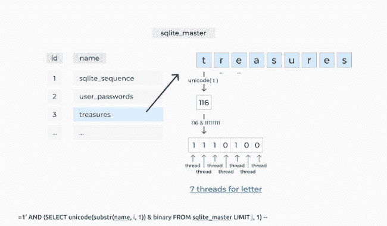
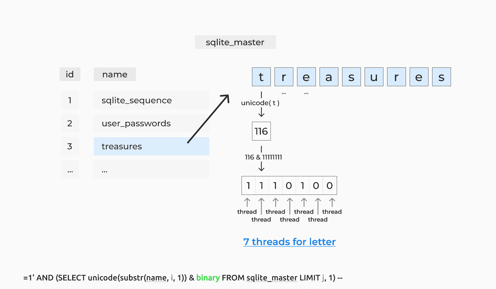
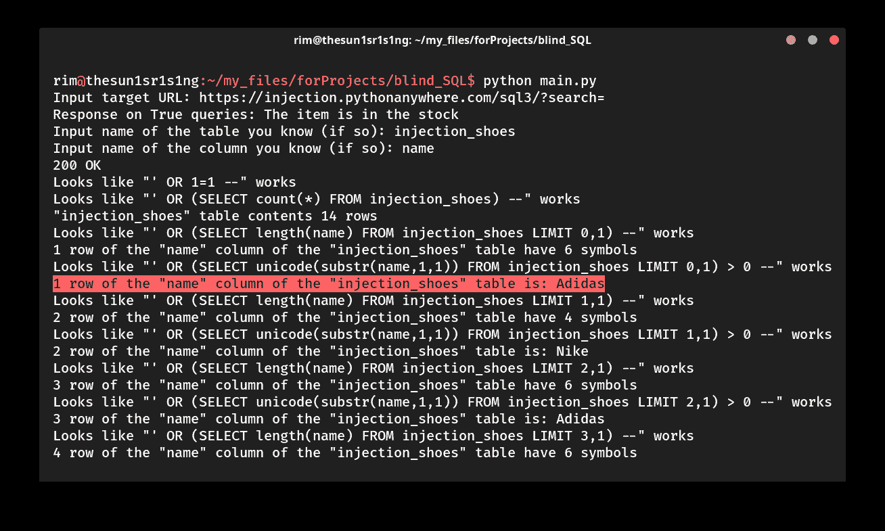

# SQLbit:只是另一个用于自动化基于布尔的盲 SQL 注入的脚本

> 原文：<https://kalilinuxtutorials.com/sqlbit/>

SQLbit 只是自动化基于布尔的盲目 SQL 注入的另一个脚本。至少支持 SQLite，支持使用 cookies。
它使用多线程的逐位比较来查找单元格值，而不是二分搜索法，这样效率更高。

它能够:

*   按表格中的列搜索单元格值
*   按表格中的列搜索单元格中的字符数
*   搜索表中的行数

搜索算法如下所示。知道其列的名称(例如，在 sqlite 中默认为“sqlite_master ”)及其列名(在 sqlite 中为“name ”),您可以找到每行中每个单元格的值。最快的算法是检查每个单元格中每个字符的二进制值，这可以使用多线程来执行。考虑到这一点，我们可以只发送 7 个请求来获得标准的 7 位字母，使用 1000 个线程，我们每分钟可以获得大约 142 个字母(记住请求来获得单元值的长度也是值得的)。

需要比较的位数(ASCII 默认为 7)和线程数可以指定为输入数据。

**安装**

**git 克隆 https://github.com/Sunlight-Rim/sqlbit.git
pip 3 install-r requirements . txt**

**用途**

它不接受命令行参数，所以你可以在配置文件或运行时程序中指定数据。

**python sqlbit.py**

[**Download**](https://github.com/Sunlight-Rim/SQLbit)