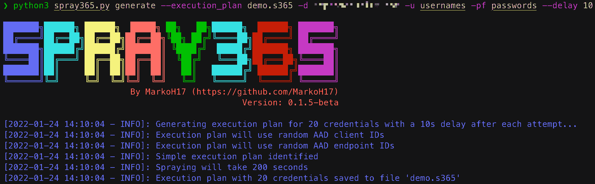
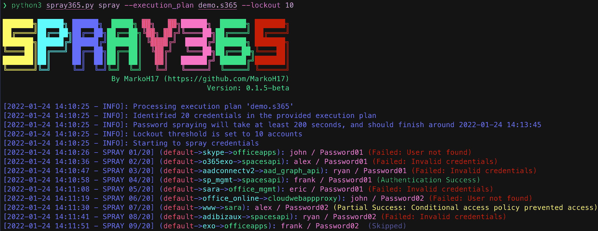

# Spray365:通过两步密码喷洒方法喷洒微软账户

> 原文：<https://kalilinuxtutorials.com/spray365/>

**Spray365** 是一款识别微软账户(Office 365 / Azure AD)有效凭证的密码喷射工具。Spray365 与已经上市的许多其他密码喷射工具有何不同？Spray365 允许从“执行计划”中喷射密码。尽管 Spray365 利用预先生成的执行计划在喷洒操作发生之前对其进行描述具有许多其他优势，但这也允许在网络错误或其他中断后恢复密码喷洒(`**-R**`选项)。虽然直接使用 Spray365 生成 Spray365 执行计划是最简单的，但其他生成兼容 JSON 结构的工具可以轻松构建独特的密码喷涂工作流。

Spray365 提供了一些在喷涂凭证时有用的选项。随机用户代理可用于检测和绕过不安全的条件访问策略，这些策略被配置为限制允许设备的类型。类似地，`-**-shuffle_auth_order**`参数是以不太可预测的方式喷洒凭证的好方法。添加此选项是为了尝试绕过智能帐户锁定(例如，Azure 智能锁定)。虽然它并不完美，但随机选择尝试凭证的顺序也有其他好处，比如使这些喷涂操作的检测更加困难。Spray365 还支持通过 HTTP/HTTPS 代理流量，它可以与 Burp Suite 等其他工具很好地集成，用于操纵喷涂操作的源。

**生成执行计划(步骤 1)**

**用执行计划喷涂凭证(步骤 2)**

**入门**

**安装**

克隆存储库，安装所需的 Python 包，并运行 Spray365！

**$ git 克隆 https://github.com/MarkoH17/Spray365
$ CD spray 365
~/spray 365 $ pip 3 install-r requirements . txt
~/spray 365 $ python 3 spray 365 . py**

**用途**

**生成执行计划**

喷涂凭证需要一个执行计划，所以我们需要创建一个！Spray365 可以通过在“生成”(`**spray365.py generate**`)模式下运行来生成自己的执行计划。更多详情见生成模式帮助(`**spray365.py generate -h**`)。

**$ python 3 spray 365 . py generate–execution _ plan-d-u-pf**

例如

**$ python 3 spray 365 . py generate–execution _ plan ex-plan . s365-d example.com-u 用户名-pf 密码**

**喷涂执行计划**

一旦有了执行计划，就可以使用 Spray365 对其进行处理。在“spray”(`**spray365.py spray**`)模式下运行 Spray365 将处理指定的执行计划并喷涂适当的凭证。更多详细信息，请参见喷射模式帮助(`**spray365.py spray -h**`)。

**$ python 3 spray 365 . py spray–execution _ plan**

例如

**$ python 3 spray 365 . py spray–execution _ plan ex-plan . s365**

**高级用法的其他选项**

**生成模式选项**

`**-ep / --execution_plan <string>**`:保存生成的 Spray365 执行计划的文件(默认:无)

`**-d / --domain <string>**`:要验证的 Office 365 域(默认:无)

`**-u / --user_file <string>**`:包含要喷涂的用户名的文件(每行一个，不带域)(默认:无)

`**-p / --password <string>**`:喷射密码(默认:无)

`**-pf / --password_file <string>**`:包含喷射密码的文件(每行一个)(默认:无)

`**--delay <int>**`:验证尝试之间等待的延迟秒数(默认值:30)

`**-cID / --aad_client <string>**`:认证工作流程中使用的客户端 ID(无为随机选择，用逗号分隔的字符串指定多个)(默认:无)

`**-eID / --aad_endpoint <string>**`:身份验证工作流期间要指定的端点 ID(无表示随机选择，用逗号分隔的字符串指定多个)(默认:无)

`**-S / --shuffle_auth_order**`:打乱验证尝试的顺序，以便每次迭代(用户 1:密码 1，用户 2:密码 1，用户 3:密码 1)将以随机的顺序和随机的密码排列进行喷射，例如(用户 4:密码 16，用户 13:密码 25，用户 19:密码 40)。请注意，此选项可能会导致给定用户的连续身份验证尝试之间的时间间隔延迟数秒。考虑使用-mD/–min _ cred _ loop _ delay 选项来强制任何给定用户的身份验证尝试之间的最小延迟。(默认值:False)

`**-SO / --shuffle_optimization_attempts <int>**`:生成随机执行计划的数量，用于标识最快的执行计划(默认为 10)

`**-mD / --min_cred_loop_delay <int>**`:给定用户在两次认证尝试之间等待的最短时间。此选项考虑了一次喷射迭代所需的时间，因此预认证延迟可能不会每次都发生(使用 0 禁用)(默认值:0)

`**-cUA / --custom_user_agent <string>**`:设置认证请求的自定义用户代理(默认:无)

`**-rUA / --random_user_agent**`:验证请求的随机化用户代理(默认:假)

**喷雾模式选项**

`**-ep, --execution_plan <string>**`:包含用于密码喷射的 Spray365 执行计划的文件(默认:无)

`**-l, --lockout <int>**`:中止喷涂会话前观察的帐户锁定次数(禁用 0)(默认:5)

`**-x, --proxy <string>**` : HTTP 代理 URL(格式:http[s]://proxy.address:port)(默认:无)

`**-k, --insecure**`:禁用 HTTPS 证书验证(默认:假)

`**-R, --resu**me_index <int>`:从执行计划中的这个位置重新开始喷射密码(默认值:0)

`**-i, --ignore_success**`:忽略用户成功认证尝试，继续喷凭证。设置此标志将为用户启用喷涂凭证，即使 Spray365 已经识别了有效凭证。(默认值:False)

[**Download**](https://github.com/MarkoH17/Spray365)