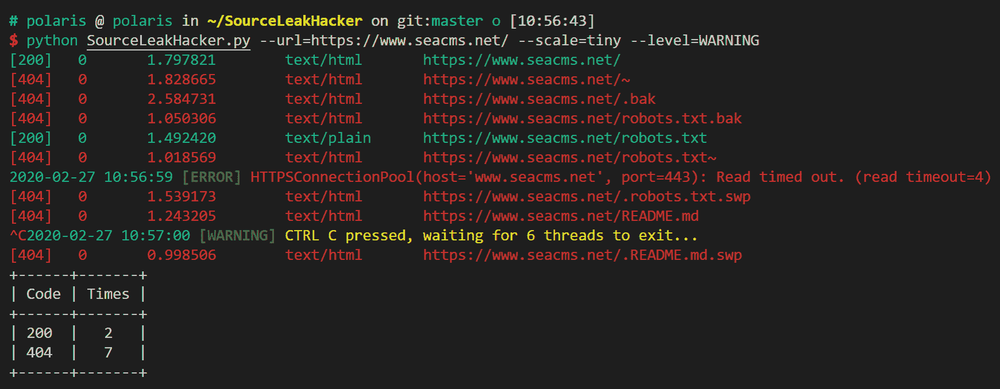
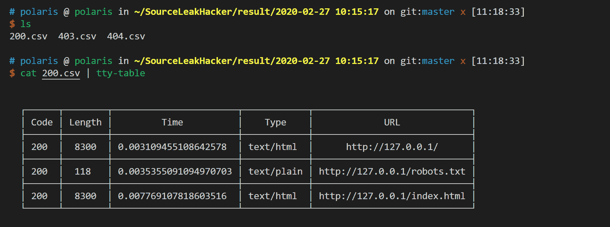
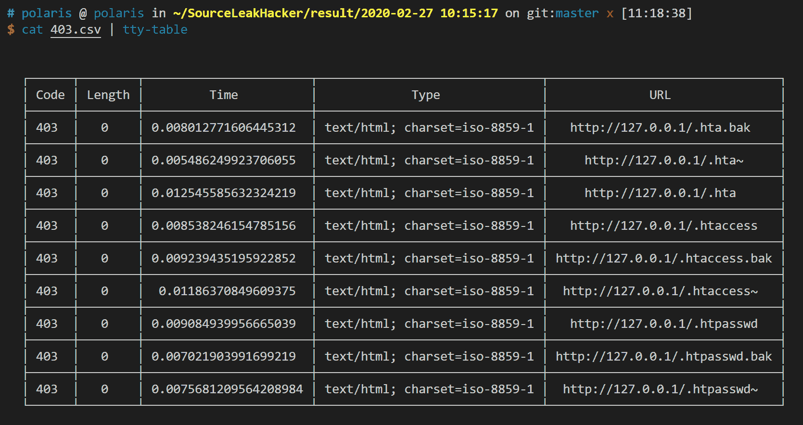

# SourceLeakHacker:一个多线程的 Web 应用程序源泄漏扫描器

> 原文：<https://kalilinuxtutorials.com/sourceleakhacker/>

SourceLeakHacker 是一个多线程的网页目录扫描器。

**安装**

**pip install-r requirements . txt**

**用途**

**用法:sourceleakhacker . py【options】
可选参数:
-h，–help 显示此帮助信息并退出
–url url 要扫描的 URL，例如:' http://127 . 0 . 0 . 1/'
–URLS URLS 文件包含要扫描的 URL，一行一个 URL。
-scale { full，tiny}内置字典 output OUTPUT output 输出文件夹，默认:result/YYYY-MM-DD hh:MM:ss
-THREADS，-t THREADS
线程数，默认:4
-time out 超时 HTTP 请求超时
-level { CRITICAL，ERROR，WARNING，INFO，DEBUG}，-v {CRITICAL，ERROR，WARNING，INFO，DEBUG}
日志级别
-version，-v 显示程序的版本号并退出**

**例子**

**$ python sourceleakhacker . py–URL = http://Baidu . com–threads = 4–time out = 8
[302]0 3.035766 text/html；charset = iso-8859-1 http://baidu.com/*/_ index . PHP[302]0 3.038096 text/html；charset = iso-8859-1 http://baidu.com/*/_ _ index . PHP . bak
……
[302]0 0.063973 text/html；charset = iso-8859-1 http://baidu.com/_adm/_index.php
[302]0 0.081672 text/html；charset = iso-8859-1 http://baidu.com/_adm/_index.php.bak
结果保存在文件中:Result/2020-02-27 07:07:47 . CSV**

**$ cat URL . txt
http://baidu.com/
http://google.com/
$ python sourceleakhacker . py–URLs = URL . txt–threads = 4–time out = 8
[302]0 2.363600 text/html；charset = iso-8859-1 http://baidu.com/_/__index.php.bak
[302]0 0.098417 text/html；charset = iso-8859-1 http://baidu.com/_adm/__index.php.bak
…
[302]0 0.060524 text/html；charset = iso-8859-1 http://google.com/_adm/_index.php.bak
[302]0 0.075042 text/html；charset = iso-8859-1 http://baidu.com/_adm/_index.php.back
结果保存在文件中:Result/2020-02-27 07:08:54 . CSV**

**演示**

[**Download**](https://github.com/WangYihang/SourceLeakHacker)