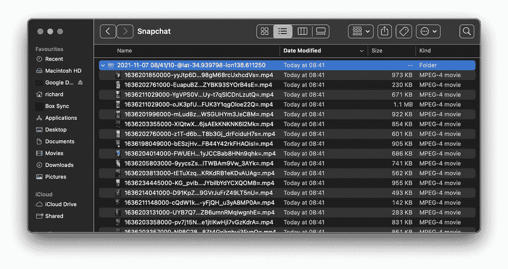
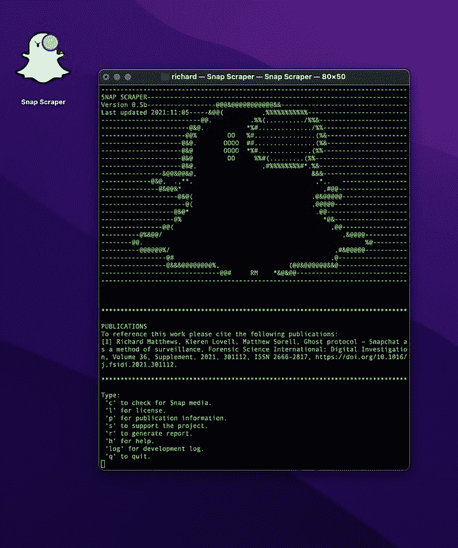
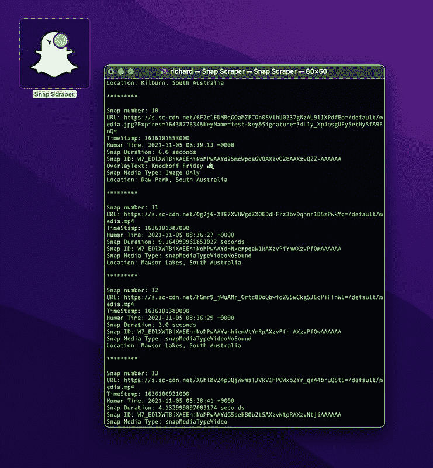
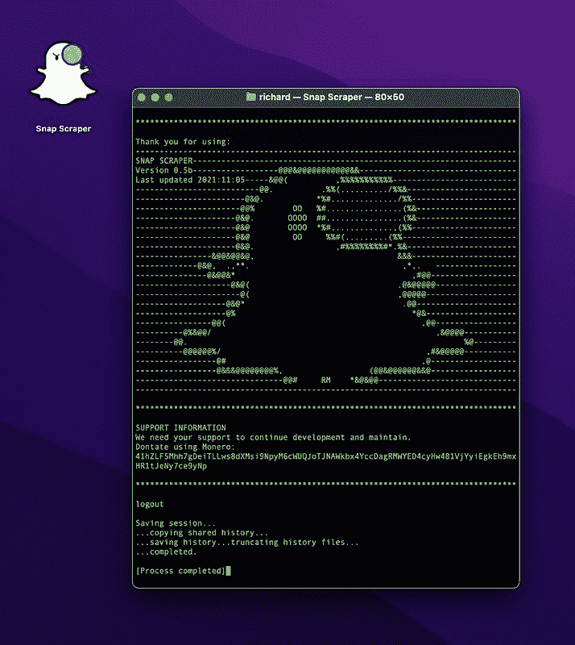

# Snap Scraper:允许用户下载上传到 Snapchat 的 Snap Map 的媒体

> 原文：<https://kalilinuxtutorials.com/snap-scraper/>

**Snap Scraper** 是一款开源智能工具，用户可以使用一组经纬度坐标下载上传到 Snapchat Snap 地图的媒体。本项目不以任何方式隶属于 Snap inc .或其任何附属机构或子公司，也不由 Snap Inc .或其任何附属机构或子公司授权、维护、赞助或认可。该程序仅用于教育、取证和错误报告目的，不提供任何担保。

使用该工具时，请引用以下出版物:

*   Richard Matthews，Kieren Lovell，Matthew Sorell，Ghost protocol–Snapchat 作为一种监控方法，法医科学国际:数字调查，第 36 卷，增刊，2021，301112，ISSN 2666-2817。

**截图**

**安装**

**MacOS**

下载最新版本的当前链接二进制文件。使用终端确保您更改权限以包括可执行权限。

**chmod 755 SnapScraper**

可选地，包括一个 icon.png 文件，该文件可用于改变下载的可执行文件的图标。

**Windows/Linux**

在这个时间点上，SnapScraper 只支持 MacOS。但是，已经检查了依赖关系，用户应该能够在他们自己的文件系统上编译代码，不会有任何问题。确保已经安装了 Alamofire。

**用法**

双击 SnapScraper 启动命令行工具。当默认窗口大小设置为 80×50 时，SnapScraper 效果最佳。

您应该会看到以下窗口:

当前使用的选项显示在命令窗口中。通过按键盘上所需的键并按回车键来选择 to 选项。

**检查**

用户将选择的主要选项是在快照图上定位快照介质的复选选项。要选择此选项，请键入“c ”,然后按 enter 键。

SnapScraper 随后会要求您提供一组可以从 map.snapchat.com 获得的经度和纬度坐标，如出版物*“Richard Matthews，Kieren Lovell，Matthew Sorell，Ghost protocol–Snapchat as a method of surveillance，Forensic Science International:Digital Investigation，Volume 36，Supplement，2021，301112，ISSN 2666-2817，https://doi.org/10.1016/j.fsidi.2021.301112."*。导航到 map.snapchat.com，记下您希望从 ie 中提取快照媒体的位置的 URL。https://map.snapchat.com/@24.931153,44.873214,6.04z*。要输入 SnapScraper 的坐标位于 URL 中的@符号之后。第一个数字是纬度，第二个是经度，最后一个是缩放级别。纬度和经度应输入到 SnapScraper 的 6 个小数位，而缩放应输入到 2 个小数位。*

将每个坐标输入到程序中后，SnapScraper 将在所需位置轮询快照映射中的快照介质。找到介质后，介质的元数据将被打印到命令窗口。

然后，用户可以选择将媒体的直接链接打印到命令窗口。选择 y 将这些链接打印到命令窗口，或选择 n 跳过。

然后，用户可以选择将链接保存到文本文件中。选择 y 保存文件，选择 n 跳过。文件将保存在用户*“下载”*目录下一个名为*“Snapchat”*的文件夹中(仅限 macOS 用户)。该文件以当前提取日期、时间和坐标为标题，并以单词*“列表”*为前缀。

最后，将询问用户是否愿意下载媒体。这是提取步骤，媒体直接从前面步骤中指示的 URL 保存。选择 y 下载，选择 n 跳过。媒体将保存在一个标题为当前提取日期、时间和坐标的文件夹中，该文件夹位于前面确定的*“Snapchat”*文件夹中。

**日志报告**

目前，日志报告尚未在 0.5.0-b 中实现。要保存提取方法的日志，请使用终端内置的*“导出文本为”*功能。

如上完成提取过程，然后选择“q”退出 SnapScraper。终端会话将结束，但窗口将保持打开状态，如图所示。

要保存活动日志，导航至 *Shell- > Export Text as…* 将打开一个保存框。导航到用户*下载*文件夹中的 *Snapchat* 文件夹，并找到已保存的最近 URL 列表(如果在之前的步骤中使用过)。点击该文件，通过删除前缀单词*将*列表*改为*日志来更改另存为文件名。这将保存一个包含终端窗口内容的文本文件，并显示 SnapScraper 运行时进行的所有活动。

**其他选项**

SnapScraper 有一个功能齐全的菜单。其他选项包括显示 MIT 许可证、与工具的当前版本相关联的发布信息、支持继续开发和维护的信息以及当前的开发日志。要访问，请输入相关的选项键，然后按回车键。

[**Download**](https://github.com/rhematt/Snap-Scraper)