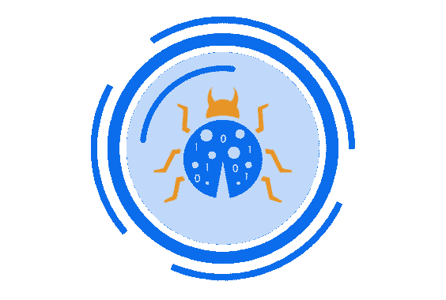
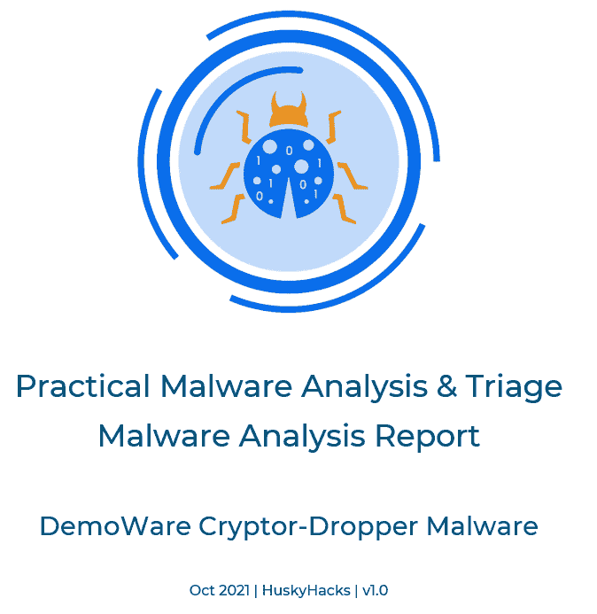

# PMAT 实验室:实用恶意软件分析和分类实验室

> 原文：<https://kalilinuxtutorials.com/pmat-labs/>

**PMAT 实验室**，这个知识库包含了用于实用恶意软件分析&分类课程(PMAT)的实时恶意软件样本。这些样本要么是为了模拟常见的恶意软件特征而编写的，要么是真实世界中的“野外捕获”样本。这两类都很危险。任何时候都要极其小心地处理这些样品。

*   不要将这些示例下载到您不拥有的计算机上。
*   不要在您不拥有的计算机上执行这些示例。
*   不要在无法恢复到保存状态的环境(即虚拟机)中下载和/或执行这些示例。
*   使用这些样本时，请始终遵循安全的恶意软件处理程序。

通过下载此存储库的内容，无论您是否购买了课程，您都同意最终用户许可协议。更多信息请参考`**EULA.md**`。

**关于课程**

如果你是在购买课程后来到这里的，欢迎！感谢你支持我作为一个内容创作者。请继续阅读下一部分，了解实验室回购的工作原理。

如果你在这里没有购买课程，欢迎！这门课的实验是免费的(而且永远是免费的),任何感兴趣的人都可以在 GitHub 上找到。但是，如果您不太知道从哪里开始和/或有兴趣从 9 个多小时的高质量视频内容中学习恶意软件分析，请考虑购买该课程！这些视频是带着爱制作的，旨在将你打造成为一名有能力、有知识的恶意软件分析师。

如果你想购买课程，并支持我作为一个内容创作者，也请考虑使用我的附属链接！

**结构**

这个存储库的结构映射到课程视频。顶层目录包含该部分的名称，子目录是该部分课程中使用的示例。例如

实验室
**📂0 比 1。处理方便
📜恶意软件。Calc.exe.7z
📜md5sum.txt
📜password.txt
📜sha256sum.txt
📂1 比 1。basicstaticanalisis
📂恶意软件。packetdandnotpacked . exe . malz
📜恶意软件。packetdandnotpacketd . exe . zip
📜md5sum.txt
📜password.txt
📜sha256sum.txt
📂恶意软件。Unknown.exe.malz
📜恶意软件。未知. exe.7z
📜README.txt
📜password . txt
【snip】**

在上面的例子中，`**0-1.HandlingAndSafety**`目录包含了`**Malware.Calc.exe.7z**`的压缩副本和 sample 提供的其他文件。它用在课程的`**Handling and Safety**`部分。

在处理和安全样本下面，`**1-1.BasicStaticAnalysis**`目录包含该部分使用的两个样本。整个课程都遵循这一结构，所以请查看您当前所在的部分，然后视频将参考该示例进行操作。

* * *

**话题**

每个部分都按主题细分:

**恶意软件处理和安全**

本节涵盖基本的恶意软件处理和安全，包括清除恶意软件和安全的传输和存储实践。

**基本静态|基本动态**

本节涵盖了初始分类、静态分析、初始引爆和基本分析的主要方法。

**高级静态|高级动态**

本节涵盖高级恶意软件分析方法，并介绍汇编、调试、反编译以及在 ASM 级别检查 Windows API。

**专业类恶意软件**

本节涵盖恶意软件的不同专业类别，如 maldocs、C#程序集和基于脚本的恶意软件。它还包括一个关于移动平台恶意软件分析的部分。

Bossfights！

Bossfights 让您与臭名昭著的真实世界恶意软件样本进行较量，并要求您进行全面分析。

**自动化|规则编写|报告编写**

本节涵盖了有效的报告编写、Yara 规则编写，以及使用 Blue-Jupyter 自动完成最初阶段的分类。

**课程结论:课程期末|参考资料|资源|进一步阅读资料**

课程期末考试由一个顶点组成，在这个顶点中，你将结合本课程中的所有相关技能来撰写和发表关于本课程中给定样本的开源信息。

课程结论包括进一步的阅读资料、参考资料和有助于进一步学习的资源。

`**Please note**:`一些样品在不同的部分被多次使用。检查以确保课程视频引用的是哪个样本，并且您拥有给定视频的正确样本。

* * *

**挑战**

本课程中的挑战示例用作不同部分的小型顶点。每个标记为挑战的样本都包括一组要回答的关于该样本的问题以及一个`**answers/**`目录。`**answers/**`目录中的自述文件包含对挑战中每个问题的简短回答。不先看答案，尽量走远一点！

* * *

**密码**

每个样本都是压缩的，有密码保护。所有恶意软件样本的密码都是`**infected**`。

* * *

**报表模板**

在课程的最后一部分，我会教你如何写一份简单的恶意软件分析报告。该部分使用的模板在这里。请随意将此作为本课程或您想要创建的任何其他恶意软件报告的模板。

**Cosmo？**

你可能会疑惑，为什么根目录里会有一张帅猫的图片？

**cosmo.jpeg**

那是科斯莫，我的猫。他不太擅长恶意软件分析，所以他顺带学点东西。我对他不抱太大希望(他毕竟只是一只猫)。

`**cosmo.jpeg**`有两个功能。

**一个代理数据文件**

本课程中的恶意软件示例旨在执行不同的功能。有些是设计来破坏数据的。有些是设计来偷的。有的根本不碰你的数据。

`**cosmo.jpeg**`是一个占位符，代表普通终端用户在其主机上可能拥有的珍贵数据。本课程中的一些恶意软件样本将窃取他，加密他，编码和渗透他，整个九码。因此，为了准确描述数据失窃或破坏的情况，本课程中定制编写的恶意软件示例将专门针对此文件。

这是一个有点沉重的文件(大约 1.6MB)，不像 Cosmo 自己根本不是一只沉重的猫。所以它应该很好地充当数据文件占位符。

**环境键控**

为了尽可能安全，我从头开始编写了本课程的样本。我知道将恶意软件样本公之于众，不管你的意图是什么，都会带来风险。因此，为了帮助减少这些样本被恶意使用的可能性，我将它们键入到这个特定的文件中。这是一个红队战术，确保有效载荷只有在环境中存在某些标识符时才会触发。在本课程中，FLARE-VM 桌面上呈现的是大多数恶意软件示例的密钥。

**指令**

当您下载并提取完该实验室存储库后，使用`**cosmo.jpeg**`将其复制到 Windows FLARE-VM 主机上主用户帐户的桌面。仅此而已！

[**Download**](https://github.com/HuskyHacks/PMAT-labs)