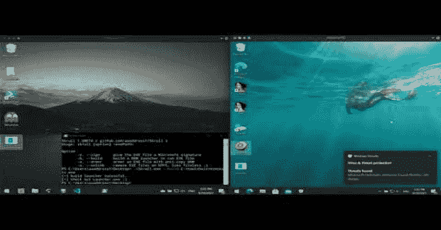
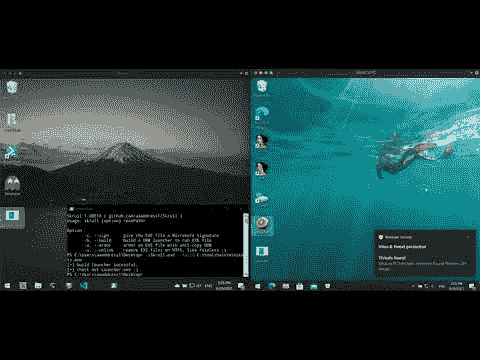

# Skrull:一个恶意软件 DRM，防止自动样本提交的反病毒/EDR

> 原文：<https://kalilinuxtutorials.com/skrull/>

Skrull 是一个恶意软件 DRM，它阻止反病毒/EDR 自动提交样本和内核签名扫描。它生成的启动器可以使用进程镜像技术在受害者身上运行恶意软件。此外，发射器是完全反拷贝的，提交时自然会损坏。

**视频演示**

[**Download**](https://github.com/aaaddress1/Skrull)