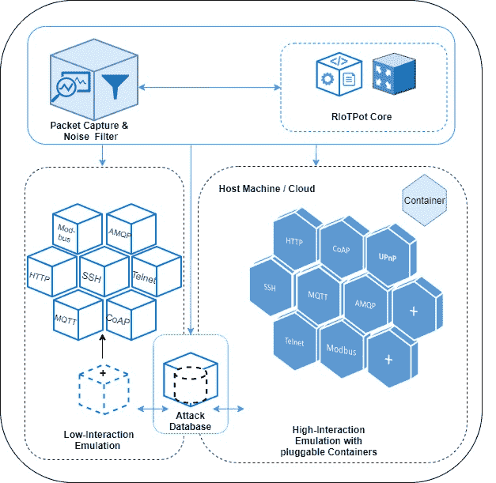

# RiotPot:弹性物联网和运营技术蜜罐

> 原文：<https://kalilinuxtutorials.com/riotpot/>

RiotPot 是一个可互操作的媒体交互蜜罐，主要专注于仿真物联网和 ot 协议，但它也能够仿真其他服务。

这些服务以插件的形式加载到蜜罐中，使得 RIoTPot 成为一个模块化的、可移植的蜜罐。服务是在运行时加载的，这意味着蜜罐的重量将根据前提而变化，加载的服务(例如 HTTP)将仅在需要时使用。因此，我们强烈建议您根据自己的需求构建自己的二进制文件。有关更多信息，请参考以下章节“安装”。

**架构**

RIoTPot 有一个模块化的架构，有助于蜜罐的可扩展性。蜜罐还提供了混合交互功能，用户可以为模拟的协议选择所需的交互级别。下图显示了 RIoTPot 的高层架构。

该架构包含 6 个组件。

“蜜罐”的核心由配置、管理和协调容器网络所需的模块组成。

**配置&编排**配置模块为 RIoTPot 提供启动时所需的所有参数。这包括用户对特定协议和轮廓模拟的偏好以及期望的交互水平。编排模块负责从核心到在容器上模拟的高交互协议服务的网络管理。收到的攻击流量将被转发到承载攻击目标协议的相应容器。此外，orchestra tor 还有助于与托管在基于云的环境中的容器进行通信。

**攻击捕获和噪音过滤器**攻击捕获和噪音过滤器模块过滤掉从 Shodan 和 Censys 等互联网扫描器收到的可疑流量。这有助于管理员专注于非良性来源的攻击。

**混合交互(低交互和高交互模式)** RIoTPot 是用 Go 语言实现的，通过包来促进模块化架构和开发。这些包充当插件，可以添加到蜜罐中来扩展模拟的协议。RIoTPot 提供了一个混合交互模型，偏好低交互或高交互。低交互是通过独立的包实现的，每个包模拟一个特定的协议。高交互模型是用一个容器实现的，容器中安装了模拟为服务的协议。容器充当高交互模块，提供协议的完整实现。通过将容器与所需的协议服务集成，可以添加额外的协议服务。混合交互模型还允许用户在低或高交互水平上模拟选择性协议。例如，用户可以选择让 SSH 处于低交互模式，让 MQTT 处于高交互模式，从而在混合交互模式下运行。

**攻击数据库**攻击数据库存储了蜜罐上收到的所有攻击流量。数据库被设置为一个独立的模块，以确保数据的可用性，即使蜜罐在潜在的大规模攻击下崩溃。该数据库可从用于攻击存储的低交互和高交互模块中访问。

**噪声滤波器**

RIoTPot 的噪音过滤模块过滤来自互联网扫描引擎的攻击，以减少警报疲劳。借助这一功能，当攻击来自 Shodan 等来源时，它们会被标记为 ***良性*** 。RIoTPot 过滤的扫描服务列表如下:

*   肖丹(https://www.shodan.io/)
*   census(https://census . io/)
*   声纳项目(https://www.rapid7.com/research/project-sonar/)
*   利基斯(https://leakix.net/)
*   暗影服务器(https://www.shadowserver.org/)
*   rwth Aachen(http://researchscan . com sys . rwth-Aachen . de/)
*   Quadmetrics (https://www.quadmetrics.com/)
*   binary edge(https://www.binaryedge.io/})
*   ipip.net(https://en.ipip.net/)
*   阿伯天文台(https://www.arbor-observatory.com/)
*   克里马利普(https://security.criminalip.com/)
*   比特视线(https://www.bitsight.com/)
*   InterneTT (http://www.internettl.org/)
*   奥尼菲(https://www.onyphe.io/)
*   纳特拉斯(https://github.com/natlas/natlas)
*   网络系统研究(https://www.netsystemsresearch.com/)
*   沙拉什卡(https://sharashka.io/data-feeds)
*   Alpha Strike 实验室(https://www.alphastrike.io)
*   拉伸型(http://stretchoid.com/)

注意:该列表将根据对其他扫描源的支持进行更新。

**总结:**总而言之，RIoTPot 的设计通过将包和容器作为插件来促进模块化。此外，模块化架构有助于实现混合交互模式。

**安装**

虽然可以下载包含一组默认运行模拟器的二进制文件和配置文件，但本指南主要面向那些寻求定制体验的人。

我们致力于使 RIoTPot 具有高度可运输性，因此，在本节中，我们可以找到多种安装方法，适用于各种环境，满足各种要求和限制。

我们强烈建议使用`**Docker**`在一个虚拟化的自包含网络中运行 RiotPot，为此我们包括了配置文件，这些文件将蜜罐作为一个封闭的环境来运行，以便进行测试和试验(类似于测试床环境)。

**注意:**可以从 Docker Hub 中提取生产映像。如果你选择这种方法，你可以直接跳到 2.1 Docker。

RIoTPot 是用 Golang 编写的，因此，如果你打算做任何更改，你需要先安装 go，否则如果你不想安装 go，你可以跳过步骤 1 和 2。

无论如何，您都需要将 RIoTPot 复制到本地:

*   **创建存储库的文件夹。
    mkdir-p $ GOPATH/src/github . com**
*   **导航到存储您的存储库的文件夹
    mkdir-p＄GOPATH/src/github . com**
*   **克隆存储库
    git 克隆 git @ github . com:AAU-network-security/riot pot . git**
*   **导航到新创建的文件夹，其中包含存储库
    cd riotpot**

**码头工人**

我们假设您对 Docker 生态系统有基本的了解，否则请先参考这里的 Docker 文档。

在 RToTPot 的部署文件夹中有一个 **docker-compose** 文件:

**$ CD ~/riot pot/deployments | ls-al
……
-rw-r–r–docker-compose . yml
……**

这个文件对应各自的软件开发环境*开发*。

**发展。** `d**ocker-compose.yml**`在一个私有的虚拟网络中构建项目，其中有三台主机: *riotpot* 、 *postgres* 和 *tcpdump* 。 **Postgres** 包含 Postgres 数据库， **tcpdump** 包含数据包捕获器，**riot pot**app 本身。他们只能互相交流。使用此设置进行**开发**和**本地测试**，方法是在您的 a 终端中键入:

**$ docker-compose-f docker-compose . yml up-d–build**

一旦你完成了蜜罐，你可以使用 *down* 命令放下容器。

**$ docker-向下-v** 化合物

**注意:**使用 *-v* 标签将删除所有挂载的卷，即 riotpot 用来存储信息的数据库和挂载用来存储蜜罐收集的日志和二进制文件的卷。记得在使用 *-v* 标签之前复印，或者干脆跳过它。

**坞站枢纽形象**

直接从 Docker Hub 中提供的映像构建 RiotPot 的最新版本:

**用-d .
docker run-d riotpot-docker:latest**抓取并运行最新发布的 riot pot 消费者图像

**本地**

要从源代码构建自己的二进制文件，请导航到存储库的文件夹，并使用 go CLI 生成它并将其存储在*中。/bin/* 文件夹:

**在。/bin 文件夹
go build-o riot pot cmd/riot pot/main . go**

此外，您还可以在系统中安装应用程序:

**#在$GOPATH/bin 安装 riot pot
$ go 安装**

像运行任何其他应用程序一样运行二进制文件:

**$。/riotpot**

**文档**

RiotPot 的文档可以在 go.pkg.dev 中找到，但是，有时您可能需要在本地可视化文档，因为您正在开发它的一部分，或者出于任何其他原因。

预可视化文档最常见的方式是使用`**godoc**`，然而，这需要 go 项目的初始设置。在 godoc 页面中找到更多信息。

为了简单起见，riotpot `**godoc**`文档可以作为一个独立于 dockerfile `**Dockerfile.documentation**`的本地容器运行。要使用该容器，只需键入:

**$制造骚乱-doc**

这将在`**http://localhost:6060/**`运行一个标签为`**riotpot/v1**`的容器。软件包的文档可以直接从 http://localhost:6060/pkg/riot pot/获得。

**轻松访问**

我们之前描述了如何设置整个项目，包括安装和文档，但是在开发新功能和测试的过程中，一些过程变得例行公事和冗长。为此，在存储库的根文件夹中，我们包含了一个`**Makefile**`，其中包含了使用最多的带有别名的例程。

将使用`**make**`加上命令的别名运行以下命令。`**Makefile**`包含更多的命令，但这是最有用的:

| 命令 | 容器名称 | 描述 |
| --- | --- | --- |
| 骚乱 | riotpot:发展 | 在**开发**模式下设置 RIoTPot。 |
| 骚乱平息 | riotpot:发展 | 放下暴动。 |
| riotpot 医生 | riotpot/v1 | 用本地文档搭建一个容器。 |
| 骚乱-所有 | riotpot/v1，riotpot | 将文档和 RIoTPot **开发**模式升级。 |
| 暴动制造者 |  | 构建二进制文件和插件。 |

**示例用法**

从 Makefile
$ make riot pot-doc 运行一个给定别名的命令

[**Download**](https://github.com/aau-network-security/riotpot)