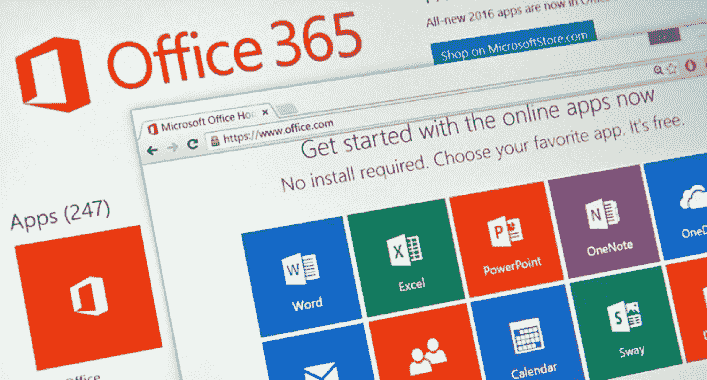

# Msmailprobe : Office 365 和 Exchange 枚举

> 原文：<https://kalilinuxtutorials.com/msmailprobe/>

众所周知，OWA (Outlook Web app)容易受到基于时间的用户枚举攻击。该工具利用默认 Exchange 安装公开的所有已知服务，甚至一些不太为人知的服务来枚举用户。它还将 Office 365 作为基于错误的用户枚举的目标。

**入门**

如果你想下载和编译简单的，非依赖的代码，你必须先安装 GoLang！我会让难以置信的文档和其他在线资源帮助你完成这项任务。

https://golang.org/doc/install

你也可以在这里下载编译好的版本。

**语法**

列出该应用程序的命令示例，但只需使用`**examples**`命令运行二进制文件:

**。/msmailprobe 示例**

您还可以通过运行带有您感兴趣的参数的二进制文件来获得更具体的帮助:

**。/msmailprobe 标识符
。/msmailprobe userenum
。/msmail probe userenum–on prem
。/msmail probe userenum–o365**

**用途**

**识别命令**

*   用于收集有关可能指向 Exchange 或 o365 绑定域的主机的信息
*   查询与 Office 365 集成相关的特定 DNS 记录
*   尝试提取 Exchange 实例的内部域名
*   为 onprem Exchange 标识易受基于时间的用户枚举攻击的服务
*   列出为 onprem Exchange 主机公开的可喷密码的服务

**要使用的标志:
-t 指定目标主机
例如:
。/msmail probe identify-t mail.target.com**

**Userenum (o365)命令**

*   Office 365 集成电子邮件地址的基于错误的用户枚举

**要使用的标志:
-E 表示电子邮件列表，或-E 表示单个电子邮件地址
-o【可选】指定已识别的有效电子邮件的输出文件
-threads【可选】用于设置并发请求的数量
示例:
。/msmail probe userenum–o365-E email list . txt-o valid emails . txt–threads 25
。/msmail probe userenum–o365-e admin@target.com**

**用户枚举(onprem)命令**

*   针对多个 onprem Exchange 服务的基于时间的用户枚举

**要使用的标志:
-t 指定目标主机
-U 用于用户列表或-U 用于单个用户名
-o【可选】为已识别的有效用户指定 out 文件
-threads【可选】用于设置并发请求量
示例:
。/msmail probe userenum–on prem-t mail.target.com-U 用户列表. txt -o 有效用户. txt–线程 25
。/msmail probe userenum–on prem-t mail.target.com-u 管理**

[**Download**](https://github.com/busterb/msmailprobe)