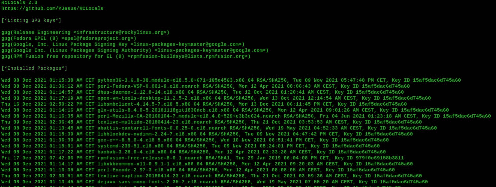
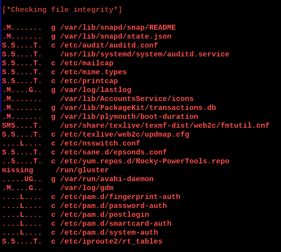
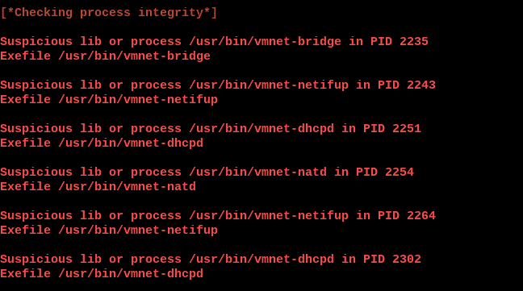
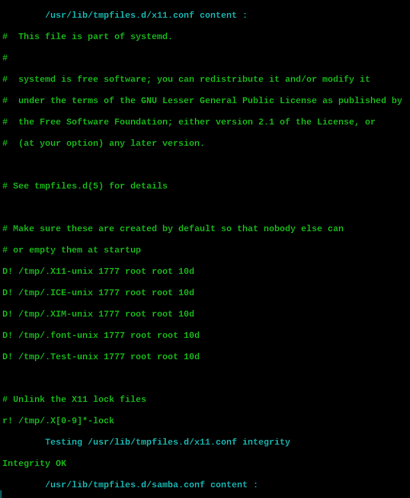

# r locals:Linux 启动分析器

> 原文：<https://kalilinuxtutorials.com/rclocals/>

r locals 的灵感来自于 Sysinternals 的“自动运行”, r locals 分析所有 Linux 启动的可能性来寻找后门，还执行进程完整性验证，扫描 DLL 注入的进程等等

## 涵盖的事物:

**列出系统信任的 GPG 密钥**

**已安装的软件包**

**文件完整性**

**进程完整性**(不属于任何已安装软件包的进程中加载的进程和库)

**名称被盗用的进程**(使用 prctl()在/bin/ps 中更改名称的进程)

**CRON 条目**

**RC 文件**

**X 系统启动文件**

**活动系统 d 单位**

**系统定时器单元**

**tmpfiles.d**

**流连忘返的用户**

**用法**

仅针对可疑信息:

# python 3 r locals . py–分类

有关详细信息:

#python3 rclocals.py –all

**截图**

[**Download**](https://github.com/YJesus/RCLocals)