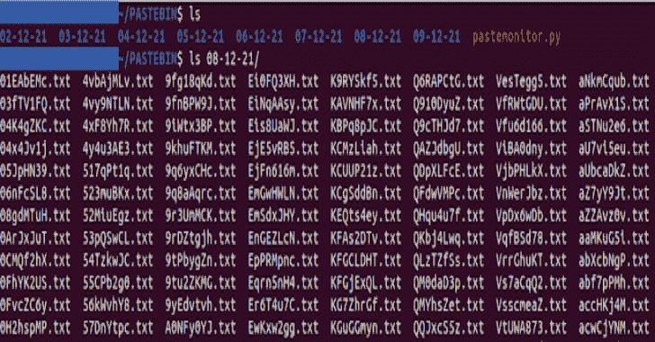
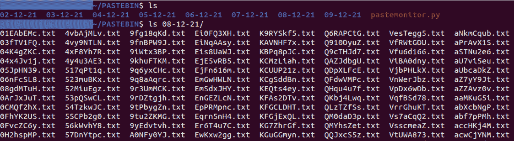
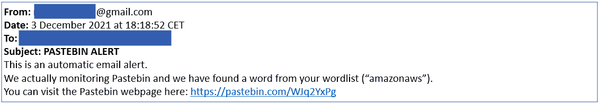
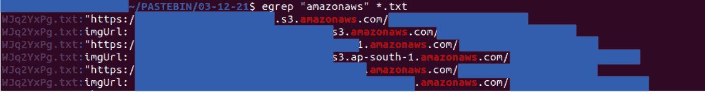

# PasteMonitor:收集每日粘贴，建立一个词表，当你有一个匹配时通过电子邮件提醒

> 原文：<https://kalilinuxtutorials.com/pastemonitor/>

PasteMonitor 是一个收集每日粘贴的 Pastebin API，建立一个词表，当你有匹配的时候通过电子邮件提醒。

**描述**

PasteMonitor 工具允许您执行两个主要操作(仅用于教育目的):

*   下载每日新公共贴

Average number of pastes per day: 1000-3000 (filetype: .txt)Average number of pastes per day: 1000-3000 (filetype: .txt)

*   发送自动电子邮件提醒

你可以设置一个单词表，当你找到匹配的单词时会收到电子邮件提醒

如果您的粘贴不再在线，您可以通过您的粘贴的 ID(这里的 ID 是“WJq2YxPg”)在您的计算机/服务器上找到它

**开始前**

启动该工具之前，请确保:

*   获取 Pastebin PRO 帐户
*   在“您的帐户和白名单 IP”部分输入您机器的 IP 地址
*   激活可以授权第三方应用程序的邮件帐户(这里我们使用 Gmail 帐户)
*   启用两步验证
*   生成应用程序密码(如需更多帮助，请参阅本教程)

然后，向代码“pastemonitor.py”中添加:

*   电子邮件凭据(“电子邮件”、“密码”)
*   电子邮件提醒收件人(“收件人”)

**Wordlist**

在“wordlist.txt”文件中，逐行添加关键字。

**先决条件**

**pip 3 install-r requirements . txt**

**用途**

**python3 pastemonitor.py**

[**Download**](https://github.com/pixelbubble/PasteMonitor)