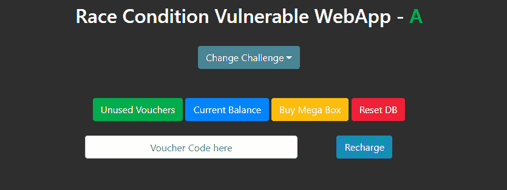
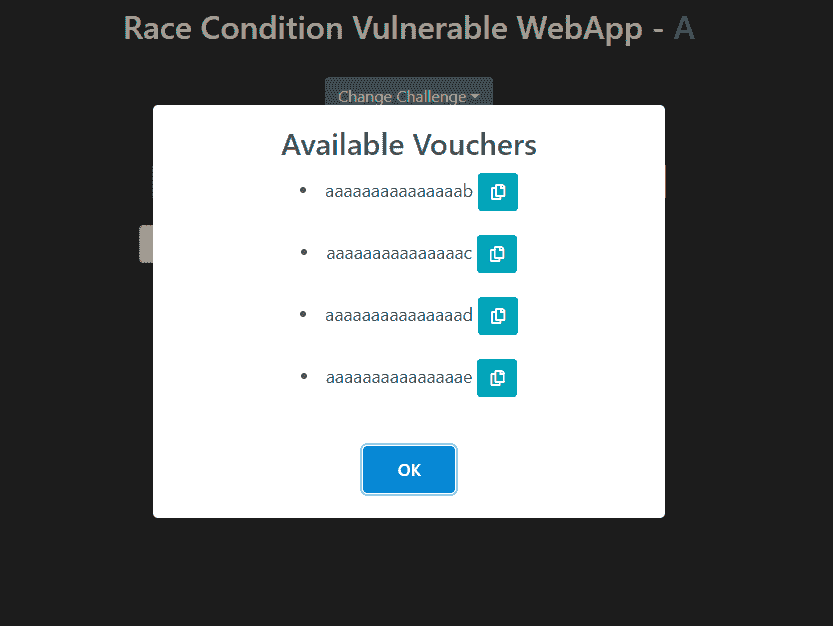
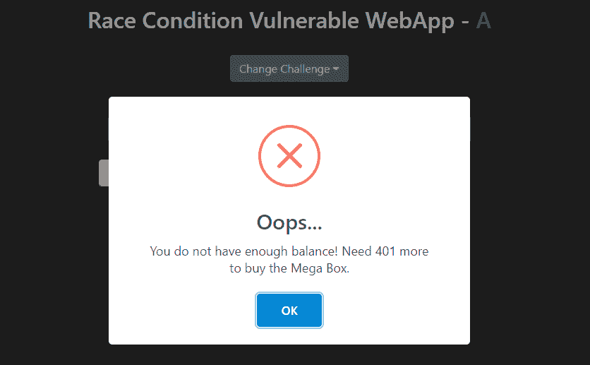
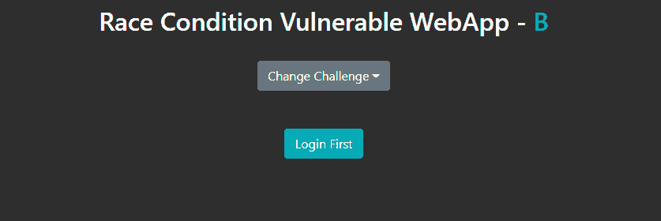

# WannaRace : WebApp 为了练习竞态条件而故意使其易受竞态条件攻击

> 原文：<https://kalilinuxtutorials.com/wannarace/>

**WannaRace** 是一个 web 应用程序，被故意设置为容易受到竞争条件的攻击

**描述**

竞态条件漏洞可以在开发的 WebApp 中实践。任务是使用竞赛条件购买一个比可用代金券价格更高的巨型盒子。实践面临两个挑战。当 PHPSESSID cookie 存在时，将解决挑战 B，cookie 是在用户登录时自动创建的。快乐学习。

**构建并运行 Docker 映像**

使用以下内容构建 Docker 映像:

**git 克隆 https://github.com/Xib3rR4dAr/WannaRace&&CD wanna race
docker build-t xib 3r 4 Dar/wanna _ race:1.0。**

运行 Docker 图像:

**docker run-it–RM xib 3r 4 Dar/wanna _ race:1.0**

然后在浏览器中打开相关的 IP:PORT

**截图**

**挑战#1**

主页

四张价值 400 单位的代金券可供充值

任务是通过利用竞争条件来购买巨型盒子(价值 401 个单位)

**挑战#2**

与挑战#1 相同，但需要登录以便设置 PHPSESSID 和适当的 cookies

[Download](https://github.com/Xib3rR4dAr/WannaRace)