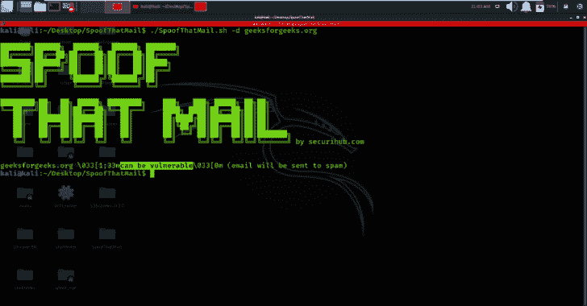
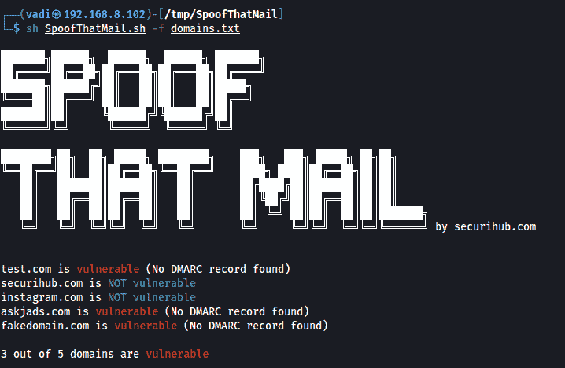

# SpoofThatMail : Bash 脚本，用于检查是否可以根据 DMARC 记录欺骗一个域或域列表

> 原文：<https://kalilinuxtutorials.com/spoofthatmail/>

**SpoofThatMail** 是一个 Bash 脚本，用于检查一个域或域列表是否可以根据 DMARC 记录被欺骗

包含域的文件:

**sh spoofthatmail . sh-f domains . txt**

一个单一域:

**sh SpoofThatMail.sh -d 域**

如果 sp 参数在 p 参数之前，脚本可能无法运行(目前正在处理此问题)

使用 nslookup-type = txt _ dmarc . domain . com 手动测试

[**Download**](https://github.com/v4d1/SpoofThatMail)