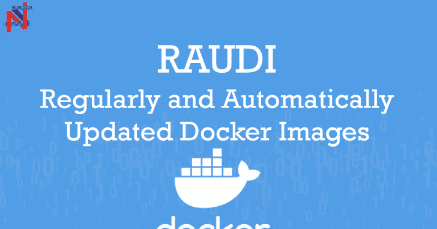

# RAUDI:一个自动生成并保持更新一系列 Docker 图像的 Repo

> 原文：<https://kalilinuxtutorials.com/raudi/>

**RAUDI** (定期自动更新的 Docker 镜像)通过 *GitHub Actions* 为非开发者提供的工具自动生成并保持更新一系列 *Docker 镜像*。

**什么是劳迪**

RAUDI 将使您免于手动创建和管理大量 Docker 图像。每次软件更新时，如果您想使用最新的功能，您需要更新 Docker 映像，依赖关系不再有效。

这既麻烦又费时。

别担心，我们会保护你的。

您可以派生这个 repo 并自己使用 GitHub 工作流，或者在本地使用它(并以您想要的方式管理它的执行)。

**叉**

如果你想叉这个回购，你也必须设置一些秘密，以便能够推动你的个人 Docker 中心帐户上的图像。必须设置两个 GitHub 秘密**和**:

*   **dock _ user**:您的 docker hub 用户名；
*   **dock _ API _ token**:您的 docker hub 密码或 API 令牌。

设置完这些秘密后，您必须编辑在*工具/main.py* 文件中设置的**组织**变量，因为它被配置为在 Docker Hub 上推送 SecSI。

这就是所有的家伙:转到**动作**，为您的分叉回购启用它，等到午夜，工作流将做繁重的工作！

**设置**

这种回购也可以在本地执行。需要满足的要求如下:

*   Python 3.x
*   dockers_withbuildx)

以下是使用 BuildX:https://docs.docker.com/buildx/working-with-buildx/的文档

设置阶段非常简单，您只需要以下命令:

**git 克隆 https://github.com/cybersecsi/RAUDI
CD RAUDI
pip install-r requirements . txt**

你已经准备好了！

**测试**

要运行测试，您需要用命令`**pip install pytest**`安装`**pytest**`(它不在`**requirements.txt**`中，因为它仅用于测试目的)，然后您可以运行:

**pytest -s**

或者

**python -m pytest -s**

来进行测试。

**本地用法**

**劳迪**可以构建和推送所有放入*工具*目录的工具。运行它时可以使用不同的选项。在本地使用它之前，你应该创建一个**。env** 文件(您可以直接复制 **.env.sample** 文件)并添加您的 *GitHub 个人访问令牌*以避免速率限制。对于未经认证的用户，GitHub 每小时最多允许 60 个请求，而经过认证的用户每小时最多允许 15000 个请求。因此，我们建议您添加它！您也可以创建一个没有任何作用域的个人访问令牌，因为我们所做的任何事情都是为每个 GitHub repo 读取一些信息。

**执行模式**

**正常执行**

在这种模式下，如果需要的话，RAUDI 会尝试构建所有的工具。运行它的命令很简单:

**蟒 3。/raudi . py–all**

**单一构建**

在这种模式下，RAUDI 试图只构建指定的工具。这种情况下的命令是:

**蟒 3。/raudi . py–single**

*工具名*必须是*工具*文件夹内的目录名。

**测试工具**

由于*测试*参数已经被添加到工具的配置结构中，因此可以帮助测试插入的命令**是否返回 0 状态码**。测试特定工具的命令是:

**蟒 3。/raudi . py–测试**

*工具名*必须是*工具*文件夹内的目录名。

**显示工具**

如果您想知道可用的工具，可以运行以下命令:

**蟒 3。/raudi . py–list**

**引导工具**

如果您想从一个可用模板开始快速添加一个新的工具文件夹，您可以运行此命令:

**蟒 3。/raudi . py–引导程序**

**选项**

| [计]选项 | 描述 | 缺省值 |
| --- | --- | --- |
| –推动 | 是否自动推送到 Docker Hub | 错误的 |
| –远程 | 在构建之前，是否检查 Docker Hub 而不是本地 Docker | 错误的 |
| –力 | 如果发现具有相同标记名的图像，是否构建 | 错误的 |

**可用工具**

这是当前已添加的工具列表。这些工具都没有开发者提供的官方 Docker 映像:

| 名字 | Docker 图像 | 来源 |
| --- | --- | --- |
| 3 代理 | 第二部分/第三部分 | https://github.com/3proxy/3proxy |
| antdns | secsi/altdns | https://github.com/infosec-au/altdns |
| Apktool | secsi/apktool | https://github.com/iBotPeaches/Apktool |
| 阿尔俊 | 第二节/arjun | https://github.com/s0md3v/Arjun |
| bfac | secsi/bfac | https://github.com/mazen160/bfac |
| 云邮件 | secsi/cloudfail | https://github.com/m0rtem/CloudFail |
| amseek | 秘书/cmseek | https://github.com/Tuhinshubhra/CMSeeK |
| 撬棍 | secsi/撬棍 | https://github.com/galkan/crowbar |
| 达尔福克斯 | secsi 达尔福克斯 | https://github.com/hahwul/dalfox |
| datasploit | 秘书/数据 | https://github.com/DataSploit/datasploit |
| dex2jar | 第二节/第二节 | https://github.com/pxb1988/dex2jar |
| dirb | secsi/dirb | http://dirb.sourceforge.net/ |
| dirhunt | 分区/dirhunt | https://github.com/Nekmo/dirhunt |
| 目录搜索 | 秘书/目录搜索 | https://github.com/maurosoria/dirsearch |
| dbscan | secsi/dnscan | https://github.com/rbsec/dnscan |
| 呆子的眼睛 | 第二部分/多克斯之眼 | https://github.com/BullsEye0/dorks-eye |
| dvcs-ripper | 章节/dvcs 撷取程式 | https://github.com/kost/dvcs-ripper |
| ExifTool | 区段/结束工具 | https://github.com/exiftool/exiftool |
| 目击者 | 秘书/目击者 | https://github.com/FortyNorthSecurity/EyeWitness |
| 快速侦察 | 秘书/快速侦察 | https://github.com/DanMcInerney/fast-recon |
| ffuf | secsi/ffuf | https://github.com/ffuf/ffuf |
| 凶猛的 | secsi/激烈 | https://github.com/mschwager/fierce |
| Findsploit | 秘书/findsploit | https://github.com/1N3/Findsploit |
| GetJS | 章节/编号 | https://github.com/003random/getJS |
| 吉特罗布 | secsi/gitrob | https://github.com/michenriksen/gitrob |
| itools | secsi/gittools | https://github.com/internetwache/GitTool |
| gobuster | secsi/gob pattern | https://github.com/OJ/gobuster |
| 谷歌地图 | secs/Googles 标记 | https://github.com/ZephrFish/GoogD0rker |
| 戈斯皮德 | secsi/gospider | https://github.com/jaeles-project/gospider |
| 地面控制的 | 秘书/地面管制 | https://github.com/jobertabma/ground-control |
| 哈克罗勒 | secsi/hakrawler | https://github.com/hakluke/hakrawler |
| hakrevdns | secsi/hakrevdns | https://github.com/hakluke/hakrevdns |
| 哈希 ID | secs/hash id | https://github.com/psypanda/hashID |
| http probe | secsi/http probe | https://github.com/tomnomnom/httprobe |
| 水螅 | 秘书/九头蛇 | https://github.com/vanhauser-thc/thc-hydra |
| 冲击 | 秘书/影响 | https://github.com/SecureAuthCorp/impacket |
| 朱姆斯坎 | secsi/joomscan | https://github.com/OWASP/joomscan |
| JSON Web 令牌工具包 | secsi/jwt_tool | https://github.com/ticarpi/jwt_tool |
| 敲 | 秘书/敲门 | https://github.com/guelfoweb/knock |
| 费城套房 | 秘书/lfisuite | https://github.com/D35m0nd142/LFISuite |
| 链接查找器 | secsi/linkfinder | https://github.com/GerbenJavado/LinkFinder |
| MASSCAN | secsi/masscan | https://github.com/robertdavidgraham/masscan |
| MassDNS | secsi/massdns | https://github.com/blechschmidt/massdns |
| 内存崩溃的 DDoS 漏洞 | secsi/内存崩溃 | https://github.com/649/Memcrashed-DDoS-Exploit |
| 通知 | secsi/netifyd | https://gitlab.com/netify.ai/public/netify-agent |
| nikto | secsi/nikto | https://github.com/sullo/nikto |
| nmap | secsi/nmap | https://github.com/nmap/nmap |
| oxml_xxe(消歧义) | secsi/oxml_xxe(消歧义) | https://github.com/BuffaloWill/oxml_xxe |
| 帕戈多 | 塞西/帕果多 | https://github.com/opsdisk/pagodo |
| 光子 | 秒/光子 | https://github.com/s0md3v/Photon |
| 数据透视套件 | secsi/数据透视套件 | https://github.com/RedTeamOperations/PivotSuite |
| 圣歌 | 章节/诗篇 | https://github.com/vimeo/psalm |
| 纯 DNS | secsi/puredns | https://github.com/d3mondev/puredns |
| 网络竞赛 | 秘书/网络竞赛 | https://github.com/TheHackerDev/race-the-web |
| 宁静的收获 | 秘书/restfulharvest | https://github.com/laramies/theHarvester |
| Retire.js | 秘书/退休 | https://github.com/RetireJS/retire.js |
| RouterSploit | 区段/路由器套件 | https://github.com/threat9/routersploit |
| 沙堡 | secsi/沙堡 | https://github.com/0xSearches/sandcastle |
| 不锈的 | secsi/无扫描 | https://github.com/vesche/scanless |
| 秘书 | secsi/seclists | https://github.com/danielmiessler/SecLists |
| spyse.py | 第一节/吐吐吐吐吐吐吐吐吐吐吐吐吐吐吐吐吐吐吐吐吐吐吐吐吐吐吐吐吐吐吐吐吐吐吐吐吐吐吐吐吐吐吐吐吐吐吐吐吐吐吐吐吐 | https://github.com/zeropwn/spyse.py |
| sqlcmap | 章节/sqlpmap | https://github.com/sqlmapproject/sqlmap |
| spidy | secsi/spidy | https://github.com/rivermont/spidy |
| 罢工者 | 秘书/前锋 | https://github.com/s0md3v/Striker |
| 子 finder | 秘书/副财务主任 | https://github.com/projectdiscovery/subfinder |
| Subjack | secsi/subjack | https://github.com/haccer/subjack |
| 子列表 3r | secsi/sublist3r | https://github.com/aboul3la/Sublist3r |
| theHarvester | 秘书/主任 | https://github.com/laramies/theHarvester |
| WAFW00F | 章节/wafw00f | https://github.com/EnableSecurity/wafw00f |
| waybackpy | 第一节/韦 backpy | https://github.com/akamhy/waybackpy |
| WhatWeb | 分项/whatweb | https://github.com/urbanadventurer/WhatWeb |
| x 光线 | 切片/x 射线 | https://github.com/evilsocket/xray |
| XSSer | secsi/xsser | https://github.com/epsylon/xsser |
| XSSSNIPER | secsi/xsssniper | https://github.com/gbrindisi/xsssniper |
| x 击键 | secsi/xsstrike | https://github.com/s0md3v/XSStrike |
| xxe 注射器 | secsi/xxejector | https://github.com/enjoiz/XXEinjector |

**刀具结构**

刀具目录中的每个刀具至少包含**和**两个文件:

*   config.py
*   Dockerfile.
*   README . MD(Docker Hub 的可选 README)

如果您想添加一个新工具，您只需在 *tools* 目录中为该特定工具创建一个文件夹。在这个文件夹中，你必须插入定义了**构建参数**的 *Dockerfile* 来定制和自动化构建。一旦创建了 Dockerfile，就必须在同一个目录中创建一个 *config.py* ，并使用一个名为 *get_config(organization，common_args)* 的函数。注意:函数必须以这种方式调用，并且必须有这两个参数(即使您不使用它们)。返回值是该特定工具的**配置**，其结构如下:

**config = {
' name ':organization+'/'，
'version ':"，#应为帮助函数
'buildargs': {
}，
'tests': []
}**

这四个键是:

*   **名称**:Docker 图像的名称(如 secsi/<tool _ name>)；
*   **版本**:Docker 镜像的版本号。为此，你可以使用一个助手函数，**能够检索最新的可用版本号**(查看*工具/ffuf* 中的例子)；
*   **buildargs** :一个 dict，指定 Docker 图像中需要更新的部分(再次:查看*工具/ffuf* 中的例子)；
*   **测试**:一组测试(通常只是一个简单的测试，如'–help ')。

这样做之后，你就可以走了！只是要注意工具**的**名**必须与你放置其 Dockerfile 文件的目录**相同。

版本有一个命名惯例:只使用点和数字；因此，请删除特定 config.py 版本中的任何结尾‘v’(查看**tools/dirsearch/config . py**中的工作示例)。

**帮手**

为了获得最新版本和关于**工具**和**基础映像**的信息，已经实现了一组助手。如果你想添加一个新的工具，你应该使用这些助手来获得一个 Docker 镜像，它会被 RAUDI 自动更新。

### `get_latest_pip_version`

这个助手用于检索最新版本的 **pip** 包。它只需要包的名称并返回**版本号**。示例:

版本**= helper . get _ latest _ pip _ VERSION(package _ name)**

### `get_latest_github_release`

该助手用于检索关于 GitHub 回购协议的信息，该回购协议使用**版本**，并拥有多种资产(例如，不同操作系统的可执行文件)。这个助手接受 repo(格式为`**user/repo**`)和一个目标字符串，以便能够识别要下载的正确资产。它返回一个带有两个关键字的字典( **url** 和**版本**)。示例:

**VERSION = helper . get _ latest _ github _ release(" user/repo "，" linux_amd64")**

### `get_latest_github_release_no_browser_download`

这个助手用于检索关于 GitHub repo 的信息，该 repo 使用**版本**，并且只有源代码(这意味着有一个 **zipball** 和一个 **tarball** )。这个助手获取 repo(格式为`**user/repo**`)并返回一个带有两个键的 dict(**URL**和**版本**)。示例:

**VERSION = helper . get _ latest _ github _ release _ no _ browser _ download("用户/回购")**

### `get_latest_github_commit`

该助手用于检索不使用**标签**或**版本**的 GitHub 回购信息。在这种情况下，目标是检索**最近的提交**。这个助手获取 repo(格式为`**user/repo**`)并返回一个字符串，该字符串表示最后一次提交的**日期**，格式为 **`YYYYYMMDD`。**

**VERSION = helper . get _ latest _ github _ commit("用户/回购")**

**例题**

本节提供了当前添加的网络安全工具的示例。如你所见，图片只提供了工具，所以如果你需要使用一个**单词表**你需要安装它。

**通用示例**

**docker run-it–RM secsi/**

**具体例子**

**坞站运行-it–RM-v:secsi/dirb/**

**如何发音**

我们是意大利人，所以我们可能会用不同的方式来发音。正确的发音(使用**音标**)如下:

 **否则，想想著名电视节目*中的填充狗:吵闹*

[**Download**](https://github.com/cybersecsi/RAUDI#get_latest_github_release)**