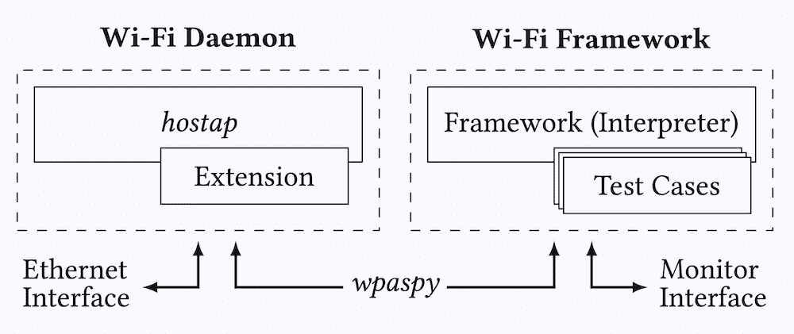

# Wifi 框架:用于创建概念证明、自动化实验、测试套件、模糊器等等…

> 原文：<https://kalilinuxtutorials.com/wifi-framework/>

**Wifi-Framework** 是一个更容易进行 Wi-Fi 实验的框架。它可以用来创建 fuzzers、实现新的攻击、创建概念验证以测试漏洞、自动化实验、实现测试套件等等。

该框架的主要优势在于它**允许您重用 Linux 的 Wi-Fi 功能，以便更容易地实施攻击和/或测试**。例如，该框架可以为您连接到(受保护的)Wi-Fi 网络，并在测试客户端时为您广播信标。一般来说，Linux 的任何 Wi-Fi 功能都可以重用，以更快地实施攻击/测试。该框架通过在 *hostap* 用户空间守护进程之上执行*测试用例*来实现这一点。

如果您是在 Linux 上进行 Wi-Fi 实验的新手，强烈建议您首先阅读 libwifi Linux 教程。当您在不需要重用 Linux 功能的情况下实现基本的 Wi-Fi 攻击时，该框架提供的优势有限，您可以考虑直接在 Scapy 中实现攻击，也可以选择使用 libwifi 库。

**用法**

要使用该框架:

*   通过运行`**./setup.sh**`安装它。请参阅安装程序以了解该脚本的作用。
*   阅读使用教程。

**例子**

假设您想要测试客户端是否使用全零密钥加密帧。这可能在密钥重新安装攻击期间发生。通过使用该框架，您不需要重新实现接入点的所有功能，而只需要编写以下测试用例:

**class example krackzerokey(Test):
name = " example-krack-zero-key "
kind = Test。认证者
def init(self):
super()。init([
#重放 4 次握手消息 3/4。
动作(触发器=触发器。连接，行动=行动。函数)，
#接收所有帧，并搜索用全零密钥加密的帧。
动作(触发器=触发器。NoTrigger，action=Action。Receive)，
#当我们收到这样一个帧的时候，我们就可以终止测试了。
动作(触发器=触发器。收到，行动=行动。终止)
])
def 重发(自身，站):
#重发 4 次握手消息 3/4。
station . wpa spy _ command(" RESEND _ M3 "+station . client MAC)
def receive(self，station，frame):
if frame[dot 11]. addr 2！= station . client MAC or not frame . has layer(dot 11 CMP):
返回 False
#检查 CCMP 加密的帧是否可以用全零密钥解密
plaintext = decrypt _ ccmp(frame . getlayer(dot 11)，tk = b " \ x00 "* 16)
如果 plaintext 为 None:返回 False
#我们收到了一个有效的明文帧！日志(状态，“客户端用全零密钥加密了一个帧！”，color="green")
还真**

上面的测试用例将创建一个客户端可以连接的接入点。客户端连接后，4 次握手中的第 3 条新消息将被发送到客户端。然后，易受攻击的客户端将开始使用测试用例自动检测到的全零加密密钥。

您可以使用模拟 Wi-Fi 无线电运行上述测试案例，如下所示:

**。/setup/setup-hwsim.sh 4
信号源设置/venv/bin/activate
。/run.py wlan1 示例-krack-zero-key**

您可以连接到创建的接入点进行测试(使用密码`**passphrase**`的网络`**testnetwork**`):

**。# hostap . py WLAN 2 的缩写是 t1 #**

通过更改网络配置，此 AP 可以轻松配置为使用 WPA2 或 WPA3 和/或配置为使用企业认证，而无需对我们编写的测试用例进行任何更改！在这个例子中使用框架的其他好处是:

*   无需手动广播信标
*   认证和关联阶段由框架处理
*   WPA2 和/或 WPA3 握手由框架处理
*   Linux 内核将自动重新传输注入的数据包
*   向 AP 发送的数据包将被确认
*   客户端的睡眠模式由内核自动处理
*   …

[**Download**](https://github.com/domienschepers/wifi-framework)