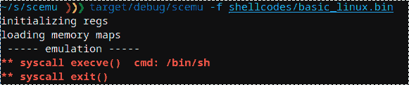
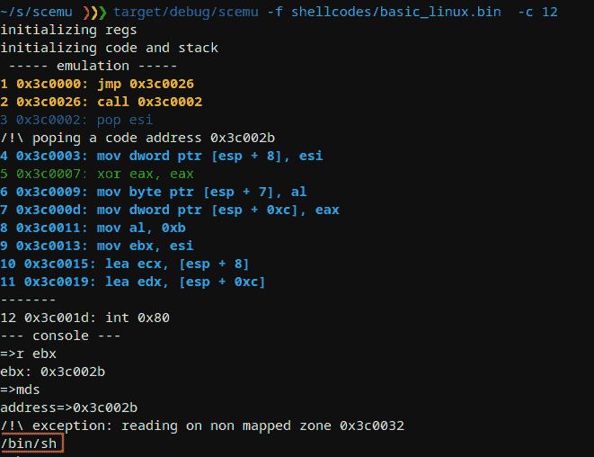
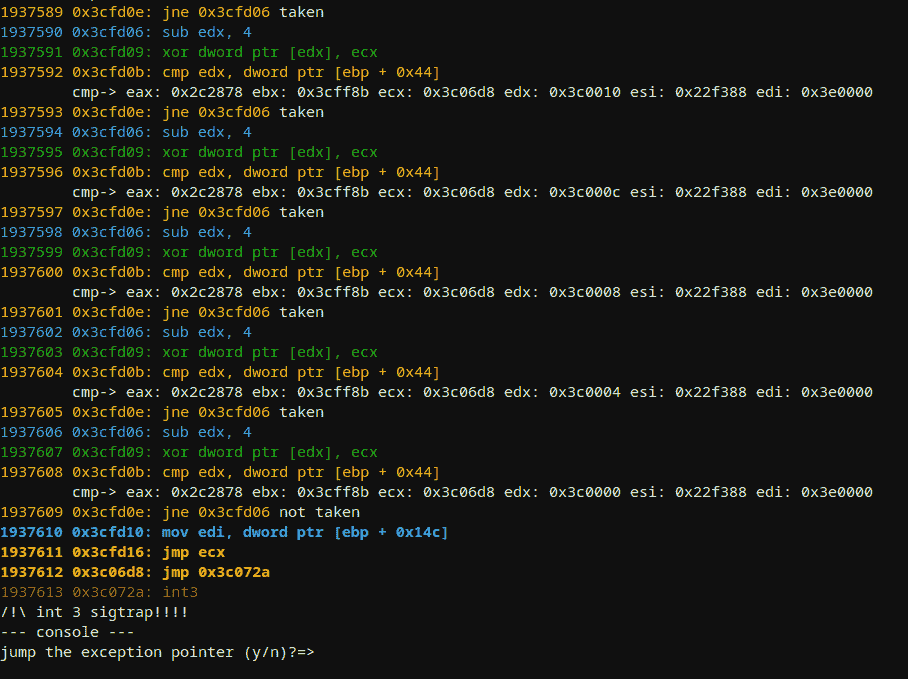
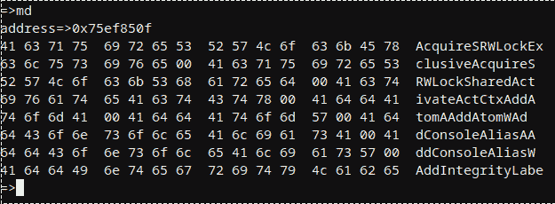
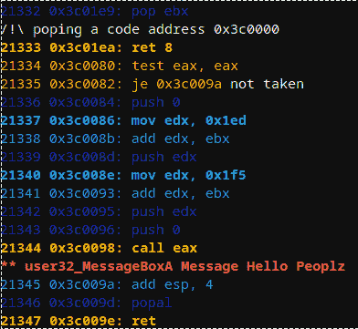
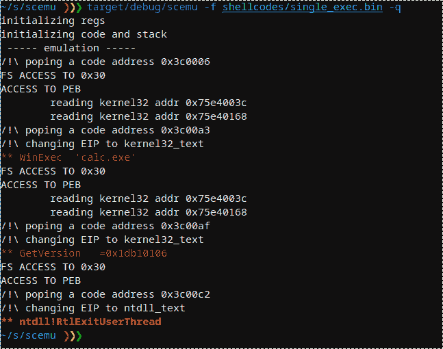
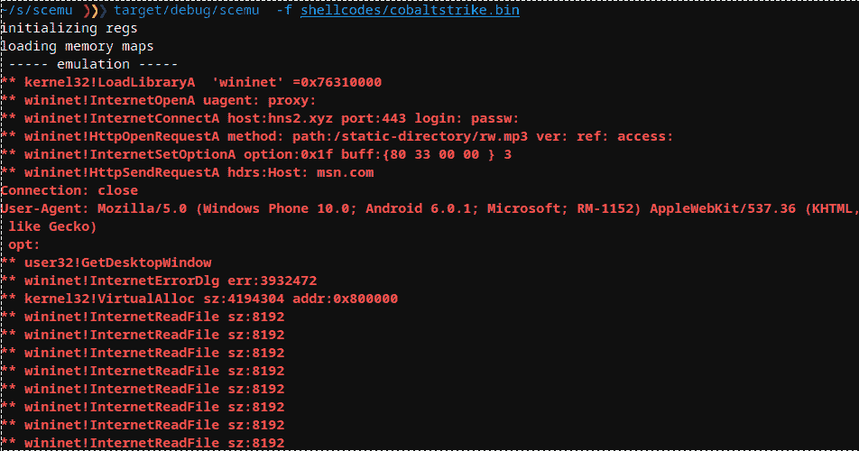
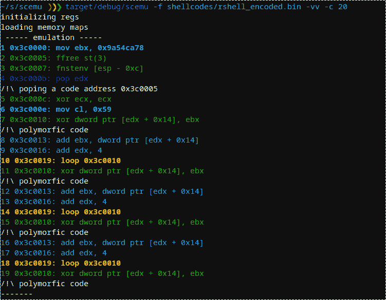
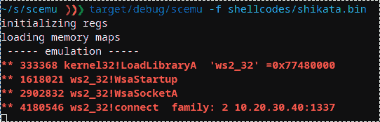

# SCE mu:X86 32 位仿真器，用于安全地仿真外壳代码

> 原文：<https://kalilinuxtutorials.com/scemu/>

Scemu 是一个 x86 位仿真器，用于安全地仿真外壳代码

**特色**

*   防锈安全，对恶意软件有益。
    *   所有的依赖都在生锈。
    *   零个不安全的{}块。
*   非常快速的仿真(比独角兽快得多)
    *   每秒 3，000，000 条指令
    *   100，000 条指令/秒打印每条指令-vv。
*   由 ice-x86 rust disassembler awesome 库提供支持。
*   迭代检测器。
*   存储器和寄存器跟踪。
*   彩色的。
*   在特定的时刻停下来，探索状态或修改它。
*   执行了 174 条指令。
*   112 winapi 实现了 5 个 dll。
*   所有 linux 系统调用。
*   SEH 连锁店。
*   向量异常处理程序。
*   PEB，TEB 结构。
*   内存分配器。
*   与 int3 反应。
*   未调试的 cpuid。
*   已知有效载荷的测试:
    *   metasploit 外壳代码。
    *   metasploit 编码器。
    *   钴罢工。
    *   谢尔根。
    *   guloader(现在还不完全是，但是比调试器更远)

**待办事项**

*   **更多 fpu**
*   **mmx**
*   **64 位**
*   **脚本？**

**用途**

**SCE mu 32 bits emulator for Shellcodes 0 . 2 . 5
@ sha 0 coder
用法:
scemu【标志】【选项】
标志:
-e，–端点与端点执行通信，使用 tor 或 vpn！
-h，–help 打印帮助信息
-l，–loops 显示循环迭代，很慢。
-m，–memory 跟踪所有的内存读写访问。
-n，–no colors 打印无颜色，用于重定向到文件> out
-r，–regs 打印每一步的寄存器值。
-V，–version 打印版本信息
-v，–verbose-vv 用于查看程序集，-V 仅显示消息，不显示 verbose 仅查看 api 调用并运行
更快
选项:
-b，–base 设置代码的基址
-c，–console 选择在哪个时刻将生成控制台进行检查。
-C，–console _ addr spawn console on first EIP = address
-a，–入口 shellcode 的入口点，默认情况下从头开始。
-f，–filename 设置外壳代码二进制文件。
-i，–检查监视器内存，如:-i 'dword ptr [ebp + 0x24]
-M，–maps 选择内存映射文件夹
-R，–reg 在每一步中跟踪一个特定的寄存器，值和内容
-s，–string 特定地址上的监视器字符串**

**一些使用案例**

scemu 模拟了一个简单的外壳代码来检测 execve()中断。

我们选择该行来停止并检查内存

在 linux 中模拟了 GuLoader win32 的近 200 万条指令后，伪造 cpuid 和其他技巧，到达一个 sigtrap 来迷惑调试器。

api 加载程序上的内存转储示例。

默认情况下有几个映射，可以使用 LoadLibraryA 之类的 API 或从控制台手动创建更多的映射

基于打印消息的 LdrLoadDLl()模拟基本 windows 外壳代码:

控制台允许查看和编辑 cpu 的当前状态:

**—控制台—
= > h
—帮助—
q ……退出
cls ……..清晰屏幕
h ………………。帮助……………。堆栈
v ……变量
r ……………。寄存器显示所有
r 寄存器显示寄存器
rc 寄存器变化
f。显示所有标志
fc …………清除所有标志
fz ………切换标志零
fs …………切换标志符号
c …………。继续地址
bi 上的
ba …………断点指令编号
bmr 上的………断点..读取存储器上的断点
bmw ………………..写存储器上的断点
bc ……清除断点
n ……下一条指令
eip ……………..更改 eip
按钮…………。将 dword 压入堆栈
弹出……..从堆栈
fpu 中弹出双字…………………..fpu 视图
md5 ………..检查存储器映射的 MD5
seh……………..查看 SEH
车辆..查看向量执行指针
m ………………。存储器映射
ma …………存储器分配
mc ………存储器创建映射
mn …………存储器地址名称
ml ………存储器加载文件内容映射
mr ………存储器读取，指定 ie: dword ptr [esi]
mw ………存储器读取，指定 ie: dword ptr [esi]然后:1af
md ………………存储器转储
Mr..存储器读取双字
mds …………..内存转储字符串
mdw …………..内存转储宽字符串
mdd ……………..内存转储到磁盘
mt ……内存测试
ss ……搜索字符串
sb ……搜索字节
sba ……..在所有地图中搜索字节
ssa ……………..在所有映射中搜索字符串
ll………………………………链表遍历
d ………………。拆卸
dt …………倾卸结构
进入……… st** ep

cobalt strike api 加载程序与 metasploit 相同，模拟它:

Cobalt Strike API 调用:

使用少量 fpu 隐藏多态性的 Metasploit SGN 编码器；

同样以 fpu 开始的 Metasploit shikata-ga-nai 编码器:

显示 PEB 结构:

**=>dt
structure =>peb
address =>0x 7 ffdf 000
PEB {
reserved 1:[
0x0，
0x0，
]，
正在调试:0x 0，
reserved2: 0x0，
reserved3: [
0xffffffff，
0x400000，
]，，**

显示 PEB LDR 数据结构:

**=>dt
structure =>PEB _ LDR _ 数据
地址=>0x 77647880
PebLdrData {
长度:0x30，
initialized:0x 1，
s handle:0x 0，
in _ load _ order _ module _ list:list entry {
flink:0x 2c 18 b 8，
blink:0x 2 cf48，** 

显示 LDR 数据表格条目和第一个模块名称

**=>dt
structure =>LDR _ 数据 _ 表格 _ 条目
地址=>0x 2c 18c 0
ldrdatableentry {
reserved 1:[
0x2c 1950，
0x77647894，
，
in _ memory _ order _ module _ links:list ENTRY {
flink:0x 0，
blink: 0x0，

reserved5: [
0x17440012，
0x4000002c，
0xffff0000，
]，
校验和:0x1d6cffff，
reserved6: 0xa640002c，
time_date_stamp: 0xcdf27764，
}
= >**

恶意软件在异常中隐藏了一些东西

**3307726 0x4f9673:推送 ebp
3307727 0x4f9674:推送 edx
3307728 0x4f9675:推送 eax
3307729 0x4f9676:推送 ecx
3307730 0x4f9677:推送 ecx
3307731 0x4f9678:推送 4f**

让我们检查异常结构:

**—控制台—
=>r esp
esp:0x 22 de 98
=>dt
structure =>cppeh _ record
address =>0x 22 de 98
CppEhRecord {
old _ esp:0x 0，
exc_ptr: 0x4f96f4，
next: 0xfffffffe，
exception _ handler:0x fffffffe，【T1**

这里我们有错误程序 0x4f96f4 和滤波器 0x51068c

[**Download**](https://github.com/sha0coder/scemu)