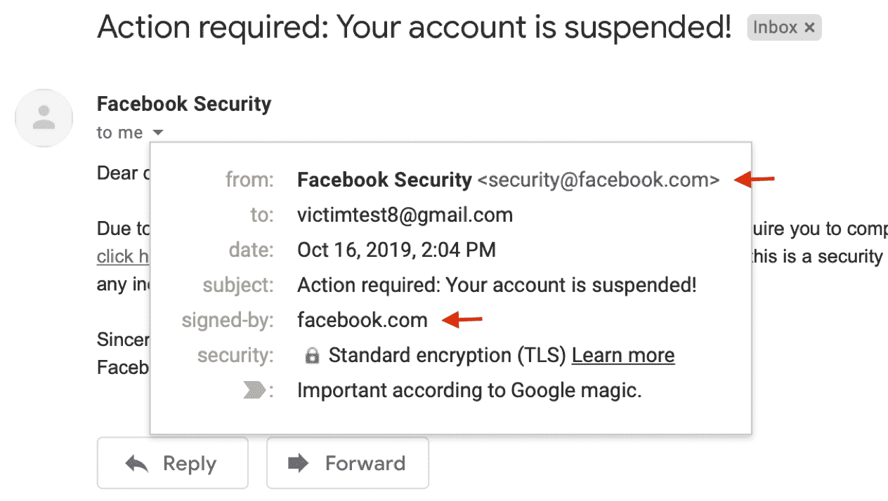
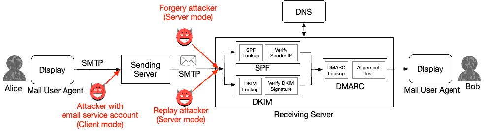
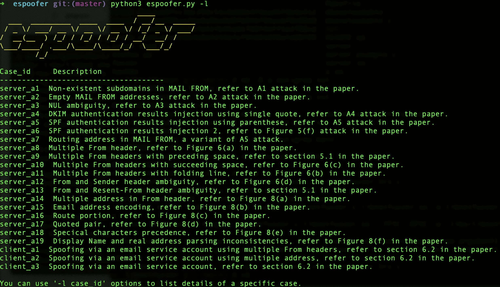

# Espoofer:一个电子邮件欺骗测试工具，旨在绕过 SPF/DKIM/DMARC

> 原文：<https://kalilinuxtutorials.com/espoofer/>

***Espoofer*** 是一款开源测试工具，可以绕过电子邮件系统中的 SPF、DKIM 和 DMARC 认证。它有助于邮件服务器管理员和渗透测试人员检查目标电子邮件服务器和客户端是否容易受到电子邮件欺骗攻击或可能被滥用来发送欺骗电子邮件。

为什么要开发这个工具？

电子邮件欺骗对个人和组织都是一大威胁。为了解决这个问题，现代电子邮件服务和网站采用认证协议(SPF、DKIM 和 DMARC)来防止电子邮件伪造。

我们的最新研究表明，这些协议的实施存在许多安全问题，可以利用这些问题绕过 SPF/DKIM/DMARC 保护。图 1 展示了我们在 Gmail 中绕过 DKIM 和 DMARC 的一种欺骗攻击。有关更多技术细节，请参阅我们的黑帽美国 2020 演讲(带演示视频)或 USENIX 安全 2020 白皮书。

*   黑帽美国 2020 幻灯片(PDF):你不知道是谁发的那封邮件:对邮件发件人认证的 18 次攻击
*   USENIX 安全 2020 论文(PDF):合成杀手:电子邮件发件人身份验证案例研究
    *   杰出论文奖获得者

在本报告中，我们总结了我们发现的所有测试案例，并将其集成到该工具中，以帮助管理员和安全从业者快速识别和定位此类安全问题。如果你做科学研究，请使用下面的引文(点击我)。

**安装**

*   下载该工具

**git 克隆 https://github.com/chenjj/espoofer**

*   安装依赖项

**sudo pip3 安装要求. txt**

**用途**

espoofer 有三种工作模式:*服务器* ('s '，默认模式)*客户端*(' c ')*手动* ('m ')。在*服务器*模式下，espoofer 像邮件服务器一样工作，在接收服务时测试有效性。在*客户端*模式下，espoofer 作为一个电子邮件客户端来测试发送服务的有效性。*手动*模式用于调试目的。

**服务器模式**

要在服务器模式下运行 espoofer，您需要拥有:1)一个 IP 地址(`**1.2.3.4**`)，其输出端口 25 不会被 ISP 阻止，以及 2)一个域(`**attack.com**`)。

域配置

*   为`**attack.com**`设置 DKIM 公钥

**选择器。_ domain key . attacker . com txt " v = dkim 1；k=rsat=yp = migfma 0 gcsqgsib 3 dqebaquea 4 gndcbikbgqdnjwdrmp/gcbkgqfrzk+LJ 6 xowuqxkaa/Li 1 en 4t 4 sluwiil 6 haqmrsq 8 xfg76 MMX 4 CHN 2 vqvewfh 7 qtvshglywwwrajdq 4 ktlfr/2 ewalritndijofr 2 tpzdrgp 0 nty 6 saktkhqdwrk 3 u 0 SZ mg 7 u 8 L9 ipj 7**

为`**attack.com**`设置 SPF 记录

**attack.com TXT " v = sp f1 ip4:1 . 2 . 3 . 4+全部"**

在 config.py 中配置工具

**config ={
"攻击者 _ 站点":b"attack.com "，# attack.com
"合法 _ 站点 _ 地址":b"admin@bank.com "，# legitimate.com
"受害者 _ 地址":b"victim@victim.com "，# victim@victim.com
" case _ id ":b " server _ a1 ", # server _ a1
}**

您可以使用`**-l**`选项列出所有测试用例的 case_id:

**python3 espoofer.py -l**

您可以在 config.py 中更改 case_id，或者在命令行中使用`**-id**`选项来测试不同的案例:

**python 3 espoofer . py-id server _ a1**

**客户端模式**

要在客户端模式下运行 epsoofer，您需要在目标电子邮件服务上拥有一个帐户。这种攻击利用了某些电子邮件服务无法对从本地 mua 收到的电子邮件进行充分验证的缺陷。例如，`**attacker@gmail.com**`试图冒充`**admin@gmail.com**`。

1.  在 config.py 中配置工具

**config ={
"合法 _ 站点 _ 地址":b"admin@gmail.com "、
"受害者 _ 地址":b"victim@victim.com "、
"case_id": b"client_a1"、
" client _ mode ":{
" sending _ server ":(" SMTP . Gmail . com "，587)、# SMTP 发送服务 ip 和端口
" username ":b " attack @ Gmail . com "、#您的帐户用户名和密码
密码**

您可以使用`**-l**`选项列出所有测试用例的 case_id:

**python3 espoofer.py -l**

注意:`**sending_server**`应该是 SMTP 发送服务器地址，而不是接收服务器地址。

2.  运行该工具来发送欺骗性电子邮件

**python3 espoofer.py -m c**

您可以在 config.py 中更改 case_id 并再次运行它，或者您可以在命令行中使用`**-id**`选项:

**python 3 espoofer . py-m c-id client _ a1**

**手动模式**

以下是手动模式的一个示例:

**python 3 espoofer . py-m m-helo attack.com-m from m@attack.com-rcpt to victim@victim.com-data raw _ msg _ here-IP 127 . 0 . 0 . 1-port 25**

**截图**

1.  测试用例的简要概述。

[**Download**](https://github.com/chenjj/espoofer)