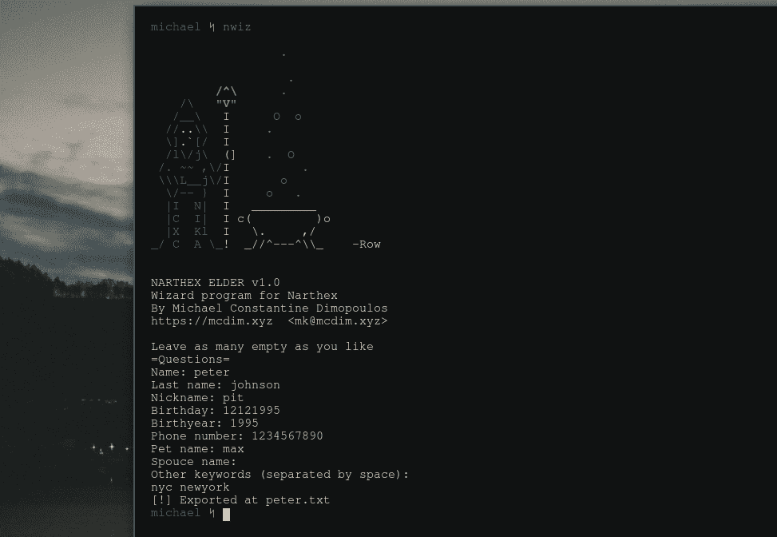

# Narthex:模块化个性化词典生成器

> 原文：<https://kalilinuxtutorials.com/narthex/>

Narthex (希腊语:νάρθηξ，νάρθηκας)是一个模块化的&最小字典生成器，用于用 c 和 Shell 编写的 Unix 和类 Unix 操作系统。它包含用于创建个性化字典的自主 Unix 风格程序，可用于密码恢复&安全评估。根据 Unix 哲学，这些程序利用 Unix 文本流进行相互协作。它是在 GPL v3.0 下授权的。目前正在开发中！

**工具**

*   *n chance*–一个将结果追加到字典底部的大写工具。
*   *ninc*–一个递增工具，将字母行相乘，并在每一行的末尾追加一个 n++。
*   *ncom*–一个组合工具，在字典的现有行之间创建不同的组合。
*   *nrev*–一个反转工具，在字典的末尾追加行的保留版本。
*   入口–一个 leetifier。用 Leet 等效项替换字符，如用@代替 a，或用 3 代替 e。
*   一个工具，用于删除不符合你标准的密码(太短，没有特殊字符等)。)
*   *napp*–一个在字典的行前或行后追加字符或单词的工具。
*   *nwiz*–一个向导，询问信息并将工具组合在一起以创建最终的字典。

**截图**

**依赖关系**

**Narthex 没有硬依赖项**，但是有两个构建依赖项`**GCC**`和`**Make**`，这两个依赖项都是为了方便编译和安装二进制文件而需要的，但不是为了运行它们。

**安装**

为了安装，请执行以下命令:

**git 克隆 https://github . com/michaeldim 02/narhex . git&&CD narhex
$ sudo make install**

**用途**

为了便于使用，有一个向导程序 nwiz 可供您使用。快跑吧

**$ nwiz**

它会询问您目标的信息并为您生成字典。

**高级用法**

如果你想充分利用 Narthex，你可以阅读每个工具的联机帮助页。他们所做的，实际上，是增强小字典。它们非常小，使用 Unix 文本流来读取和输出数据。例如，将几个关键字保存到文本文件`**words.txt**`的不同行中，并运行以下代码

**$ cat words . txt | nhance-f | ncom | nrev | nleet | ninc 1 30>dictionary . txt**

[**Download**](https://github.com/MichaelDim02/Narthex#usage)