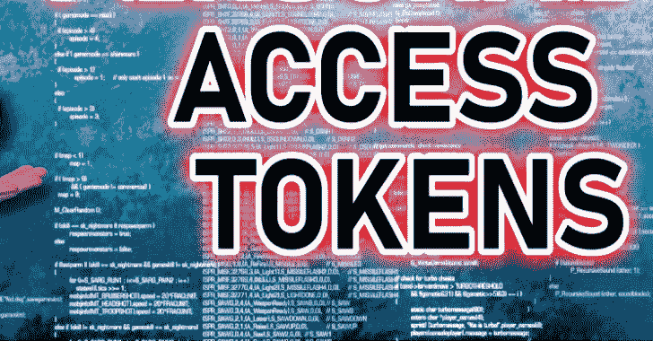

# Token Universe:使用访问令牌和 Windows 安全策略的高级工具

> 原文：<https://kalilinuxtutorials.com/tokenuniverse/>

**Token Universe** 是一款高级工具，为研究 **Windows 安全机制**提供了广泛的可能性。它有一个方便的界面，用于创建、查看和修改访问令牌，管理本地安全机构和安全帐户管理器的数据库。它允许您获取和模拟不同的安全上下文、管理权限、审计设置等等。

我的目标是创建一个有用的工具，它实现了我所知道的关于访问令牌和一般 Windows 安全模型的几乎所有东西。此外，还要在这个过程中学习更多。我相信这样一个程序可以成为研究人员和那些想更多了解安全子系统的人的一个有价值的工具。欢迎大家提出任何想法，报告 bug。

**功能列表**

**令牌相关功能**

**获得代币**

*   打开进程/线程令牌
*   打开有效线程令牌(通过直接模拟)
*   查询会话令牌
*   使用显式凭据登录用户
*   无凭据登录用户(S4U 登录)
*   重复令牌
*   重复句柄
*   打开链接令牌
*   过滤令牌
*   创建低箱令牌
*   使用更安全的 API 创建了受限令牌
*   搜索打开的句柄
*   创建匿名令牌
*   通过管道模拟登录会话令牌
*   打开剪贴板令牌

**高**低 **y 特权操作** s

*   登录用户时添加自定义组成员(需要 *Tcb 权限*
*   从头开始创建自定义令牌(需要*创建令牌权限*

**观看**

*   用户
*   统计数据、源、标志
*   扩展标志(令牌 _*)
*   限制 sid
*   应用程序容器 SID 和编号
*   能力
*   要求
*   信任级别
*   登录会话类型(过滤/提升/默认)
*   登录会话信息
*   详细的终端会话信息
*   对象和句柄信息(访问、属性、引用)
*   对象创建者(PID)
*   拥有该对象句柄的进程列表
*   创建和最后修改时间

**观看&编辑**

*   组(启用/禁用)
*   权限(启用/禁用/删除)
*   会议
*   完整性等级(降低/提高)
*   UIAccess，强制策略
*   虚拟化(启用/禁用和允许/不允许)
*   所有者和主要组
*   发起登录会话
*   默认 DACL
*   安全描述符
*   审计覆盖
*   处理标志(继承，保护)

**使用**

*   扮演
*   安全模拟
*   直接模仿
*   分配主令牌
*   向进程发送句柄
*   用令牌创建进程
*   与 TokenUniverse 的另一个实例共享

**其他动作**

*   比较令牌
*   链接登录会话以创建 UAC 友好令牌
*   登录会话关系映射

**AppContainer 概要文件**

*   查看 AppContainer 信息
*   列出每个用户的 AppContainer 配置文件
*   列出子 AppContainers
*   创建/删除 AppContainers

**当地安全局**

*   全局审计设置
*   每用户审核设置
*   特权分配
*   登录权限分配
*   定额
*   安全性
*   用特权枚举帐户
*   用权限枚举帐户

**证券账户经理**

*   领域信息
*   群组信息
*   别名信息
*   用户信息
*   枚举域组/别名/用户
*   枚举组成员
*   枚举别名成员
*   管理组成员
*   管理别名成员
*   创建组
*   创建别名
*   创建用户
*   Sam 对象树
*   安全性

**流程创建**

**方法**

*   CreateProcessAsUser
*   CreateProcessWithToken
*   WMI
*   RtlCreateUserProcess
*   RtlCreateUserProcessEx
*   NtCreateUserProcess
*   NtCreateProcessEx
*   CreateProcessWithLogon(凭据)
*   ShellExecuteEx(无标记)
*   通过 IShellDispatch2 执行 shell(无令牌)
*   通过代码注入创建流程(无令牌)
*   WdcRunTaskAsInteractiveUser(无令牌)

**参数**

*   当前目录
*   桌面
*   窗口显示模式
*   标志(继承句柄、创建挂起、脱离作业等)
*   环境变量
*   父流程覆盖
*   缓解政策
*   子进程策略
*   工作分配
*   作为调用程序运行兼容性
*   AppContainer SID
*   能力

**界面特征**

*   即时崩溃通知
*   窗口站和桌面访问检查
*   调试消息报告

**进程列表**

*   等级制度
*   核标准情报中心
*   列出来自低完整性& AppContainer 的进程
*   基本操作(恢复/暂停等)
*   可自定义的列
*   突出
*   安全性
*   处理表格操作

**界面特征**

*   作为系统重新启动
*   以 SYSTEM+身份重启(使用*创建令牌权限*
*   可自定义的列
*   图形散列图标
*   自动检测继承的句柄
*   我们自己的带有任意 sid 和强制标签修改的安全编辑器
*   可定制的建议 sid 列表
*   详细的错误状态信息
*   关于错误的详细建议

[**Download**](https://github.com/diversenok/TokenUniverse)