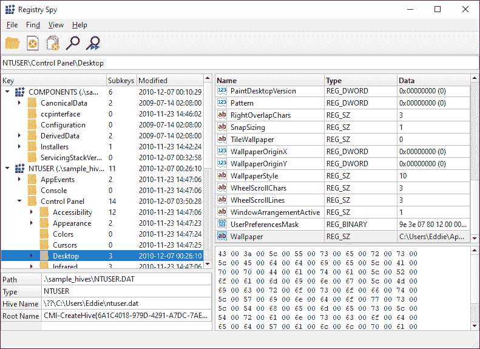
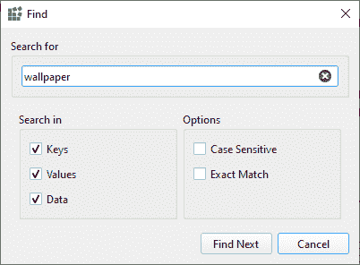

# 注册表间谍:跨平台注册表浏览器的原始 Windows 注册表文件

> 原文：<https://kalilinuxtutorials.com/registry/>

**Registry-Spy** 是一款免费、开源的跨平台 Windows 注册表查看器。这是一个快速，现代，多才多艺的原始注册表文件的浏览器。

功能包括:

*   快速、动态解析意味着没有前期开销
*   一次打开多个蜂窝
*   搜索
*   十六进制浏览器
*   修改时间戳

**要求**

*   Python 3.8 以上版本

**安装**

从发布页面下载最新版本。或者，使用下列方法之一。

**皮普(推荐)**

*   `**pip install registryspy**`
*   `**registryspy**`

**手动**

*   `**pip install -r requirements.txt**`
*   `**python setup.py install**`
*   `**registryspy**`

**单机**

*   `**pip install -r requirements.txt**`
*   `**python registryspy.py**`

**截图**

**主窗口**

**查找对话框**

**大楼**

依赖关系:

*   PyInstaller 4.5+

常规建筑:`**pyinstaller registryspy_install.spec**`

创建单个文件:`**pyinstaller registryspy_onefile.spec**`

[**Download**](https://github.com/andyjsmith/Registry-Spy)