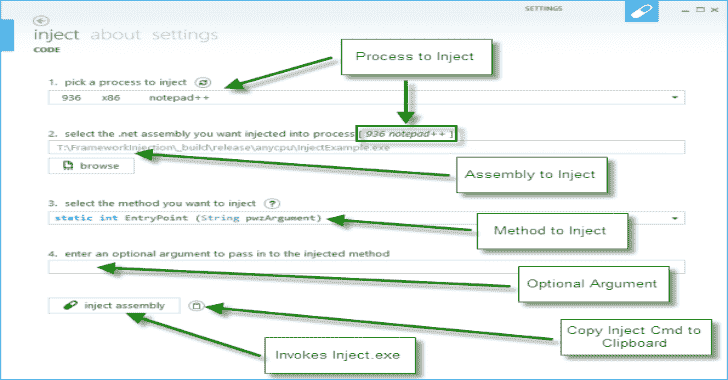

# 注入-装配:注入。NET 程序集合并到现有进程中

> 原文：<https://kalilinuxtutorials.com/inject-assembly/>

**注入装配**是钴击传统叉和运行执行的替代方案。加载程序可以被注入到任何进程中，包括当前信标。长时间运行的程序集将继续运行并将输出发送回信标，类似于 execute-assembly 的行为。

注入组件有两个组成部分:

*   BOF 初始化器:一个小程序，负责将汇编加载器注入到一个远程进程中，并传递任何参数。它使用信标注入过程来执行注入，这意味着可以在可延展的 C2 配置文件中或使用过程注入 BOF(从版本 4.5 开始)来定制该行为。
*   **PIC 组装装载机**:项目的主体。加载程序将初始化。NET 运行库，加载提供的程序集，并执行该程序集。加载程序将在目标进程中创建新的应用程序域，以便在执行完成时可以完全卸载加载的程序集。

远程进程和信标之间的通信通过命名管道进行。攻击者脚本生成一个管道名，然后将其传递给 BOF 初始化器。

**显著特征**

*   补丁环境。Exit()以防止远程进程退出。
*   。NET 汇编头文件踩踏(MZ 字节，e_lfanew，DOS 头文件，富文本，PE 头文件)。
*   基于源点的随机管道名称生成。
*   即使程序集被加载到当前进程中，也不会阻塞信标。

**用法**

下载并加载 inject-assembly.cna 攻击者脚本到 Cobalt Strike。然后，您可以使用以下命令执行程序集:

**注入-装配 pid 装配[args…]**

将 0 指定为要在当前信标进程中执行的 PID。

建议使用另一个工具，如 FindObjects-BOF，来定位已经加载了。NET 运行时，但这并不是注入程序集运行的必要条件。

[**Download**](https://github.com/kyleavery/inject-assembly)