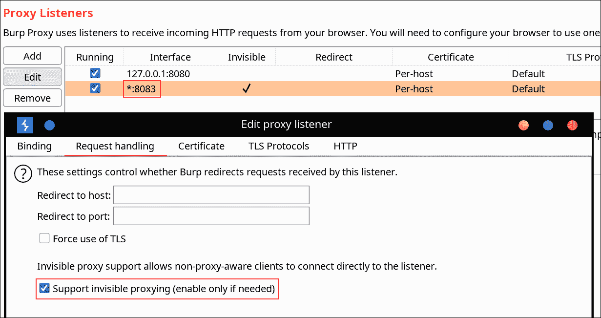
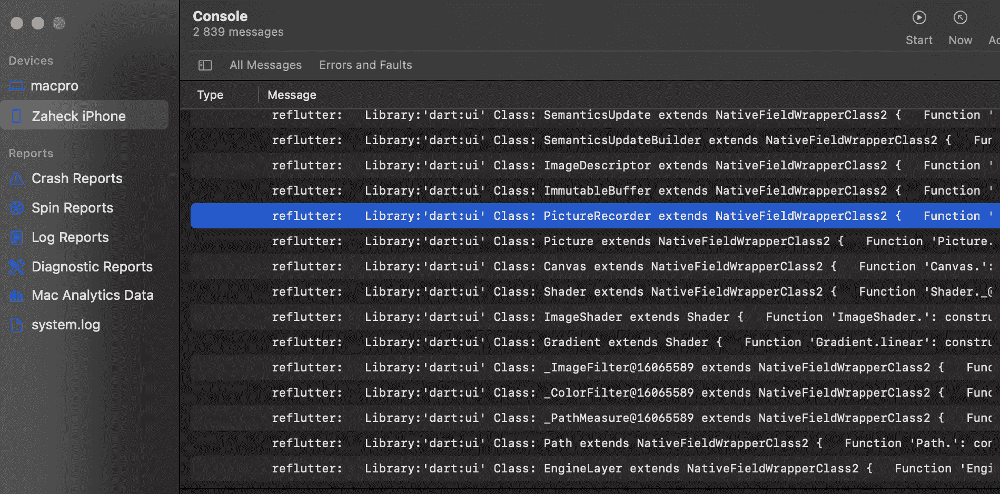

# ReFlutter:颤振逆向工程框架

> 原文：<https://kalilinuxtutorials.com/reflutter/>

**ReFlutter** framework 使用已经编译好的补丁版本的 Flutter 库帮助 Flutter 应用程序逆向工程，并准备好应用程序重新打包。该库修改了快照反序列化过程，允许您以方便的方式执行动态分析。

主要特点:

*   `**socket.cc**`打补丁进行流量监控和拦截；
*   `**dart.cc**`是修改打印类、函数和一些字段；
*   包含有助于成功编译的微小更改；
*   如果你想实现你自己的补丁，有手工颤振代码改变是支持使用特制的`**Dockerfile**`

**支持的发动机**

*   安卓:arm64，arm32
*   iOS:arm 64；
*   版本:稳定，测试版

**安装**

# Linux，Windows，MacOS

**pip3 安装重组器**

**用途**

**impact @ f:~ $ ref lutter main . apk
请输入你的 Burp Suite IP:
snapshot hash:8e 4 ef 7 a 67 df 9845 FBA 331734198 a953
生成的 apk 文件:。/发布。RE.apk
请签署 apk 文件
配置 Burp Suite 代理服务器监听*:8083
代理选项卡- >选项- >代理监听器- >编辑- >绑定选项卡
然后在请求处理选项卡
支持不可见代理->true
impact @ f:~ $ ref lutter main . IPA**

**流量拦截**

您需要指定 Burp Suite 代理服务器的 IP 地址，该服务器位于安装了 flutter 应用程序的设备所在的网络中。接下来，您应该在`**BurpSuite -> Listener Proxy -> Options tab**`中配置代理

*   添加端口:`**8083**`
*   绑定到地址:`**All interfaces**`
*   请求处理:支持隐形代理= `**True**`

不需要安装任何证书。在 Android 设备上，您也不需要 root 访问权限。reFlutter 还允许绕过一些 Flutter 证书锁定实现。

**在安卓上的使用**

生成的 apk 必须经过校准和签名。我用的是 uber-apk-signer `**java -jar uber-apk-signer.jar --allowResign -a release.RE.apk**`。要查看通过 DartVM 加载了哪些代码，需要在设备上运行应用程序。reFlutter 在 logcat 中打印其带有`**reflutter**`标签的输出

影响@ f:~ $ ADB log cat-e reflutter | sed ' s/。* dart VM//'>T3【reflutter . txt

**代码输出**

**库:' package:anyapp/Navigation/deeplinkimpl . dart ' Class:Navigation extends Object {
String * DeepUrl = anyapp://evil . com/；
功能‘导航’:构造函数。(动态，动态，动态，动态)=>navigation interactor {
}
函数' initDeepLinkHandle ':(动态)= >未来* {
}
函数' _navigateDeepLink@547106886 ':(dynamic，dynamic，{ dynamic navigator })=>void {
}
}
库:' package:anyapp/auth/navigation/AuthAccount . dart '类:auth Account 扩展帐户{
plain notification token * _ instance = sentinel；
函数“getAuthToken”:(动态，动态，动态，动态)= >未来> { }函数‘check email’:(动态，动态)= >未来> { }函数' validateRestoreCode ':(动态，动态，动态)= >未来> { }函数' sendSmsRestorePassword ':。(动态，动态)= >未来<布尔*>*{
}
}**

**在 iOS 上的使用**

使用执行`**reflutter main.ipa**`命令后创建的 IPA 文件。要查看通过 DartVM 加载了哪些代码，需要在设备上运行应用程序。reFlutter 在 XCode 的控制台日志中用`**reflutter**`标签打印它的输出。

**构建引擎**

引擎是使用 Github Actions 中的 reFlutter 构建的，以构建所需的版本，提交和快照哈希使用该表。快照的哈希从`**storage.googleapis.com/flutter_infra_release/flutter/<hash>/android-arm64-release/linux-x64.zip**`中提取

**定制构建**

如果你想实现你自己的补丁，手工颤振代码改变是支持使用特制的 Docker

`**sudo docker pull ptswarm/reflutter**`

**Linux，Windows
示例构建 ANDROID arm 64:
sudo docker run-e WAIT = 300-e x64 = 0-e arm = 0-e HASH _ PATCH =-e COMMIT =–RM-iv $ { PWD }:/t ptswarm/ref lutter
FLAGS:
-e x64 = 0
-e arm = 0
-e WAIT = 300
-e HASH _ PATCH =[Snapshot _ HASH]
-e COMMIT =[引擎**

[**Download**](https://github.com/ptswarm/reFlutter)