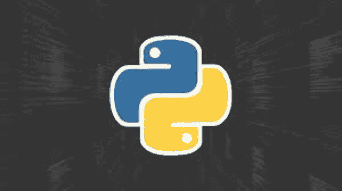
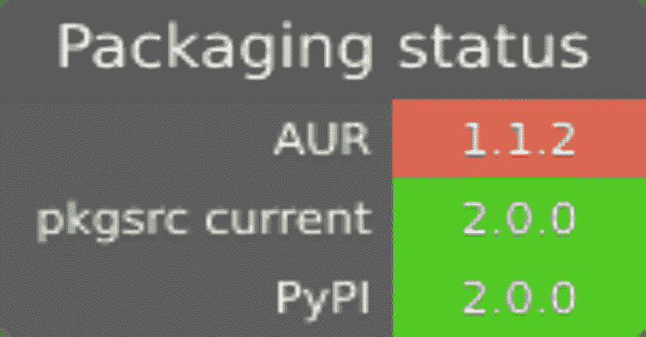

# Pip-Audit:审计 Python 环境和依赖树中已知的漏洞

> 原文：<https://kalilinuxtutorials.com/pip-audit/>

`**pip-audit**`是一个工具，用于扫描 Python 环境中具有已知漏洞的包。它通过 PyPI JSON API 使用 Python 打包咨询数据库(https://github.com/pypa/advisory-database)作为漏洞报告的来源。

这个项目是由谷歌支持下的比特轨迹开发的。这不是谷歌的官方产品。

**特色**

*   支持审计本地环境和需求风格的文件
*   支持多种漏洞服务(PyPI，OSV)
*   支持在 CycloneDX XML 或 JSON 中发出 SBOMs
*   人类和机器可读的输出格式(列式，JSON)
*   无缝重用您现有的本地`**pip**`缓存

**安装**

`**pip-audit**`需要 Python 3.7 或更新版本，可以通过`**pip**`直接安装:

**python -m pip 安装** **pip-audit**

**第三方包**

`**pip-audit**`有多个**第三方**包。下面的矩阵和徽章列出了其中一些:

特别是，`**pip-audit**`可以通过`**conda**`安装:

**康达安装-康达锻造 pip-审计**

第三方包**不是本项目直接支持的**。有关更详细的安装指导，请参考您的软件包管理器的文档。

**用法**

您可以将`**pip-audit**`作为独立程序运行，或者通过`**python -m**`运行:

p**IP-audit–help**
**python-m pip _ audit–help**

**用法:pip-audit [-h] [-V] [-l] [-r 需求] [-f 格式] [-s 服务]
[-d][-S][–desc[{ on，off，auto }]][–CACHE-DIR CACHE _ DIR]
[–progress-spinner { on，off }][–time out 超时]
[–path 路径][–V][–fix][–require-hashs]
[–INDEX-URL INDEX _ URL –version 显示程序的版本号并退出
-l，–local 仅显示本地
环境中依赖项的结果(默认:False)
-r REQUIREMENTS，–requirement REQUIREMENTS
审计给定的需求文件； 此选项可以多次使用
(默认:无)
-f 格式，–FORMAT FORMAT
以(选择:columns，
json，cyclonedx-json，cyclonedx-xml)格式发出审计结果(默认:
columns)
-s 服务，–vulnerability-SERVICE SERVICE
审计依赖项
的漏洞服务(选择:osv，pypi)(默认:pypi)
-d，–无【无使用`--fix`:执行
审计步骤，但不执行任何修复(默认:
假)
-S，–如果依赖关系收集失败
则严格使整个审计失败(默认:假)
–desc[{开，关，自动}]
包括每个漏洞的描述；`auto`
默认为`json`格式的`on`。该标志对`cyclonedx-json`或`cyclonedx-xml`
格式没有影响。(默认值:auto)
–CACHE-DIR CACHE _ DIR
用作 PyPI 的 HTTP 缓存的目录；默认情况下使用
`pip`HTTP 缓存(默认:无)
–progress-spinner { on，off}
显示一个进度 spinner(默认:on)
–time out time out 设置套接字超时(默认:15)
–path path 限制为
审计包的指定安装路径；该选项可以多次使用
(默认:[])
-v，–verbose 给出更多输出；此设置覆盖了
`PIP_AUDIT_LOGLEVEL`变量，相当于
将其设置为`debug`(默认:假)
–修复自动升级与已知
漏洞的依赖关系(默认:假)
–require-hashes 需要一个哈希来检查每个需求，以进行
可重复审计；当需求文件中的任何
包有一个`--hash`选项时，这个选项是隐含的。
(默认:False)
–INDEX-URL INDEX _ URL
Python 包索引的基础 URL；这应该
指向一个符合 PEP 503 的存储库(
简单存储库 API)(默认:
https://pypi.org/simple)
–EXTRA-INDEX-URL EXTRA _ INDEX _ URLS
除了
`--index-url`之外要使用的包索引的额外 URL；应遵循与
`--index-url`(默认:[])
–跳过-可编辑不审计标记为可编辑的包
(默认:假)**

**退出代码**

完成后，`**pip-audit**`将退出，并显示一个指示其状态的代码。

当前代码为:

*   `**0**`:没有检测到已知的漏洞。
*   `**1**`:发现一个或多个已知漏洞。

**试运行**

`**pip-audit**`支持`**--dry-run**`标志，可用于控制是否实际执行审计(或修复)步骤。

*   就其本身而言，`**pip-audit --dry-**run`跳过审计步骤，打印出*已经被*审计的依赖项的数量。
*   在修复模式中，`**pip-audit --fix --dry-run**`执行审计步骤，并打印出*已经执行的*的修复行为(即，哪些依赖项将被升级或跳过)。

**例子**

审核当前 Python 环境的依赖关系:

**$ pip-audit
未发现已知漏洞**

审核给定需求文件的依赖关系:

**$ pip-audit-r ./requirements . txt** 基金无已知漏洞

审核需求文件的依赖关系，不包括系统包:

**$ pip-audit-r ./requirements . txt-l
未发现已知漏洞**

审核本地 Python 项目的依赖关系:

**$ pip-审计。
未发现已知漏洞**

`**pip-audit**`在提供的路径中搜索各种 Python“项目”文件。目前只支持`**pyproject.toml**`。

存在漏洞时审核依赖关系:

**$ pip-audit
在 1 个包中发现 2 个已知漏洞
名称版本 ID 修复版本
——————————————————
Flask 0.5 PYSEC-2019-179 1.0
Flask 0.5 PYSEC-2018-66 0 . 12 . 3**

**安全模式**

本节描述了使用`**pip-audit**`时**可以**和**不可以**做出的安全假设。

TL；博士:**如果你不想做，你就不应该做。**

`**pip-audit**`是一个用于审计 Python 环境中具有*已知漏洞*的包的工具。“已知漏洞”是一个软件包中公开报告的缺陷，如果不加以纠正，*可能会*允许恶意行为者执行意想不到的操作。

`**pip-audit**`**能否通过告诉您何时有已知漏洞，以及应该如何升级来保护您免受已知漏洞的攻击。比如你的环境里有`**somepackage==1.2.3**`，`**pip-audit**`，**可以**告诉你需要升级到`**1.2.4**`。**

 **你**可以**假设`**pip-audit**`会尽最大努力*完全解析*你所有的 Python 依赖关系，并且*或者*完全审计每个*或者*明确声明它跳过了哪些依赖关系，以及为什么跳过它们。

`**pip-audit**`**不是**是静态代码分析器吗？它分析依赖树，而不是代码，并且它**不能**保证任意的依赖解析静态发生。要理解这是为什么，请参考达斯汀·英格拉姆关于 Python 依赖解析的精彩文章。

因此:你**不能**认为`**pip-audit**`会**保护**你免受恶意软件包的攻击。尤其是把`**pip-audit -r INPUT**`当成`**pip-audit**`的“更安全”变种**是不正确的**。对于所有意图和目的，`**pip**-**audit -r INPUT**`在功能上等同于`p**ip install -r INPU**T`，带有少量的**非安全隔离**以避免与您的任何本地环境冲突。

[**Download**](https://github.com/trailofbits/pip-audit)**